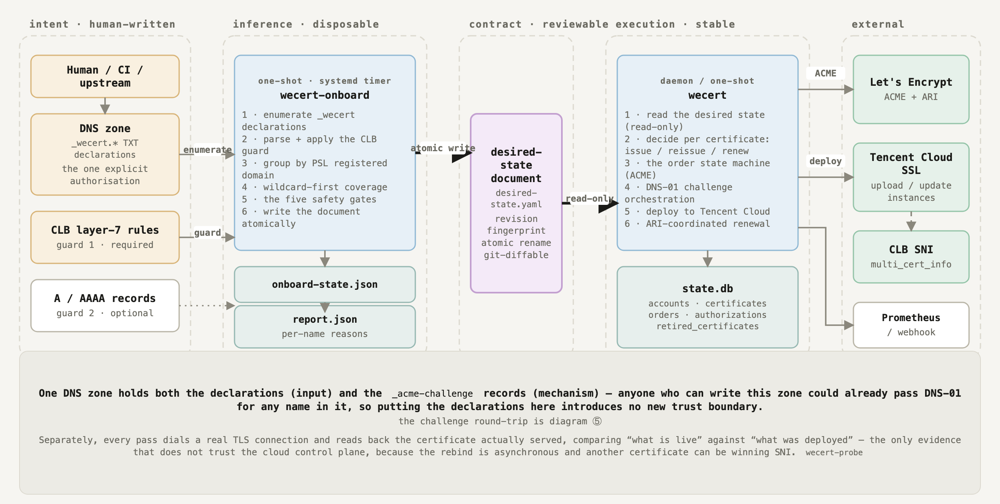
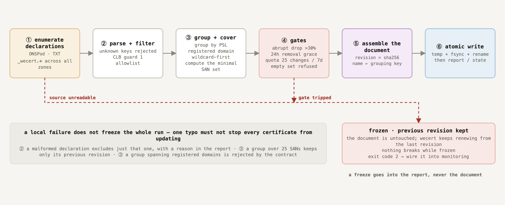
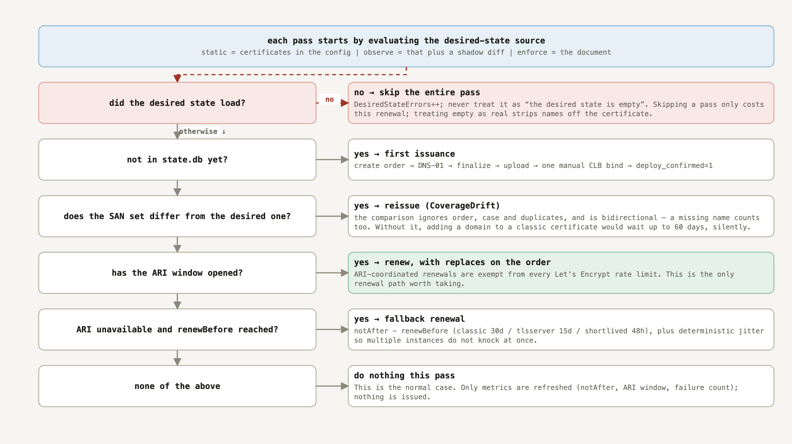
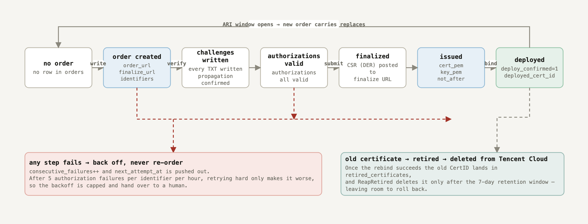
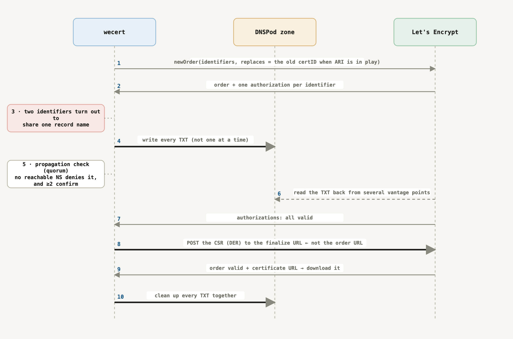
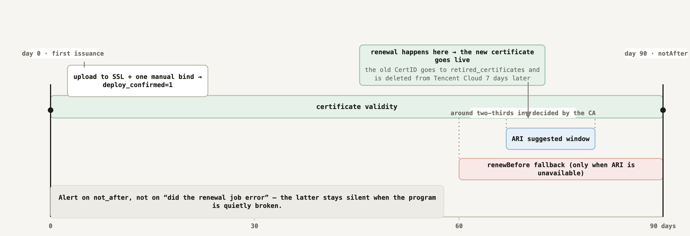

<p align="center">
  <picture>
    <source media="(prefers-color-scheme: dark)" srcset="docs/logo-dark.png">
    
  </picture>
</p>

<p align="center">
  <b>English</b> &nbsp;·&nbsp; <a href="README.zh-CN.md">简体中文</a>
</p>

<p align="center">
  
  
  
  
  <a href="https://github.com/susunola/wecert/actions/workflows/ci.yml"></a>
</p>

# wecert

A cert-manager-style ACME certificate renewer for the deployment shape where **TLS terminates at
Tencent Cloud CLB**.

One binary and one SQLite file. Because decryption happens at the load balancer, there is no node
agent and no certificate files to distribute — the entire deploy action is a few Tencent Cloud API
calls.

**At a glance**

| | |
|---|---|
| **Issues and renews** | Let's Encrypt over DNS-01, with ARI (RFC 9773) so renewals are coordinated with the CA and exempt from its rate limits |
| **Deploys** | Uploads to Tencent Cloud SSL and rebinds the CLB listener — no listener inventory to maintain, and other certificates on the same listener are untouched |
| **Verifies** | Dials 443 and reads back the certificate actually served, because "the API said it worked" and "it is serving" are different claims |
| **Handles multi-domain** | Wildcard-first grouping, up to 100 names per certificate, and a per-name failure ledger that drops one name that keeps failing instead of losing the whole certificate |
| **Runs as** | One daemon (or an hourly systemd timer) on any CVM; all state in one file you can back up |
| **Tells you things** | Prometheus metrics plus 17 ready-to-load alert rules, and an optional authenticated webhook for event-driven convergence |

New here? [Requirements](#requirements) then [Quick start](#quick-start) gets a certificate issued,
deployed and verified. The reasoning behind the design is in [How it works](#how-it-works) and the
[full reference](README.reference.md).

## Why this exists

A Let's Encrypt certificate is free, and the price is a short validity — 90 days today, and the
CA/Browser Forum has scheduled ≤100 days from 2027-03-15 and ≤47 days from 2029-03-15. That is
several rotations a year, forever, and a human remembering each one will eventually miss.

Existing ACME clients assume the certificate ends up on the machine that asked for it: certbot
writes files, cert-manager writes a Kubernetes Secret. Here the certificate is a **cloud resource**
that the CLB serves, so what is needed is not a file writer but a small controller: notice, issue,
upload, rebind, verify — and be honest about every step of it.

Two consequences shape the whole design:

- **Domains sharing a certificate share their fate.** SNI only decides *which* certificate is used;
  the SAN decides which domains it can serve. Once `a.example.com` and `b.example.com` are in the
  same certificate, a DNS problem on one drags the other down. Wildcard-first grouping, the desired
  state, and the failure fallback all exist because of this.
- **The limits that hurt are about state and identifiers, not the SAN ceiling.** *New certificates
  per exact set of identifiers* is 5 per 7 days with no override, while ARI-coordinated renewals are
  exempt from everything. Losing `state.db` therefore costs far more than re-issuing — which is why
  the order URL is persisted before any CA call, and why that file is the one thing to back up.

More on both in [Why this exists](README.reference.md#why-this-exists).

## Requirements

- **A Tencent Cloud account** with a CLB (layer-7 listener) and the CAM permissions in
  [`deploy/cam-policy-runtime.json`](deploy/README.md): SSL upload/describe/delete plus DNSPod
  record writes. Credentials come from a CVM role, the environment, or the config file.
- **A DNS zone you control**, hosted in **DNSPod** (API token) or **Tencent Cloud DNS** (the same
  CAM credentials). Let's Encrypt validates over DNS-01, so the zone has to be reachable by API and
  correctly delegated.
- **A host to run on** — any CVM that can reach the Tencent Cloud API. It does not have to be
  reachable from the internet.
- **Go 1.26+**, only if you build from source. Release binaries are static for linux/amd64,
  linux/arm64 and darwin/arm64.

One thing to know before you start: **the first issuance needs one manual bind in the CLB console.**
There is no old certificate for Tencent Cloud to find the listeners through yet, so wecert uploads
and stops; you bind it once. Every renewal after that is automatic.

## Quick start

### 1. Get the binary

Build from source, or take the static ones:

```bash
git clone https://github.com/susunola/wecert.git
cd wecert
make build          # → bin/wecert, for the machine you are on
make tools          # → bin/wecert-preflight, bin/wecert-clbverify
make release        # → dist/wecert_{linux_amd64,linux_arm64,darwin_arm64} + SHA256SUMS
```

`make release` is the one to use when the build host is not the CVM: the binaries are static and
cross-compiled, so `dist/wecert_linux_amd64` is what goes to a Linux CVM. The module path matches
the repository, so `go install github.com/susunola/wecert/cmd/wecert@latest` works too.

### 2. Check credentials, DNS ownership and NS delegation

All read-only. Do this before anything else: it catches the mistakes that would otherwise surface as
a failed challenge after the order is already placed.

```bash
export TENCENTCLOUD_SECRET_ID="<secret-id>"
export TENCENTCLOUD_SECRET_KEY="<secret-key>"
./bin/wecert-preflight -domain example.com
```

It verifies SSL read access, DNSPod ownership of `example.com`, NS delegation, and leftover
`_acme-challenge` records. Every failure names what to fix.

### 3. Configure, then dry-run

[`config.example.yaml`](config.example.yaml) is annotated field by field. It ships with
`acme.directory` pointing at Let's Encrypt **staging** on purpose — `install.sh` installs that very
file as your production config, so the default has to be the safe one.

The minimum you have to edit:

```yaml
acme:
  email: ops@example.com                 # staging by default; switch to production when green
dns:
  provider: tencentcloud                 # or dnspod + loginToken
certificates:
  - name: example-com
    domains: [example.com, "*.example.com"]
```

Then install on the CVM — run this from the checkout, with the binary for that machine:

```bash
sudo ./install.sh ./dist/wecert_linux_amd64
```

`install.sh` creates the `wecert` user, installs the binary to `/usr/local/bin/wecert`, makes
`/etc/wecert` and `/var/lib/wecert` with the right ownership, places the example config as
`/etc/wecert/config.yaml` (it never overwrites one that already exists) and drops in the systemd
units. It does not start anything.

Edit that file, then validate it:

```bash
sudo vi /etc/wecert/config.yaml
sudo -u wecert /usr/local/bin/wecert -config /etc/wecert/config.yaml -dry-run
```

`-dry-run` loads the config, opens or creates the state database, registers the ACME account, and
exits **without signing or deploying anything**. A green dry run means the config, the credentials
and the state directory are all usable.

### 4. Run it

```bash
sudo systemctl enable --now wecert                      # daemon, reconciles hourly
# or: sudo systemctl enable --now wecert-once.timer     # run once, hourly, then exit
```

Run **one** of the two per machine. They share one state database, and the second process is
**refused at startup** by the lock on it (exit non-zero: `the state database is already held by
another wecert process`) rather than queued.

The two modes differ in how they report a bad pass. The daemon logs per-certificate failures and
keeps running; the timer's unit is **oneshot**, so `-once` exits non-zero when the pass did not
converge (a certificate failed, the desired state was unreadable, or nothing was attempted while
everything was skipped -- the state a certificate stuck in a long backoff sits in). `systemctl
status wecert-once` and `journalctl -u wecert-once` then show a failed unit instead of a green
timer over a fleet that went unmanaged. Two processes placing orders for the same certificate
would race the same rate limits, and "at most one in-flight order per certificate" only holds
inside a single process.

The first pass issues a real certificate from the staging CA and uploads it:

```bash
journalctl -u wecert -f            # or -u wecert-once with the timer
```

### 5. Bind it once, then confirm

The first issuance stops here by design:

```
certificate uploaded; waiting for a one-time manual bind in the CLB console cert=example-com uploadedCertId=xxxxxxxx
```

Bind that certificate to the listener in the CLB console. wecert notices on a later pass and flips
`wecert_certificate_deployed` to 1. From then on `UpdateCertificateInstance` makes Tencent Cloud
find the listeners bound to the old certificate and swap them — there is no listener inventory to
maintain, and other certificates on the same listener (SNI) are untouched.

Confirm it is actually serving, rather than trusting the API. `wecert-probe` is a separate binary
from the same build, and it only needs to reach the name over 443, so run it from wherever you built
the tools:

```bash
./bin/wecert-probe -host www.example.com -min-valid 168h
```

Exit `0` means the name served a certificate with more than a week left, `2` means it served
something else — which is what "the rebind silently did nothing" looks like. To pin it to the exact
certificate wecert deployed, pass `-expect-not-after` with that certificate's `notAfter`
(`wecert_certificate_not_after_timestamp_seconds` in the metrics, or the log line).

### 6. Switch to production

Once staging is green end to end, point `acme.directory` at
`https://acme-v02.api.letsencrypt.org/directory` and restart. Adding `wecert-onboard` — see
[When domains are declared elsewhere](#when-domains-are-declared-elsewhere) — is a good moment to
start the timer that keeps the desired state fresh.

> **Stuck on the first run?** The three usual causes, in order: NS delegation not visible yet (run
> `wecert-preflight -domain`), a DNSPod token used where Tencent Cloud CAM credentials are expected
> (the two are different credential systems, and the config says which one the chosen provider
> needs), and a rate limit — `wecert_ratelimit_blocked` says which limit is refusing, and for the
> account's new-order quota the daemon logs the exact instant the CA will listen again.

## Day-2 operations

**Where state lives.** `statePath`, default `/var/lib/wecert/state.db` (0600, directory 0700). It
holds the ACME account key, every certificate private key, in-flight order URLs and the ARI
certID — and losing an order URL costs an issuance against the 5-per-7-days limit. So it is also
snapshotted automatically: `stateBackup` is on by default, a consistent `VACUUM INTO` every 24h with
7 kept. What each loss costs and how to restore one: [docs/recovery.md](docs/recovery.md).

**Health and alerting.** `/metrics` on `127.0.0.1:9800` by default, with a
[ready-to-load rule file](deploy/prometheus/wecert-alerts.yml): 17 alerts covering expiry per
profile, convergence, and integrity — a revocation the CA has not accepted, a pass that has not
finished in two hours, a certificate serving that is not the one deployed. The listener serves no
authentication, so keep it on localhost or a private interface.

If the metrics port cannot be bound, wecert exits rather than logging and continuing: `/metrics` is
the only expiry-alerting path, and a silently dead endpoint means certificates expire unnoticed.

**Convergence on demand.** Configure `webhook` and CI can trigger convergence right after a domain
is added, instead of waiting for the next tick:

```bash
curl -X POST http://127.0.0.1:9801/hook/reconcile \
  -H "Authorization: Bearer $TOKEN" \
  -d '{"cert":"example-com"}'
```

> The listener is **plain HTTP** — it is meant to sit behind your own TLS terminator or on a
> private interface, and the token is the authentication. `X-Wecert-Token: <token>` works instead of
> the `Authorization` header if that suits your caller better.

It answers `202 Accepted` and converges in the background; poll `GET /hook/status` for the outcome.
The timer and an event trigger can land on the same certificate at the same moment, so the slot is
reserved **synchronously** and the second caller is told `skipped` rather than placing a duplicate
order — which would run straight into the 5-per-7-days limit for that identifier set. The token is
mandatory and must be at least 16 characters, and the endpoint performs real issuance, so treat it
as a credential. Details in [Configuration reference → `webhook`](README.reference.md#webhook).

**Revoking.** An explicit operator action, never something wecert decides on its own:

```bash
wecert -config /etc/wecert/config.yaml -revoke example-com -revoke-reason keyCompromise
```

It asks you to type the certificate name back (skip with `-yes`), then records the decision in
`state.db` **before** contacting the CA. That order is the point: revocation is unbounded in time —
a leaked private key does not stop being leaked because the CA returned a 503 — so a failed attempt
leaves a durable request that the daemon retries on **every** pass until the CA accepts it, with
`wecert_revocation_pending` and an alert making it visible. `-revoke-reason` takes the RFC 5280 codes
that make sense here: `unspecified` (the default, which omits the reason), `keyCompromise`,
`affiliationChanged`, `superseded`, `cessationOfOperation`.

Two limits worth knowing: the certificate is read from `state.db`, so one issued before wecert
started archiving material can only be revoked at the CA; and revocation does **not** restore
rate-limit quota — those resources were consumed when the certificate was issued.

**Upgrading.** Migrations are additive and run at startup under the same file lock that keeps a
second instance out, so a newer binary upgrades an older database in place rather than asking you to
rebuild it. Rolling *back* to an older binary is not covered by a test yet
([backlog](docs/backlog.md)).

## How it works

Four invariants. Each exists because breaking it costs something that cannot be bought back with
time.

1. **At most one in-flight order per certificate, and the order URL is persisted before any CA
   call.** A restart resumes the same order instead of placing a new one. The order's private key is
   stored on the order and never written over the live key, so a failed deployment still leaves
   something to roll back to.
2. **ARI first, and orders carry `replaces`.** Without it there is no rate-limit exemption.
3. **A wildcard and its apex share one `_acme-challenge` name**, so the shape is *write all →
   verify all → clean up together*, never one at a time.
4. **The desired state is the domain set, not a timestamp.** If the live certificate's SANs differ
   from the config, it reissues immediately rather than waiting for the renewal window — adding a
   domain to a 90-day certificate would otherwise take up to 60 days to apply, silently.

lego's high-level `certificate.Obtain` is deliberately not used: it calls `newOrder` internally, so
the order URL cannot be persisted. The low-level `acme/api` package is used instead, which is what
makes the state machine ours. Full rationale in
[Domains that change often](README.reference.md#domains-that-change-often) and
[Field notes and pitfalls](README.reference.md#field-notes-and-pitfalls).

## Certificate lifecycle

The one rule everything else follows: **wecert never infers.** Something else works out what should exist and writes it down; wecert only reads that document and converges. Judgement is inferred once and reviewed as a diff, while the certificate lifecycle stays stable.

### 0. Deployment shape — a free certificate rotating itself on the CLB


The scenario this system exists for is the band on top: **a Let's Encrypt certificate is free, and the price is a 90-day validity** — at least four rotations a year, and a human remembering each one will eventually miss.

Tencent Cloud's own free DV is not an alternative. **It is a single-domain certificate: no SAN, no wildcard.** A deployment with a handful of domains would need one certificate and one rotation pipeline per domain. One Let's Encrypt certificate carries up to 100 names and does support wildcards, so several domains — including `*.example.com` — collapse into a single certificate with a single rotation to look after. That is what makes the multi-SAN shape drawn below possible at all.

The point is not that wecert *can* issue; it is that the certificate is already replaced before it expires, with nobody involved.

Requests arrive at the CLB over SNI. The CLB picks the certificate out of `multi_cert_info` using the name the client sent, and the layer-7 rules route by domain to the backend RS pool. `wecert` runs on one of those CVMs; it reads the `_wecert.*` declarations from DNSPod, writes the `_acme-challenge` records, obtains the certificate from Let's Encrypt, uploads it to Tencent Cloud SSL and rebinds the listener.

Two consequences of this shape are easy to miss:

- **The backend RSs take no part in TLS.** Decryption happens at the CLB, so the certificate is a *cloud resource*, not a few files. Putting certbot on every RS buys nothing, and tools that assume the certificate ends up in a Secret have nowhere to land here.
- **Domains sharing one certificate share their fate.** SNI only decides *which* certificate is used; the certificate's SAN decides which domains it can actually serve. So once `a.example.com` and `b.example.com` are in the same certificate, a DNS problem on one drags the other down with it.

The second point is the constraint everything else is built around — wildcard-first grouping, the desired state, and the failure fallback all exist because of it.

### 1. System map — who owns what, who only reads



### 2. Intent → contract — the inference pipeline



### 3. Reconcile decisions



### 4. Order state machine



### 5. DNS-01 — a wildcard and its apex share one TXT name



### 6. The life of one certificate



The axis is drawn for a `classic` 90-day certificate. What actually decides when renewal happens is ARI's `suggestedWindow`; `renewBefore` is only the fallback for when ARI is unavailable.

ARI-coordinated renewals are **exempt from every Let's Encrypt rate limit** — but only if the identifier set is unchanged. That is what makes wildcard-first more than an optimisation, and why adding a domain has to be driven to nearly zero cost.

The tables behind these diagrams — data ownership, failure semantics and the rate-limit arithmetic — are in [The certificate lifecycle](README.reference.md#the-certificate-lifecycle), alongside the same seven figures. There is also a single interactive page at [docs/certificate-lifecycle.en.html](docs/certificate-lifecycle.en.html), with links between the figures and a print/PDF button.

## Profiles

"100 domains per SAN" is profile-dependent, not fixed:

| Profile | Validity | Max Names |
|---|---|---|
| `classic` (default) | 90 days | 100 |
| `tlsserver` | 45 days | 25 |
| `shortlived` | 160 hours | 25 |

The CA/Browser Forum has scheduled **≤100 days from 2027-03-15 and ≤47 days from 2029-03-15**, so "90-day certificates plus a manual fallback" stops being an option within two years. Keeping each certificate to **25 domains or fewer** aligns with `tlsserver` and bounds the blast radius — domains in one certificate succeed, fail and expire together.

> Adding or removing a domain makes that issuance a new certificate, so it counts against **Certificates per Registered Domain (50 / 7 days)** instead of enjoying the ARI exemption.

## When domains are declared elsewhere

If domains get added by other people or other systems, `wecert-onboard` takes that judgement out of wecert entirely. Domains are declared as `_wecert` TXT records in the DNS zone, the binary turns them into a reviewable desired-state document, and **wecert only ever reads that document — it never infers anything**.

The payoff is the quota arithmetic above. With `*.example.com` declared, adding `foo.example.com` costs **zero** issuances, against 50 re-issuances for a 50-subdomain import without a wildcard.

Deletion is deliberately an order of magnitude more conservative than addition, and the whole thing can run in a read-only `observe` mode first. Start at [Desired state](docs/desired-state.md).

## Documentation

**Operating it**

- [Full reference](README.reference.md) — architecture, the reconcile state machine, the state schema, every configuration field, operations, and the pitfalls found by running it.
- [Configuration reference](README.reference.md#configuration-reference) · [Operations](README.reference.md#operations) · [Metrics and alerting](README.reference.md#metrics-and-alerting).
- [Alert rules](deploy/prometheus/wecert-alerts.yml) — load straight into Prometheus; each threshold says where the number came from.
- [Recovery](docs/recovery.md) — what is in `state.db`, what each loss costs, and how to restore a snapshot and verify it before starting.
- [Availability](docs/availability.md) — what a restart already survives, why a second process on the same host would be redundant, and the three real options with what each costs.
- [Backlog](docs/backlog.md) — what is worth doing next, ordered by real exposure over effort.

**Understanding it**

- [Why this exists](README.reference.md#why-this-exists) — which rate limits shaped the design.
- [The certificate lifecycle](README.reference.md#the-certificate-lifecycle) — the figures above plus data ownership, failure semantics and the rate-limit arithmetic. Interactive: [docs/certificate-lifecycle.en.html](docs/certificate-lifecycle.en.html).
- [Desired state](docs/desired-state.md) — declaring domains as `_wecert` DNS records, generating the desired-state document, and switching wecert over to it. Design rationale: [desired-state-providers.md](docs/desired-state-providers.md).
- [Challenge types](docs/challenge-types.md) — why DNS-01 is the right default here, what HTTP-01 would additionally require, and why TLS-ALPN-01 cannot work at all.
- [Field notes and pitfalls](README.reference.md#field-notes-and-pitfalls) — the CLB SNI trap, `DescribeListeners` not reading bindings back, the DNSPod TTL floor, the lego API traps.
- [Lifecycle acceptance case](docs/lifecycle-acceptance.md) — the executable checklist for a certificate's whole life against real DNSPod + Let's Encrypt **staging**: issuance, SAN drift, the shared wildcard/apex TXT name, concurrent certificates, the ARI and fallback renewal paths, crash recovery, and the declaration → document → enforce handover.
- [Roadmap](README.reference.md#roadmap) · [Development](README.reference.md#development).

**Working on it**

- [CONTRIBUTING.md](CONTRIBUTING.md) — what a change is expected to include, and how to run the gates.
- [SECURITY.md](SECURITY.md) — how to report a vulnerability privately, and which limitations are deliberate.
- [deploy/README.md](deploy/README.md) — the least-privilege CAM policies and the Prometheus rules.

## Status and support

The engineering is production-grade: 600+ tests, a real ACME lifecycle against pebble in the test
suite, mutation-verified regression tests, reproducible release binaries and an SBOM. It also has
**no production track record yet** — it has not run for a year on somebody else's fleet, and this
README will not imply otherwise. Treat the first deployment as a rollout: staging first, then one
certificate, then the rest.

The supported version is the newest release. There is no long-term-support branch, so a security fix
is not backported to an older tag. Known gaps and what is planned are in the
[backlog](docs/backlog.md) and the [CHANGELOG](CHANGELOG.md).

<details>
<summary>Command reference</summary>

### `wecert`

| Flag | Default | Description |
|---|---|---|
| `-config` | `config.yaml` | Config file path |
| `-state` | — | Override `statePath` (useful for tests) |
| `-once` | `false` | Run one pass and exit (systemd timer / cron) |
| `-interval` | `1h` | Reconcile interval in daemon mode |
| `-log-level` | `info` | `debug` \| `info` \| `warn` \| `error` |
| `-dry-run` | `false` | Validate config and initialise the ACME account; sign and deploy nothing |
| `-revoke` | — | Name of the certificate to revoke, then exit (see [Revoking](#day-2-operations)) |
| `-revoke-reason` | `unspecified` | RFC 5280 reason: `unspecified` \| `keyCompromise` \| `affiliationChanged` \| `superseded` \| `cessationOfOperation` |
| `-yes` | `false` | With `-revoke`: skip the interactive confirmation |
| `-version` | `false` | Print version and exit |

### `wecert-onboard` (desired-state generator)

Turns `_wecert` TXT declarations into the desired-state document that `wecert` reads.
Runs as a systemd timer and exits. Only needed once `desiredState.mode` leaves `static`.

| Flag | Default | Description |
|---|---|---|
| `-config` | — | **Required.** The same config file `wecert` reads; the `onboarding` section holds the policy |
| `-out` | `desiredState.path` | Where to write the desired-state document |
| `-state` | `<out>.state.json` | Where to keep the grace-period and budget bookkeeping |
| `-report` / `-no-report` | `<out>.report.json` | Per-hostname decision report |
| `-zones` | every visible zone | Comma-separated DNS zones to enumerate |
| `-require-clb` | `true` | Guard 1: a declaration only counts when a CLB rule serves the name |
| `-allow` | — | Comma-separated registered domains that may be issued for |
| `-max-names` | `25` | Max SAN entries per certificate |
| `-grace` | `24h` | How long a name must be confirmed absent before removal |
| `-budget` / `-budget-window` | `25` / `168h` | Name-set changes allowed per window |
| `-drop-threshold` | `0.30` | Freeze when the declared set shrinks by more than this |
| `-profile` / `-keytype` / `-deploy` | from the config | Defaults for the certificates it generates |
| `-force` | `false` | Skip the fuses, the grace period and the CLB reference check; only for a change you made on purpose |
| `-dry-run` | `false` | Compute everything, write nothing |
| `-json` | `false` | Print the report as JSON instead of a human summary |
| `-quiet` | `false` | Only print the final one-line summary |

Exit codes: `0` written (or unchanged), `1` the program failed, `2` **deliberately frozen** — read the report.

```bash
./bin/wecert-onboard -config /etc/wecert/config.yaml -dry-run   # see what would change
./bin/wecert-onboard -config /etc/wecert/config.yaml            # write it
```

### `wecert-preflight` (diagnostic; `-prune-certs` deletes)

| Flag | Description |
|---|---|
| `-domain` | Verify SSL read access, DNSPod ownership, NS delegation and leftover challenge records |
| `-list-certs` | List the account's SSL certificates |
| `-prune-certs` | Delete wecert-uploaded certificates (alias prefix `wecert/`) |
| `-bindings` | Dump the raw bind-resource result for one certificate ID (debugging the "0 bound" verdict) |
| `-yes` | Skip the confirmation prompt for `-prune-certs` |

> `-prune-certs` matches on the alias prefix `wecert/`, which wecert applies to **every** certificate it uploads — including the one currently serving. It prints the list and requires confirmation; non-interactive stdin is treated as "no". A delete the API refuses (`DeleteResult=false`) is reported as a failure and makes the command exit non-zero, rather than being reported as a deletion that did not happen.

### `wecert-probe` (network-side evidence)

Dials a real TLS connection and reports the certificate the far end actually serves. This is the part of wecert that does **not** trust the cloud control plane: a rebind is asynchronous and another certificate can be winning SNI, and neither is visible through the API.

| Flag | Default | Description |
|---|---|---|
| `-host` | — | **Required.** Comma-separated names to probe |
| `-port` | `443` | TCP port to dial |
| `-timeout` | `10s` | Per-attempt timeout |
| `-min-valid` | `0` | Fail if the served certificate has less than this left, e.g. `168h` |
| `-expect-san` | — | SAN set that was deployed; the served set must match exactly |
| `-expect-not-after` | — | RFC3339 `notAfter` of the deployed certificate; catches a rebind that did not take effect |
| `-wait` | `0` | Poll until the verdict is ok or this long elapses (e.g. `90s`) — useful right after a rebind |
| `-json` | `false` | Print each attempt as one JSON object (NDJSON, so a retry under `-wait`, or a host that resolves to several addresses, produces one line per attempt) |

Exit codes: `0` served as expected · `1` could not complete a probe · `2` probed successfully but the certificate served was not the expected one.

```bash
./bin/wecert-probe -host www.example.com -min-valid 168h
./bin/wecert-probe -host www.example.com -wait 90s        # just rebound
```

> It cannot probe a wildcard — `*.example.com` has no address of its own. Probe a concrete name the same certificate covers.

### `wecert-clbverify` (independent evidence)

| Flag | Description |
|---|---|
| `-region` / `-clb` / `-listener` | Target listener; `-listener` defaults to the first under that CLB |
| `-expect` / `-not-expect` | Assert the primary certificate ID equals / does not equal |
| `-wait` | Poll this long for the rebind (it is asynchronous, measured ~15s) |
| `-raw` | Dump the raw `DescribeListeners` JSON |

```bash
./bin/wecert-clbverify -region ap-guangzhou -clb lb-xxxx -listener lbl-yyyy \
  -expect apJdfyPa -not-expect apJRqDsC -wait 90s
```

</details>

## License

[MIT](LICENSE)
