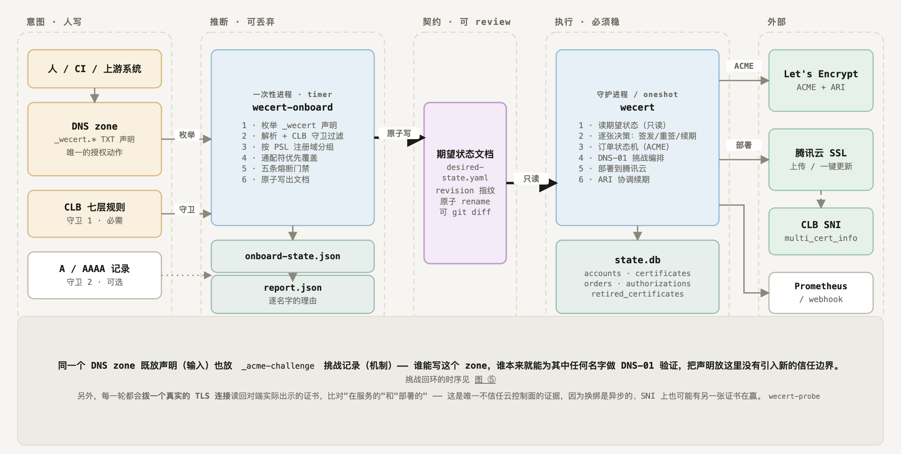
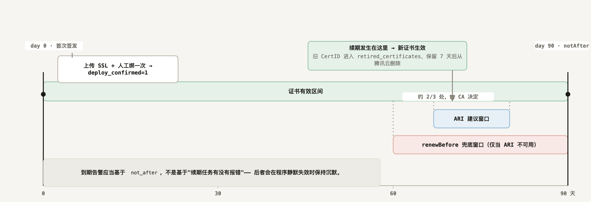

<p align="center">
  <picture>
    <source media="(prefers-color-scheme: dark)" srcset="docs/logo-dark.png">
    
  </picture>
</p>

<p align="center">
  <b>English</b> &nbsp;·&nbsp; <a href="README.zh-CN.md">简体中文</a>
</p>

<p align="center">
  
  
  
  
  <a href="https://github.com/susunola/wecert/actions/workflows/ci.yml"></a>
</p>

# wecert

A cert-manager-style ACME certificate renewer for deployments where **TLS terminates at Tencent Cloud CLB**.

One binary and one SQLite file. Because decryption happens at the load balancer, there is no node agent and no certificate files to distribute — the entire deploy action is a few Tencent Cloud API calls.

## Install

Requires Go 1.26+ to build.

```bash
git clone https://github.com/susunola/wecert.git
cd wecert
make build          # → bin/wecert
make tools          # → bin/wecert-preflight, bin/wecert-clbverify
```

Static binaries for linux/amd64, linux/arm64 and darwin/arm64:

```bash
make release        # → dist/ + SHA256SUMS
```

On the target CVM, `install.sh` creates the `wecert` user, installs to `/usr/local/bin/wecert`, prepares `/etc/wecert/` and drops in the systemd units:

```bash
sudo ./install.sh ./dist/wecert_linux_amd64
```

> The module path matches the repository, so both `git clone` + `make build` and `go install github.com/susunola/wecert/cmd/wecert@latest` work.

## Quick start

**1. Check credentials, DNS ownership and NS delegation** — all read-only:

```bash
export TENCENTCLOUD_SECRET_ID="<secret-id>"
export TENCENTCLOUD_SECRET_KEY="<secret-key>"
./bin/wecert-preflight -domain example.com
```

**2. Configure.** `config.example.yaml` is annotated, and its `acme.directory` deliberately points at Let's Encrypt **staging** — `install.sh` installs that file as your production config, so the default has to be the safe one.

```bash
sudo cp config.example.yaml /etc/wecert/config.yaml
sudo chown root:wecert /etc/wecert/config.yaml && sudo chmod 640 /etc/wecert/config.yaml
sudo -u wecert ./bin/wecert -config /etc/wecert/config.yaml -dry-run
```

**3. Start it.** Once staging is green end to end, switch `acme.directory` to production and run:

```bash
sudo systemctl enable --now wecert                      # daemon, reconciles hourly
# or: sudo systemctl enable --now wecert-once.timer     # run once, hourly
```

Run **one** of the two modes per machine. They share one state database, and the "at most one in-flight order per certificate" guarantee only holds inside a single process.

**4. Bind the certificate once.** On first issuance Tencent Cloud has no "old certificate → cloud resource" binding to look up, so wecert only uploads it:

```
certificate uploaded; waiting for a one-time manual bind in the CLB console cert=example-com uploadedCertId=xxxxxxxx
```

Bind it in the CLB console. Every renewal after that is automatic — `UpdateCertificateInstance` makes Tencent Cloud find the listeners bound to the old certificate and swap them. **There is no listener inventory to maintain**, and other certificates on the same listener (SNI) are untouched.

## How it works

Four invariants, chosen because the limits that hurt are the ones about *state and identifiers*, not the SAN ceiling — **New Certificates per Exact Set of Identifiers is 5 per 7 days with no override**, while ARI-coordinated renewals are exempt from everything. Losing the state database therefore costs far more than re-issuing.

1. **At most one in-flight order per certificate, and the order URL must be persisted.** A restart resumes the same order instead of creating a new one. The order's private key is stored on the order, never written over the live key, so a failed deployment still leaves you something to roll back to.
2. **ARI first, and orders carry `replaces`.** Without it there is no rate-limit exemption.
3. **A wildcard and its apex share one `_acme-challenge` name**, so it is *write all → verify all → clean up*, never one at a time.
4. **The desired state is `domains`, not a timestamp.** If the live certificate's SANs differ from the config, it reissues immediately rather than waiting for the renewal window. Adding a domain to a 90-day certificate would otherwise take up to 60 days to apply — silently.

lego's high-level `certificate.Obtain` is deliberately not used: it calls `newOrder` internally, so the order URL cannot be persisted. The low-level `acme/api` package is used to own the state machine.

Full rationale in [Domains that change often](README.reference.md#domains-that-change-often) and [Field notes and pitfalls](README.reference.md#field-notes-and-pitfalls).

## Certificate lifecycle

The one rule everything else follows: **wecert never infers.** Something else works out what should exist and writes it down; wecert only reads that document and converges. Judgement is inferred once and reviewed as a diff, while the certificate lifecycle stays stable.



Left to right is the transfer of authority: **intent** (written by a human, as `_wecert` TXT records) → **inference** (`wecert-onboard`, disposable) → **contract** (a machine-written desired-state document) → **execution** (`wecert`, must be stable) → **external services**.

Splitting it that way is about failure modes. If wecert enumerated DNS and CLB itself, a single API hiccup returning empty could be read as "these names are gone", and it would reissue a certificate without them — the site fails to handshake. With a document in between, a source failure means *the desired state stops updating*, which is safe.



Every pass asks the same five ordered questions, and "do nothing" is the answer on the overwhelming majority of them. Renewal is ARI-first and carries `replaces`, because ARI-coordinated renewals are **exempt from every Let's Encrypt rate limit** — while a change to the name set makes the issuance a brand-new certificate, which forfeits that exemption. That is what makes wildcard-first more than an optimisation: with `*.example.com` declared, adding `foo.example.com` costs **zero** issuances.

The full story — all six diagrams, plus data ownership, failure semantics and the rate-limit arithmetic — is in [The certificate lifecycle](README.reference.md#the-certificate-lifecycle). There is also a single interactive page at [docs/certificate-lifecycle.html](docs/certificate-lifecycle.html), with links between the figures and a print/PDF button.

## Event-driven

By default wecert converges on a timer. Configure `webhook` and it can also be triggered on demand — by CI right after a domain is added, say, instead of waiting for the next tick:

```bash
curl -X POST https://wecert.internal:9801/hook/reconcile \
  -H "Authorization: Bearer $TOKEN" \
  -d '{"cert":"example-com"}'
```

It answers `202 Accepted` and converges in the background; poll `GET /hook/status` for the outcome. The timer and an event trigger can land on the same certificate at the same moment, so the slot is reserved **synchronously** and the second caller is told `skipped` rather than placing a duplicate order — which would run straight into the 5-per-7-days limit for that identifier set.

The endpoint performs real issuance and consumes rate-limit quota, so the token is mandatory and must be at least 16 characters; a shorter one is rejected when the config is loaded.

Details in [Configuration reference → `webhook`](README.reference.md#webhook).

## Profiles

"100 domains per SAN" is profile-dependent, not fixed:

| Profile | Validity | Max Names |
|---|---|---|
| `classic` (default) | 90 days | 100 |
| `tlsserver` | 45 days | 25 |
| `shortlived` | 160 hours | 25 |

The CA/Browser Forum has scheduled **≤100 days from 2027-03-15 and ≤47 days from 2029-03-15**, so "90-day certificates plus a manual fallback" stops being an option within two years. Keeping each certificate to **25 domains or fewer** aligns with `tlsserver` and bounds the blast radius — domains in one certificate succeed, fail and expire together.

> Adding or removing a domain makes that issuance a new certificate, so it counts against **Certificates per Registered Domain (50 / 7 days)** instead of enjoying the ARI exemption.

### When domains are declared elsewhere

If domains get added by other people or other systems, `wecert-onboard` takes that judgement out of wecert entirely. Domains are declared as `_wecert` TXT records in the DNS zone, the binary turns them into a reviewable desired-state document, and **wecert only ever reads that document — it never infers anything**.

The payoff is the quota arithmetic above. With `*.example.com` declared, adding `foo.example.com` costs **zero** issuances, against 50 re-issuances for a 50-subdomain import without a wildcard.

Deletion is deliberately an order of magnitude more conservative than addition, and the whole thing can run in a read-only `observe` mode first. Start at [Desired state](docs/desired-state.md).

## Documentation

- [Full reference](README.reference.md) — architecture, the reconcile state machine, the state schema, every configuration field, operations, and the pitfalls found by running it.
- [Why this exists](README.reference.md#why-this-exists) — which rate limits shaped the design.
- [Configuration reference](README.reference.md#configuration-reference) · [Operations](README.reference.md#operations) · [Metrics and alerting](README.reference.md#metrics-and-alerting).
- [Field notes and pitfalls](README.reference.md#field-notes-and-pitfalls) — the CLB SNI trap, `DescribeListeners` not reading bindings back, the DNSPod TTL floor, the lego API traps.
- [Desired state](docs/desired-state.md) — declaring domains as `_wecert` DNS records, generating the desired-state document, and switching wecert over to it. Design rationale: [desired-state-providers.md](docs/desired-state-providers.md).
- [The certificate lifecycle](README.reference.md#the-certificate-lifecycle) — six diagrams from a DNS declaration to retiring the old certificate, plus data ownership, failure semantics and the rate-limit arithmetic. Interactive version: [docs/certificate-lifecycle.html](docs/certificate-lifecycle.html).
- [Roadmap](README.reference.md#roadmap) · [Development](README.reference.md#development).

<details>
<summary>Command reference</summary>

### `wecert`

| Flag | Default | Description |
|---|---|---|
| `-config` | `config.yaml` | Config file path |
| `-state` | — | Override `statePath` (useful for tests) |
| `-once` | `false` | Run one pass and exit (systemd timer / cron) |
| `-interval` | `1h` | Reconcile interval in daemon mode |
| `-log-level` | `info` | `debug` \| `info` \| `warn` \| `error` |
| `-dry-run` | `false` | Validate config and initialise the ACME account; sign and deploy nothing |
| `-version` | `false` | Print version and exit |

### `wecert-onboard` (desired-state generator)

Turns `_wecert` TXT declarations into the desired-state document that `wecert` reads.
Runs as a systemd timer and exits. Only needed once `desiredState.mode` leaves `static`.

| Flag | Default | Description |
|---|---|---|
| `-config` | — | **Required.** The same config file `wecert` reads; the `onboarding` section holds the policy |
| `-out` | `desiredState.path` | Where to write the desired-state document |
| `-state` | `<out>.state.json` | Where to keep the grace-period and budget bookkeeping |
| `-report` / `-no-report` | `<out>.report.json` | Per-hostname decision report |
| `-zones` | every visible zone | Comma-separated DNS zones to enumerate |
| `-require-clb` | `true` | Guard 1: a declaration only counts when a CLB rule serves the name |
| `-allow` | — | Comma-separated registered domains that may be issued for |
| `-max-names` | `25` | Max SAN entries per certificate |
| `-grace` | `24h` | How long a name must be confirmed absent before removal |
| `-budget` / `-budget-window` | `25` / `168h` | Name-set changes allowed per window |
| `-drop-threshold` | `0.30` | Freeze when the declared set shrinks by more than this |
| `-force` | `false` | Skip the fuses; only for a change you made on purpose |
| `-dry-run` | `false` | Compute everything, write nothing |
| `-json` | `false` | Print the report as JSON |

Exit codes: `0` written (or unchanged), `1` the program failed, `2` **deliberately frozen** — read the report.

```bash
./bin/wecert-onboard -config /etc/wecert/config.yaml -dry-run   # see what would change
./bin/wecert-onboard -config /etc/wecert/config.yaml            # write it
```

### `wecert-preflight` (read-only)

| Flag | Description |
|---|---|
| `-domain` | Verify SSL read access, DNSPod ownership, NS delegation and leftover challenge records |
| `-list-certs` | List the account's SSL certificates |
| `-prune-certs` | Delete wecert-uploaded certificates (alias prefix `wecert/`) |
| `-yes` | Skip the confirmation prompt for `-prune-certs` |

> `-prune-certs` matches on the alias prefix `wecert/`, which wecert applies to **every** certificate it uploads — including the one currently serving. It prints the list and requires confirmation; non-interactive stdin is treated as "no".

### `wecert-probe` (network-side evidence)

Dials a real TLS connection and reports the certificate the far end actually serves. This is the part of wecert that does **not** trust the cloud control plane: a rebind is asynchronous and another certificate can be winning SNI, and neither is visible through the API.

| Flag | Default | Description |
|---|---|---|
| `-host` | — | **Required.** Comma-separated names to probe |
| `-port` | `443` | TCP port to dial |
| `-timeout` | `10s` | Per-attempt timeout |
| `-min-valid` | `0` | Fail if the served certificate has less than this left, e.g. `168h` |
| `-expect-san` | — | SAN set that was deployed; the served set must match exactly |
| `-expect-not-after` | — | RFC3339 `notAfter` of the deployed certificate; catches a rebind that did not take effect |
| `-wait` | `0` | Poll until the verdict is ok or this long elapses (e.g. `90s`) — useful right after a rebind |
| `-json` | `false` | Print the raw result as JSON |

Exit codes: `0` served as expected · `1` could not complete a probe · `2` probed successfully but the certificate served was not the expected one.

```bash
./bin/wecert-probe -host www.example.com -min-valid 168h
./bin/wecert-probe -host www.example.com -wait 90s        # just rebound
```

> It cannot probe a wildcard — `*.example.com` has no address of its own. Probe a concrete name the same certificate covers.

### `wecert-clbverify` (independent evidence)

| Flag | Description |
|---|---|
| `-region` / `-clb` / `-listener` | Target listener; `-listener` defaults to the first under that CLB |
| `-expect` / `-not-expect` | Assert the primary certificate ID equals / does not equal |
| `-wait` | Poll this long for the rebind (it is asynchronous, measured ~15s) |
| `-raw` | Dump the raw `DescribeListeners` JSON |

```bash
./bin/wecert-clbverify -region ap-guangzhou -clb lb-xxxx -listener lbl-yyyy \
  -expect apJdfyPa -not-expect apJRqDsC -wait 90s
```

</details>

## License

No license file is present, which means all rights reserved by default. **Add one before distributing or accepting external contributions.**
