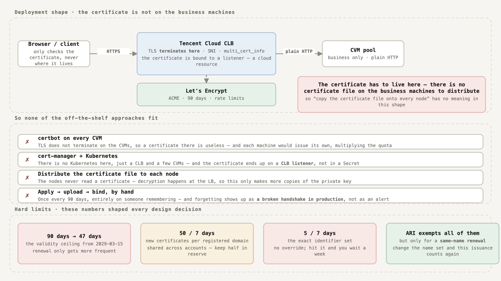

<!-- Detailed reference. Start with README.md for the short introduction. -->
<p align="center">
  <picture>
    <source media="(prefers-color-scheme: dark)" srcset="docs/logo-dark.png">
    
  </picture>
</p>

<p align="center">
  <b>English</b> &nbsp;|&nbsp; <a href="README.zh-CN.md">简体中文</a>
</p>

<p align="center">
  
  
  
  
  <a href="https://github.com/susunola/wecert/actions/workflows/ci.yml"></a>
</p>

# wecert

A cert-manager-style ACME certificate renewer for deployments where **TLS terminates at Tencent Cloud CLB**.

<sub>[← Back to the overview](README.md)</sub>

A cert-manager-style ACME certificate renewer for deployments where **TLS terminates at Tencent Cloud CLB**.

One machine, one binary, one SQLite file. Because decryption happens at the load balancer, there is no node agent and no certificate distribution to manage.

```
┌────────────────────────────────────────────────────┐
│  wecert  (single binary, running on one CVM)       │
│                                                    │
│  ├─ ACME layer (lego's low-level api.Core)         │
│  │    ├─ account key + order URL persisted         │
│  │    ├─ ARI: GetRenewalInfo → renewal window      │
│  │    └─ NewWithOptions{Profile, ReplacesCertID}   │
│  ├─ DNS-01 solver (DNSPod + authoritative NS wait) │
│  ├─ State store (SQLite)                           │
│  └─ Deployer (Tencent Cloud UpdateCertificate…)    │
└────────────────────────────────────────────────────┘
                        │ Tencent Cloud API
                        ▼
             CLB (TLS termination, SNI certificates)
                        │
                        ▼
              N × CVM (runs application code only)
```

---

## Table of Contents

- [Why this exists](#why-this-exists)
- [The four invariants](#the-four-invariants)
- [Key features](#key-features)
- [Tech stack](#tech-stack)
- [Prerequisites](#prerequisites)
- [Quick start](#quick-start)
- [Architecture](#architecture)
- [The certificate lifecycle](#the-certificate-lifecycle)
- [Domains that change often](#domains-that-change-often)
- [Configuration reference](#configuration-reference)
- [Operations](#operations)
- [CLI reference](#cli-reference)
- [Field notes and pitfalls](#field-notes-and-pitfalls)
- [Development](#development)
- [Roadmap](#roadmap)
- [License](#license)

---

## Why this exists

Among Let's Encrypt's rate limits, the painful one is not the 100-SAN ceiling:

| Limit | Value |
|---|---|
| New Orders per Account | 300 / 3 hours |
| New Certificates per Registered Domain | 50 / 7 days (global, shared across accounts) |
| **New Certificates per Exact Set of Identifiers** | **5 / 7 days (no override)** |
| Authorization Failures per Identifier | 5 / hour |

**ARI (RFC 9773) coordinated renewals are exempt from all of these.** The official documentation names the most common way people trip over this: *"reinstalling the client while troubleshooting, or deleting the ACME client's configuration data on every deploy."*

That is what shapes this design: state is precious, and losing it is expensive.

## The four invariants

1. **At most one in-flight order per certificate, and the order URL must be persisted.**
   `Reconcile` looks for a non-expired pending order first and advances it — never creates a new one.
   *Except* when the configured `domains` changed: that order can no longer produce what you asked for, so it is discarded (see [Domains that change often](#domains-that-change-often)).
2. **ARI first, and orders must carry `replaces`.** Without it you don't get the exemption.
3. **A wildcard and its apex write to the same `_acme-challenge` name**, so it must be *write all → verify all → then clean up*, never one at a time.
4. **The desired state is `domains`, not a timestamp.** If the live certificate's SANs don't match the config, reissue immediately rather than waiting for the renewal window — and clean up DNS before deleting authorization rows, because those rows are the only handle on the records.

Invariant 3 is the easiest to get wrong: when signing `example.com` + `*.example.com`, both authorizations' challenge values land on `_acme-challenge.example.com`. Implemented as "write one → verify one → delete one", the second one is guaranteed to fail.

Two further deliberate choices:

- **lego's high-level `certificate.Obtain` is not used.** It calls `newOrder` internally, so the order URL can't be persisted and reused across restarts. The low-level `acme/api` package is used to own the state machine.
- **A new private key is attached to the order, not written over the live key.** Otherwise a failed deployment leaves you with nothing to roll back to. The order's key is only promoted once the new certificate is live.

## Key features

- **No node agent, no certificate files to distribute** — TLS terminates at CLB, so the entire deploy action is a few Tencent Cloud API calls.
- **ARI-driven renewal** with `replaces`, so renewals are exempt from rate limits.
- **Crash-safe by design** — account key, order URL, ARI window, and cloud certificate IDs all live in SQLite. A restart resumes the same order instead of creating a new one.
- **Domain-set reconciliation** — adding or removing a SAN takes effect on the next reconcile, not at the next renewal window.
- **Scales to large SAN lists** — bounded-concurrency DNS propagation probing and authorization polling.
- **Handles wildcard + apex on a shared `_acme-challenge` name** correctly.
- **Idempotent cleanup** — orphaned DNS challenge records are reclaimed automatically, and cloud certificates leaked by failed deploys go into a reaper queue.
- **Prometheus metrics**, with expiry-based alerting as the primary signal.
- **Single static binary** — pure-Go SQLite, `CGO_ENABLED=0`, cross-compiled for linux/amd64, linux/arm64 and darwin/arm64.

## Tech stack

| Component | Choice | Why |
|---|---|---|
| Language | Go 1.26 | Single static binary, no runtime |
| ACME client | [`go-acme/lego`](https://github.com/go-acme/lego) v4.35.2 — low-level `acme/api` | Only the low level allows persisting the order URL |
| DNS | [`miekg/dns`](https://github.com/miekg/dns) | Direct queries to authoritative nameservers |
| DNS provider | DNSPod (own token) or Tencent Cloud DNSPod (CAM credentials) | Supports optional `_acme-challenge` CNAME delegation |
| State | [`modernc.org/sqlite`](https://gitlab.com/cznic/sqlite) | **Pure Go** — enables `CGO_ENABLED=0` static builds |
| Cloud SDK | `tencentcloud-sdk-go` (ssl, clb, dnspod, common) | Certificate upload/rebind and DNS records |
| Metrics | `prometheus/client_golang` | Expiry alerting |
| Config | `gopkg.in/yaml.v3` with `KnownFields(true)` | Unknown fields are an error, not silently ignored |

## Prerequisites

- **Go 1.26+** to build (the module declares `go 1.26.5`).
- **A domain hosted on DNSPod** — either the DNSPod product (`dnspod.cn`) or Tencent Cloud DNSPod.
- **A Tencent Cloud account** with the CLB resources you want the certificate on.
- **Credentials**, one of:
  - a CVM instance role (recommended — temporary credentials, nothing on disk), or
  - a DNSPod API token (if `dns.provider: dnspod`), or
  - a Tencent Cloud CAM key pair (local debugging only).
- **`_acme-challenge` CNAME delegation** is strongly recommended; see [Configuration reference](#configuration-reference).

Optional: `terraform` and `sqlite3` for the end-to-end harness under `testenv/` and `scripts/`.

> **Note on the module path.** `go.mod` declares `github.com/susunola/wecert`, matching the repository, so `go install github.com/susunola/wecert/cmd/wecert@latest` resolves correctly.

## Quick start

### 1. Build

```bash
git clone https://github.com/susunola/wecert.git
cd wecert
make build          # → bin/wecert
make tools          # → bin/wecert-preflight, bin/wecert-clbverify
```

Static release binaries for three platforms:

```bash
make release        # → dist/wecert_{linux_amd64,linux_arm64,darwin_arm64} + SHA256SUMS
```

### 2. Run the preflight checks

Before touching any cloud resource, verify credentials, DNS ownership and NS delegation. All checks are read-only.

```bash
export TENCENTCLOUD_SECRET_ID=...
export TENCENTCLOUD_SECRET_KEY=...
./bin/wecert-preflight -domain example.com
```

### 3. Install on the target CVM

```bash
sudo ./install.sh ./dist/wecert_linux_amd64
```

This creates the `wecert` system user, installs the binary to `/usr/local/bin/wecert`, prepares `/etc/wecert/`, and installs the systemd units. It does **not** start the service or fill in your token.

Or do it by hand:

```bash
sudo useradd --system --no-create-home --shell /usr/sbin/nologin wecert
sudo mkdir -p /etc/wecert
sudo chown root:wecert /etc/wecert
sudo chmod 750 /etc/wecert

sudo cp config.example.yaml /etc/wecert/config.yaml
sudo chown root:wecert /etc/wecert/config.yaml
sudo chmod 640 /etc/wecert/config.yaml
```

### 4. Validate against staging first

`config.example.yaml` already points at Let's Encrypt **staging**, deliberately: `install.sh` installs that file as your production config, so the default has to be the safe one. Registering a real ACME account in production consumes a limited resource (10 per IP per 3 hours).

```bash
sudo -u wecert ./bin/wecert -config /etc/wecert/config.yaml -dry-run
```

`-dry-run` validates the config and initialises the ACME account, but signs and deploys nothing.

### 5. Start the service

```bash
sudo cp bin/wecert /usr/local/bin/
sudo cp deploy/systemd/wecert.service /etc/systemd/system/
sudo systemctl daemon-reload
sudo systemctl enable --now wecert
```

Once staging is green end to end, switch `acme.directory` to production:

```yaml
directory: https://acme-v02.api.letsencrypt.org/directory
```

### 6. The first issuance needs one manual bind

On first issuance, Tencent Cloud has no "old certificate → cloud resource" binding to look up, so wecert only uploads the certificate and logs the new CertId:

```
certificate uploaded; waiting for a one-time manual bind in the CLB console cert=example-com uploadedCertId=xxxxxxxx
```

Bind it once in the CLB console. Every renewal after that is automatic: [`UpdateCertificateInstance`](https://www.tencentcloud.com/document/product/1007/57981) makes Tencent Cloud find the listeners bound to the old certificate and swap them.

**There is no listener inventory to maintain here**, and other certificates on the same listener (SNI) are not disturbed.

Once bound, the next pass notices by itself and confirms it:

```
confirmed the certificate is bound to cloud resources cert=example-com certId=xxxxxxxx resources=2
```

This matters because `wecert_certificate_deployed` reads `deploy_confirmed`. Without a re-check, a certificate you bound by hand would keep reporting 0 until its next renewal — up to 90 days on the `classic` profile, for a certificate that is serving traffic the whole time. The check is read-only (`CreateCertificateBindResourceSyncTask`, cached) and stops once confirmed.

Once a rebind is confirmed, the log line becomes:

```
certificate renewed and live cert=example-com notAfter=… deployedCertId=xxxxxxxx
```

> Tencent Cloud also offers `UploadUpdateCertificateInstance`, which keeps the certificate ID stable and replaces the content in place — but it requires a whitelist ticket and is CLB-only. Nice to have, not needed; the public `UpdateCertificateInstance` is sufficient.

---

## Architecture

### Directory structure

```
wecert/
├── cmd/
│   ├── wecert/               # main daemon / one-shot runner
│   ├── preflight/            # read-only pre-flight checks (creds, DNS, NS delegation, leftovers)
│   └── clbverify/            # independent evidence from the CLB API, for test assertions
├── internal/
│   ├── acme/
│   │   ├── client.go         # account load/register → api.Core
│   │   ├── keys.go           # key generation, CSR (DER), leaf parsing, coverage/drift checks
│   │   ├── ari.go            # RFC 9773 certID + renewal window, deterministic scheduling
│   │   ├── dns.go            # DNS-01 solver: present, propagation wait, cleanup
│   │   ├── manager.go        # Manager struct, Reconcile decision entry point
│   │   ├── manager_flow.go   # advance / solveChallenges / authz polling / TXT cleanup
│   │   ├── manager_done.go   # download / deploy / discardOrder / backoff
│   │   └── manager_renew.go  # renewal decision (ARI) / issue
│   ├── config/               # declarative desired state and validation
│   ├── deploy/               # TencentCLB deployer and credential sources
│   ├── metrics/              # Prometheus collectors
│   ├── reconcile/            # reconcile loop over all certificates
│   └── state/                # SQLite persistence
├── deploy/
│   ├── cam-policy-*.json     # minimal CAM policies (test / stage-AB)
│   └── systemd/
│       ├── wecert.service        # long-running daemon
│       ├── wecert-once.service   # single pass (Type=oneshot)
│       └── wecert-once.timer     # hourly trigger for the oneshot unit
├── docs/
│   ├── logo.png / logo-dark.png        # brand assets (light / dark theme)
│   └── logo-mark.png / logo-mark-dark.png
├── scripts/
│   ├── e2e-test.sh           # full issuance against staging, throwaway state DB
│   └── run-stage-ab.sh       # Terraform + issuance + rebind assertion
├── testenv/                  # Terraform: VPC + CLB + HTTPS listener + optional CVM
├── config.example.yaml
├── e2e-config.example.yaml   # staging configs for the e2e harness
└── Makefile
```

### Reconcile lifecycle

Every certificate follows the same decision path on each pass. **The order of the checks matters** — see [Reconcile decisions](#3-reconcile-decisions) for the diagram.

Two things that diagram does not show, because they are about *when* rather than *what*:

- **An order's identifier set is fixed when it is created.** If the configuration changes while it is still open, the order is discarded and rebuilt, rather than holding to "never create a new order" and advancing one whose CSR can no longer finalize.
- **Discarding an order cleans DNS first.** The authorization rows are the only record of which TXT records were written, so deleting them first leaks those records permanently.

The ACME order state machine is in [Order state machine](#4-order-state-machine).

### State schema

A single SQLite file. Losing it means re-ordering, which collides with the rate limits — so it is the one thing to back up.

```
accounts                      -- one ACME account per directory URL
├── directory       TEXT PK   -- e.g. https://acme-v02.api.letsencrypt.org/directory
├── kid             TEXT      -- account URL
├── private_key_pem BLOB      -- account key
└── updated_at      INTEGER

certificates                  -- live state per configured certificate
├── name                 TEXT PK
├── not_after            INTEGER   -- expiry (unix seconds); 0 = never issued
├── cert_url             TEXT
├── cert_pem / key_pem   BLOB      -- the currently served certificate + key
├── issued_at            INTEGER
├── ari_cert_id          TEXT      -- base64url(AKI).base64url(serial)
├── ari_window_start/end INTEGER   -- ARI suggested window
├── ari_checked_at       INTEGER   -- throttles renewalInfo queries
├── ari_retry_after_ns   INTEGER   -- honours the server's Retry-After
├── consecutive_failures INTEGER   -- drives exponential backoff
├── next_attempt_at      INTEGER
├── last_error           TEXT
├── deployed_cert_id     TEXT      -- Tencent Cloud CertId
├── deploy_confirmed     INTEGER   -- 1 = confirmed live, not merely uploaded
└── updated_at           INTEGER

orders                        -- at most ONE in-flight order per certificate
├── cert_name    TEXT PK
├── order_url    TEXT NOT NULL -- must be persisted; losing it re-orders
├── finalize_url TEXT          -- POST the CSR here, NOT to order_url
├── cert_url     TEXT
├── expires_at   INTEGER
├── status       TEXT
├── key_pem      BLOB          -- this order's key, NOT the live key
├── identifiers  TEXT          -- canonical identifier set at creation time
└── updated_at   INTEGER

authorizations                -- one row per identifier, keyed by authz URL
├── cert_name, authz_url PK
├── identifier           TEXT
├── status               TEXT
├── challenge_url/token  TEXT
├── txt_name, txt_value  TEXT      -- the only handle for cleaning up the record
├── presented            INTEGER   -- written to DNS (propagation not guaranteed)
└── challenge_sent       INTEGER   -- CA notified to verify

retired_certificates          -- uploaded certificates awaiting reaping
├── cert_id    TEXT PK
├── cert_name  TEXT
└── retired_at INTEGER
```

Migrations run on `Open` and add missing columns in place (`PRAGMA table_info` + `ALTER TABLE`). **Upgrades never require rebuilding the database.** The file, its `-wal` and its `-shm` are all created `0600`, because they contain the ACME account key and every certificate's private key.

### Packages

| Package | Responsibility |
|---|---|
| `internal/config` | Desired state: parse, validate, normalise. Domain normalisation (lowercase, dedupe), per-label validation, profile Max Names enforcement, `DomainKey` for order-insensitive set comparison. |
| `internal/state` | SQLite persistence with in-place migrations. |
| `internal/acme` | The state machine: issuance, DNS-01, ARI scheduling, deployment, cleanup, backoff. |
| `internal/deploy` | The `Deployer` interface, the Tencent CLB implementation, and credential sources (CVM role metadata or static). |
| `internal/reconcile` | Iterates all certificates; one certificate failing never blocks the others; publishes metrics. |
| `internal/metrics` | Prometheus collectors. |

## The certificate lifecycle

Seven diagrams covering the whole path, from the problem this exists to solve through to "the old certificate is deleted from the cloud". They are also available as a single interactive page — with working links between the figures and a print/PDF button — at [docs/certificate-lifecycle.en.html](docs/certificate-lifecycle.en.html); the images below are that same page rendered.

Regenerate them with `make diagrams`. The **Chinese page is the source of truth**; the English page and both sets of images are generated from it through a translation table, and the build fails loudly if anything is left untranslated — so the two languages cannot drift apart silently.

The build also *measures* every label in a real browser, in **both** languages, and refuses to render if any of them overflows its box or if two `<text>` labels collide. English runs longer than Chinese, so "fits in Chinese, overflows in English" is a real failure mode — the first run caught exactly that.

### 0. The problem this solves



TLS terminates at the CLB and the business machines hold no certificate file at all, so the premise every conventional approach rests on does not hold here: certbot on each CVM has nowhere to put a certificate, cert-manager assumes Kubernetes and produces a Secret rather than a listener binding, and copying the file to each node only makes more copies of a private key that nothing reads.

What makes it hard rather than merely awkward is the last row. ARI exempts renewals from every rate limit — but **only for a same-name renewal**, so changing the name set once burns one issuance. "Domains change all the time" is this project's premise, so every other design decision follows from making "add a domain" avoid producing a new issuance.

### 1. System map — who owns what, who only reads


Left to right is the transfer of authority: **intent** (written by a human) → **inference** (disposable) → **contract** (machine-written) → **execution** (must be stable) → **external**. Each layer has a different failure mode, and that is exactly why they are separated.

### 2. Intent → contract — the inference pipeline


Note that red is only attached where a freeze actually happens. A bad declaration in stage 2 excludes just that one; a group that exceeds the SAN limit in stage 3 keeps only that group's previous revision. **Neither freezes the whole run** — a single typo must not stop every certificate from being updated.

**Wildcard-first is where the quota is saved:**

| Action | Without a wildcard | With `*.example.com` declared |
|---|---|---|
| Add `foo.example.com` | 1 re-issuance | **0** — the SAN set does not change |
| Import 50 subdomains | 50 → the weekly allowance is gone | **0** |
| Add `a.b.example.com` | 1 re-issuance | 1 — needs `*.b.example.com` |
| Add `example.net` | 1 re-issuance | 1 — a different registered domain is a different certificate |

> **A wildcard is never invented.** Declaring `*.example.com` means the certificate can complete a handshake for *any* subdomain — that is a privilege expansion, and it has to be an explicit declaration rather than something the grouping logic decides on your behalf. For the same reason `*.example.com` does **not** cover `example.com`; both need declaring.

### 3. Reconcile decisions


The checks are **ordered**. The first branch that matches decides what this pass does, and if none match the answer is "do nothing" — which is what happens on the overwhelming majority of passes.

> **Three invariants decide that order.** (1) At most one in-flight order per certificate, and the order URL is on disk before anything else happens. (2) Renewals are ARI-first and carry `replaces`. (3) A wildcard and its apex share one `_acme-challenge` name, so the TXT records are written together, verified together and cleaned up together. Breaking any of them runs straight into *5 certificates per exact set of identifiers / 7 days* — and that limit has no override.

### 4. Order state machine


The entire point of this state machine is that **the process can be killed at any moment**. Every state has a corresponding column in `state.db`, and those columns are what decide, after a restart, whether to carry on or to place a new order.

> **The order URL must be on disk immediately after `newOrder` returns, before anything else.** That is the whole of the crash-safety story: without it, a process killed during the few minutes of DNS propagation would place a second order whose identifier set is identical to the first — straight into the exact-set limit, with **no override available**.

The same reasoning explains why an order's identifier set is stored separately: it is fixed when the order is created. If the configuration changes in the meantime, the correct action is to **discard and rebuild** the order, not to honour "never create a new order" and keep advancing one whose CSR can no longer finalize.

### 5. DNS-01 — a wildcard and its apex share one TXT name


This is the easiest part to get wrong and the hardest to notice. `example.com` and `*.example.com` both put their challenge at `_acme-challenge.example.com` — one name, two values.

Handling identifiers one at a time — write, verify, clean, next — means the value written for `*.example.com` gets removed or overwritten before `example.com` is reached. DNSPod allows several TXT records under one name, but the **cleanup has to happen together**, or a challenge that already verified becomes invalid again.

Propagation checking uses a quorum rather than "every authoritative nameserver reachable": in practice one of nine is routinely unreachable (measured: 8 confirm, 0 deny, 1 unreachable). Demanding all of them would never pass. The criterion is **no reachable nameserver denies it, and at least two confirm**.

### 6. The life of one certificate


The axis is drawn for a `classic` 90-day certificate. What actually decides when renewal happens is ARI's `suggestedWindow`; `renewBefore` below it is only the fallback for when ARI is unavailable.

| Profile | Validity | Max Names | Default `renewBefore` |
|---|---|---|---|
| `classic` (default) | 90 days | 100 | 30 days |
| `tlsserver` | 45 days | **25** | 15 days |
| `shortlived` | 160 hours | 25 | 48 hours |

The CA/Browser Forum has scheduled **≤100 days from 2027-03-15 and ≤47 days from 2029-03-15**, so "90 days plus a manual fallback" stops being an option within two years. The desired-state generator caps a certificate at **25** names by default (aligned with `tlsserver`) so that switching profiles later needs no redesign.

### Data ownership

"Losing it" is the column worth remembering: it decides where each piece of state belongs and whether it needs backing up.

| Thing | Written by | Read by | If it is lost |
|---|---|---|---|
| `_wecert.*` TXT declarations | a human / CI | wecert-onboard | **Matters** — after the grace period the names are removed from the certificate |
| `desired-state.yaml` | wecert-onboard | wecert | **Safe** — wecert freezes on the previous revision and alarms |
| `onboard-state.json` | wecert-onboard | wecert-onboard | **Matters** — the grace period resets, so deletion becomes aggressive |
| `desired-state.report.json` | wecert-onboard | a human | **Harmless** — troubleshooting only |
| `state.db` | wecert | wecert | **Disaster** — order URLs, ARI certIDs and CertIds all gone, so orders are re-placed into the exact-set limit |
| The ACME account key | wecert | wecert | **Disaster** — accounts are a limited resource (10 per IP per 3 hours) |

### Failure semantics

Every kind of "cannot read it" has a defined reaction. **None of them treats "unreadable" as "gone".**

| Situation | Reaction | Why |
|---|---|---|
| Declaration source unreadable | **Freeze the whole run**, document untouched | Empty is not the same as gone; acting on it would reissue a certificate with no names |
| CLB guard unreadable | **No deletions at all**, and the guard counts as satisfied | Degrading makes safety disappear along with the dependency, precisely when you need it most |
| Document unreadable (runtime) | Freeze on the last good revision and keep renewing from it | Renewals continue; only new names stop arriving |
| Document unreadable (startup, `enforce`) | **Hard failure, does not start** | Failing to start is loud; "starts but renews nothing" is silent |
| Desired state computes to empty | **Refuse to write**, `-force` does not override | A legitimate empty state and a failed generation look identical in the file |
| Declared set drops by more than 30% | Freeze and alert | A normal decommission does not lose a third of the names |
| More than 25 name-set changes in 7 days | Freeze and alert | Let's Encrypt allows 50 per registered domain per 7 days, shared across accounts |
| Removing a name | Only when **confirmed absent, past the 24h grace period, and unreferenced by any CLB rule** | Deletion is an order of magnitude more dangerous than addition |
| A group exceeds 25 SANs | Keep that group's previous revision | Dropping the group would show wecert a certificate that vanished |
| One declaration is malformed | Exclude just that one, record the reason | A single typo must not stop every certificate from updating |
| One certificate fails to issue | Does not affect the others | One misconfigured certificate holding up every renewal is the most dangerous coupling in automation |
| Near expiry and issuance keeps failing (`failureFallback` on) | Drop the names that keep failing and issue for the rest | Partial availability beats total failure; only names with evidence of individual failure are dropped, and it heals itself |

### The rate-limit arithmetic

| Limit | Allowance | When you hit it | How to avoid it |
|---|---|---|---|
| New Orders / account | 300 / 3 hours | Re-placing orders | Persist the order URL and reuse it after a crash |
| New Certs / registered domain | 50 / 7 days, **shared across accounts** | Frequent changes to the name set | Wildcard-first plus a 25-changes-per-week budget |
| New Certs / **exact identifier set** | 5 / 7 days, **no override** | Reissuing the same name set repeatedly | At most one in-flight order per certificate |
| Authorization failures / identifier | 5 / hour | Retrying a name whose DNS is not configured | Backoff, then hand over to a human |
| **ARI-coordinated renewals** | **exempt from all of the above** | — | The order must carry `replaces` and the identifier set must be unchanged |

That last row is what makes wildcard-first more than an optimisation: **changing the name set makes the issuance a brand-new certificate**, which forfeits the ARI exemption. The cost of "add one domain" therefore has to be driven to nearly zero, and a wildcard is the only way to do that. It is also why the desired-state generator prefers to report "covered by the declared wildcard, 0 issuances" over touching the SAN set.

---

## Domains that change often

A certificate may carry many SANs, and that set changes. Three things exist specifically for this.

**A change takes effect immediately, not at the renewal window.** Every pass compares the configured `domains` against the live certificate's actual SANs — insensitive to order, case and duplicates, and in *both* directions so that removing a domain is caught too. Without this, adding a domain to a `classic` (90-day) certificate would silently wait up to 60 days, and you would believe it had already taken effect.

**An in-flight order cannot block a new domain set.** An order's identifier set is fixed when it is created. If the config changes while the order is still open, the order is discarded and rebuilt — rather than holding to "never create a new order" and advancing one whose CSR can no longer finalize. The `orders.identifiers` column is what makes that judgement possible.

**Domains are normalised before the Max Names check.** These lists are usually pasted in from somewhere else, so duplicates and mixed case are normal. Deduping *after* enforcing the limit would reject a legal 100-domain config because it contained one duplicate.

> ### ⚠️ Changing domains has a quota cost
>
> ARI's renewal exemption requires a *same-identifier* renewal. As soon as you add or remove a domain, that issuance becomes a new certificate and counts against **Certificates per Registered Domain (50 / 7 days, shared across accounts)**.
>
> If you churn identifiers frequently, watch that ceiling. Splitting unrelated services across different registered domains keeps them from competing for the same budget. This is logged as a warning on the drift path.

### Declaring domains dynamically

Everything above assumes the domain set lives in the config file. When domains are added by other people or other systems, `wecert-onboard` moves that judgement out of wecert entirely: domains are declared as `_wecert` TXT records in the DNS zone, the binary turns them into a reviewable desired-state document, and wecert only reads that document. wecert itself never infers anything.

The payoff is quota arithmetic. With `*.example.com` declared, adding `foo.example.com` changes nothing and costs **zero** issuances — against 50 re-issuances for a 50-subdomain import without a wildcard, which is the entire weekly allowance.

Deletion is deliberately an order of magnitude more conservative than addition: a name leaves the certificate only when it has been *confirmed* absent, for longer than the grace period, **and** no CLB rule still references it. See [Desired state](desired-state.md).

## Configuration reference

`config.example.yaml` carries the annotated version.

### Top level

| Field | Required | Default | Description |
|---|---|---|---|
| `statePath` | yes | — | SQLite path. Must be on persistent storage — losing it re-orders. |
| `acme` | yes | — | See below |
| `dns` | yes | — | See below |
| `tencent` | yes | — | See below |
| `metrics` | no | `127.0.0.1:9800` | Prometheus listen address |
| `webhook` | no | — | Event trigger and outbound notifications; see below |
| `desiredState` | no | `mode: static` | Where the desired state comes from; see below |
| `onboarding` | no | — | Policy for `wecert-onboard`. **wecert itself never reads this section.** |
| `probe` | no | enabled | Network-side verification that the deployed certificate is the one actually being served |
| `certificates` | static/observe only | — | At least one. Must be **empty** when `desiredState.mode` is `enforce` |

### `acme`

| Field | Required | Description |
|---|---|---|
| `directory` | yes | ACME directory URL. Staging: `https://acme-staging-v02.api.letsencrypt.org/directory`. Production: `https://acme-v02.api.letsencrypt.org/directory` |
| `email` | yes | Contact address for the ACME account |

### `dns`

The two providers use completely different credentials. Don't mix them up.

| Field | Required | Default | Description |
|---|---|---|---|
| `provider` | no | `dnspod` | `dnspod` uses DNSPod's own API token (dnsapi.cn). `tencentcloud` uses Tencent Cloud CAM credentials (dnspod.tencentcloudapi.com) — recommended, because it shares credentials with deployment and supports `SessionToken` for instance roles. |
| `loginToken` | when `provider: dnspod` | — | DNSPod's own API token, shaped `12345,abcdef…`. **Not** a Tencent Cloud SecretId/SecretKey. |
| `ttl` | no | `600` | TTL for the `_acme-challenge` TXT record. **600 is the floor on DNSPod's free tier** — configuring 60 is rejected with `LimitExceeded.RecordTtlLimit`. Paid tiers can go lower to speed up propagation and cleanup. |
| `propagationTimeout` | no | `5m` | Upper bound on waiting for all authoritative nameservers to see the record |
| `pollingInterval` | no | `5s` | Interval between propagation probes |

#### Strongly recommended: `_acme-challenge` CNAME delegation

CNAME every domain's `_acme-challenge.example.com` into a single zone you control (for example `acme-auth.example.com`). Then:

- onboarding a new domain is one CNAME — no program change and no new zone permission
- CAM needs write access to **one** zone instead of dozens
- switching DNS providers becomes a CNAME change

This is fully supported: `GetChallengeInfo` follows the CNAME and reports the real `EffectiveFQDN`, and propagation waiting targets the delegated zone.

### `tencent`

| Field | Required | Default | Description |
|---|---|---|---|
| `credentialMode` | no | `cvm-role` | `cvm-role` takes temporary credentials from instance metadata (nothing on disk). `static` uses `secretId`/`secretKey` below, or the `TENCENTCLOUD_SECRET_ID` / `TENCENTCLOUD_SECRET_KEY` environment variables (local debugging only). |
| `secretId` / `secretKey` | when `static` | — | CAM key pair. Prefer the environment variables so the config file can be committed and backed up freely. |
| `roleName` | when `cvm-role` | — | The role bound to the CVM instance |
| `resourceTypes` | no | `[clb]` | Resource types for `UpdateCertificateInstance`. `clb` is the common one; `cdn`, `waf`, `tke` and `apigateway` are also supported. |
| `regions` | yes | — | **CLB is a regional resource. List every region that has a CLB.** A missing region is silently not updated and the certificate there expires. |

### `webhook`

Optional. Omit it and wecert only converges on the timer.

| Field | Default | Notes |
|---|---|---|
| `listen` | *(empty — disabled)* | Address for the trigger endpoint |
| `token` | — | **Required when `listen` is set**, minimum 16 characters |
| `notifyURL` | *(empty)* | Optional outbound event target |

The trigger endpoint performs **real issuance** and consumes Let's Encrypt rate-limit quota, so it is never allowed to run unauthenticated. A token shorter than 16 characters is rejected at config load: on this endpoint a weak token is the same as no token.

#### Endpoints

| Method | Path | Auth | Purpose |
|---|---|---|---|
| `POST` | `/hook/reconcile` | yes | Trigger convergence |
| `GET` | `/hook/status` | yes | Per-certificate state, for polling after a trigger |
| `GET` | `/healthz` | no | Liveness (leaks nothing, so probes can reach it) |

Authenticate with either header:

```
Authorization: Bearer <token>
X-Wecert-Token: <token>
```

The trigger body is optional. Omit it to converge everything:

```jsonc
{}                                  // every certificate
{"cert": "example-com"}             // one
{"certs": ["a-com", "b-com"]}       // several
```

It answers `202 Accepted` — not `200` — because convergence is handed to the background and can take minutes (DNS propagation). Waiting would blow up the caller's timeout.

```json
{ "accepted": ["a-com"], "skipped": ["b-com"], "unknown": ["typo-com"] }
```

- `accepted` — now running
- `skipped` — already running, **not** started a second time
- `unknown` — not in the configuration

Poll `/hook/status` for the outcome:

```json
{
  "time": "2026-09-15T18:00:00Z",
  "certificates": [
    { "name": "a-com", "notAfter": "2026-12-14T16:41:58Z", "daysLeft": 89,
      "deployed": true, "deployConfirmed": true, "consecutiveFailures": 0 }
  ]
}
```

#### Why `skipped` matters more than it looks

The timer and an event trigger can land on the same certificate at the same moment. Both would place an order, and that runs straight into **5 certificates per exact set of identifiers per 7 days** — a limit with no override. `StartCert` therefore reserves the slot **synchronously** before handing the work to the background, so the second caller is told "already running" rather than starting a duplicate.

#### Outbound notifications

With `notifyURL` set, every renewal attempt emits:

```json
{ "event": "renewal", "cert": "a-com", "result": "ok", "timestamp": "2026-09-15T18:00:00Z" }
```

`result` is `ok` or `error` (with an `error` field). Delivery is **asynchronous and best-effort**: a slow or dead notification target must never slow down renewal — that is the same class of coupling error as one certificate's failure blocking the others.

### `desiredState`

Which side has the final say over what should exist. The difference between the modes is **authority**, not "how many files get read".

| Field | Required | Default | Description |
|---|---|---|---|
| `mode` | no | `static` | `static` \| `observe` \| `enforce` |
| `path` | observe/enforce | — | Desired-state document. Rejected in `static` mode, because an unused path is almost always a half-finished switch |
| `maxStaleness` | no | `48h` | Warn once the document has not been refreshed for this long |

| Mode | Converges on | Use it for |
|---|---|---|
| `static` | `certificates` in the config | The original behaviour, zero risk |
| `observe` | still `certificates`, **plus** a diff report against the document | The migration window |
| `enforce` | the document | Dynamic issuance |

**Do not jump from `static` to `enforce`.** `observe` signs nothing and only answers "if the document were authoritative, what would be added and what would be removed". The drift data it produces is what tells you how large the debounce window, the group size and the fuses should be — guessing those costs account-level rate limiting.

The document is machine-written and refuses several things on purpose: an empty `certificates` list (indistinguishable from a failed generation, and acting on it would strip every name from every certificate), a `revision` that does not match its contents (hand-edited), and a certificate whose `name` is not derived from its registered domain.

> **Why the name rule is enforced at the contract boundary.** If a certificate name followed the domain set, adding one domain would create a brand-new state row while the old row's order URL, ARI certID and deployed CertID all became orphans. The "at most one in-flight order per certificate" invariant would fail with it, and both orders would fly at once — straight into *5 certificates per exact set of identifiers / 7 days*, which has no override.

### `onboarding`

Policy for the `wecert-onboard` binary. These numbers decide how fast quota is spent and how conservative deletion is, so they live in the config rather than in the code — and they are meant to be tuned from real drift data.

| Field | Default | Description |
|---|---|---|
| `zones` | every visible zone | DNS zones to enumerate for `_wecert` declarations |
| `requireCLBRule` | `true` | Guard 1: a declaration only counts when a CLB rule serves the name |
| `allowlist` | no restriction | Registered domains that may be issued for. Normalised to eTLD+1 |
| `maxNames` | `25` | Max SAN entries per certificate. Aligned with `tlsserver` so switching profiles later needs no redesign |
| `profile` / `keyType` | `classic` / `ecdsa-p256` | Defaults for generated certificates |
| `deploy` | `true` | Default deploy flag for generated certificates |
| `gracePeriod` | `24h` | How long a name must be **confirmed** absent before it may be removed |
| `budget` / `budgetWindow` | `25` / `168h` | Name-set changes allowed per window. Let's Encrypt allows 50 per registered domain per 7 days, shared across accounts; half of that is the budget |
| `dropThreshold` | `0.30` | Freeze when the declared name set shrinks by more than this fraction |
| `statePath` | `<out>.state.json` | Grace-period and budget bookkeeping. Must be persistent: an in-memory grace period never elapses across runs |
| `reportPath` | `<out>.report.json` | Per-hostname decision report |

See [Desired state](desired-state.md) for the `_wecert` declaration syntax, the five fuses, the systemd units and the troubleshooting table.

### `probe`

Every pass, wecert dials a real TLS connection to each deployed certificate's first few names and reads back the certificate the far end **actually serves**. This is the only evidence in the system that does not trust the cloud control plane — and the gap between "the API says the rebind succeeded" and "the browser gets this certificate" is exactly where CLB problems live: the rebind is asynchronous (measured ~15s), and another certificate can be winning SNI.

| Field | Default | Description |
|---|---|---|
| `enabled` | `true` | Turn the probe off if wecert runs somewhere that cannot reach the VIP |
| `port` | `443` | TCP port to dial |
| `timeout` | `10s` | Per-attempt timeout. Cross-AZ handshakes routinely take 3–5s; too small a value causes false alarms, and false alarms train people to ignore alarms |
| `maxHostsPerCert` | `3` | Names probed per certificate. Not exhaustive on purpose: 25 handshakes per pass has linearly growing cost and diminishing returns |
| `minValidFor` | unset | Fail when the served certificate has less than this left. Redundant with the expiry alarm, but it asserts *the served* certificate is valid, not *the recorded* one |

Wildcards are skipped — `*.example.com` has no address of its own to dial. A certificate that is entirely wildcards is therefore never probed, and is logged at debug level when that happens.

Two metrics keep the failure modes apart:

- `wecert_certificate_probe_errors_total{host}` — the probe could not run at all (resolve, dial or handshake failed). This is an environment problem, not a certificate problem.
- `wecert_certificate_probe_match{host}` — the probe completed and compares what was served against what was deployed. `0` means a rebind did not take effect, or another certificate is winning SNI.

> **The comparison is against what was deployed, not "some valid certificate".** `wecert_certificate_probe_not_after_timestamp_seconds` (read over the network) sitting next to `wecert_certificate_not_after_timestamp_seconds` (read from the state store) is what makes "the rebind silently did nothing" visible.

### `failureFallback`

When a certificate is close to expiry and issuance keeps failing, drop the names whose authorizations keep failing and issue for the rest. **Partial availability beats total failure** — one misconfigured DNS record out of 25 names should not take the other 24 down with it.

**Off by default.** It changes what the certificate covers, which is a security decision, and it is not the job of the program to make it on your behalf. When it fires it logs at **ERROR** and stays visible in metrics until it clears.

| Field | Default | Description |
|---|---|---|
| `enabled` | `false` | Turn it on |
| `afterFailures` | `5` | Consecutive failures before falling back at all |
| `beforeExpiry` | `168h` | Only inside this window. Too large a value is a net loss: you would be trading a perfectly valid certificate for one with names missing |
| `minIdentifierFailures` | `3` | A name must have failed this many times before it may be dropped. `1` would let a single network blip drop a name |
| `failureWindow` | `24h` | How long a failure record stays relevant |
| `minNames` | `1` | Refuse to fall back if it would leave fewer than this. That would be total failure wearing a disguise |

**It only ever drops names that failed individually.** With no per-identifier evidence it does nothing — dropping names at random would sacrifice the healthy ones too, which is worse than not falling back at all. It also requires a live certificate: without one there is no "keep what you have" argument, only "sign for less".

**It heals itself.** A dropped name is never attempted again, so it can never earn its way back through a success. Instead the failure record ages out after `failureWindow`, the name stops being dropped, and the next pass retries the full set. Fix the DNS and recovery takes at most one window — no extra retry state, no manual step.

`wecert_certificate_fallback_active{cert}` and `wecert_certificate_fallback_dropped_names{cert}` are what you alert on. A fallback that stays active is an unresolved problem, not a steady state.

### `certificates[]`

| Field | Required | Default | Description |
|---|---|---|---|
| `name` | yes | — | Unique name; the state key. Changing it looks like a brand-new certificate. |
| `domains` | yes | — | SAN list. Lowercased and deduped automatically. Order is preserved — `classic` promotes the first `dNSName` to the CN. |
| `profile` | no | `classic` | ACME profile, which determines the Max Names ceiling |
| `keyType` | no | `ecdsa-p256` | `ecdsa-p256`, `ecdsa-p384`, `rsa2048`, `rsa4096` |
| `renewBefore` | no | derived from profile | Only a fallback when ARI is unavailable: `classic` 30d, `tlsserver` 15d, `shortlived` 48h |
| `deploy.enabled` | no | `false` | If false, certificates stay in local state only and are never pushed to Tencent Cloud |

#### Profiles and SAN limits

"100 domains per SAN" is profile-dependent, not a fixed number:

| Profile | Validity | Max Names |
|---|---|---|
| `classic` (default) | 90 days | 100 |
| `tlsserver` | 45 days | **25** |
| `shortlived` | 160 hours | 25 |

The CA/Browser Forum has scheduled **≤100 days from 2027-03-15 and ≤47 days from 2029-03-15**, so "90-day certificates plus manual fallback" stops being an option within two years.

**Keep each certificate to 25 domains or fewer.** That aligns with `tlsserver`'s ceiling (so switching profiles later needs no re-architecture) and bounds the blast radius: domains in one certificate succeed, fail and expire together.

> A wildcard covers exactly one label: `*.example.com` does **not** include `a.b.example.com`. Multi-level naming needs a separate `*.b.example.com` per subzone, or explicit entries. `*.*.example.com` is not allowed. Wildcards can only use DNS-01.

## Operations

### systemd deployment

Two mutually exclusive modes. **Enable only one** — they share one state database, and "at most one in-flight order per certificate" holds only inside a single process.

This is **enforced, not just documented**: opening the state database takes an exclusive `flock` on `<statePath>.lock`, and a second process fails at startup with

```
the state database is already held by another wecert process (lock file: /var/lib/wecert/state.db.lock)
```

Without it, a daemon and a timer running together would each keep their own view of "one in-flight order per certificate" and place two orders for the same exact identifier set — *5 certificates per exact set of identifiers / 7 days*, a limit with no override.

The lock is advisory and kernel-managed, so a `kill -9` releases it immediately; there is no stale PID file to clean up. `-dry-run` deliberately skips it, because it almost always runs while the daemon is up and it never places an order.

**Daemon mode (default):** reconcile every hour, plus a jittered startup pass.

```bash
sudo systemctl enable --now wecert
journalctl -u wecert -f
```

**Timer mode:** run once and exit, hourly.

```bash
sudo systemctl disable --now wecert.service
sudo systemctl enable --now wecert-once.timer
```

| Unit | Purpose |
|---|---|
| `wecert.service` | Long-running daemon, `Restart=on-failure`. `StateDirectory=wecert` (`0700`), `ProtectSystem=strict`. |
| `wecert-once.service` | `Type=oneshot`, `-once`, `TimeoutStartSec=45min`. The timeout allows for `propagationTimeout + authzWait + orderWait` **per certificate**, and reconcile is serial across certificates — raise it if you have many. |
| `wecert-once.timer` | `OnBootSec=2min`, `OnUnitActiveSec=1h`, `RandomizedDelaySec=10min`, `Persistent=true`. Declares `Unit=wecert-once.service` explicitly. |

The timer's `Unit=` is not decorative: without it, systemd resolves the service of the same name, so if the file is ever renamed to `wecert.timer` the timer silently points at the **daemon** and timer mode stops working while appearing fine.

### Metrics and alerting

`/metrics` exposes:

| Metric | Use |
|---|---|
| `wecert_certificate_not_after_timestamp_seconds` | **Primary expiry signal** |
| `wecert_certificate_deployed` | `1` only when the certificate is confirmed live on a cloud resource; `0` while merely uploaded and awaiting the manual bind |
| `wecert_certificate_consecutive_failures` | Persistently > 0 means manual intervention |
| `wecert_certificate_ari_window_start_timestamp_seconds` | Start of the ARI window |
| `wecert_reconcile_total{cert,result}` | Reconcile pass counter |
| `wecert_certificate_probe_match{host}` | 1 when the certificate served is the one deployed; 0 when a rebind did not take effect or another certificate is winning SNI |
| `wecert_certificate_probe_not_after_timestamp_seconds{host}` | `notAfter` read back over the network — compare against the state-store value |
| `wecert_certificate_probe_errors_total{host}` | The probe could not run at all. An environment problem, not a certificate problem |
| `wecert_certificate_fallback_active{cert}` | 1 while a partial certificate is being served because some names keep failing |
| `wecert_certificate_fallback_dropped_names{cert}` | How many names that partial certificate is missing |
| `wecert_desired_state_age_seconds` | Age of the desired-state document. A growing value means `wecert-onboard` stopped running |
| `wecert_orphaned_certificates` | Certificates in the state store but absent from the desired state. They will not be renewed |

Alert on `not_after`, **not** on "did the renewal job error" — the latter stays silent when the program is quietly broken:

```promql
# classic (90 days) — alert 21 days ahead
(wecert_certificate_not_after_timestamp_seconds - time()) / 86400 < 21

# tlsserver (45 days) — alert 10 days ahead
(wecert_certificate_not_after_timestamp_seconds - time()) / 86400 < 10
```

**The black-box probe is built in.** Every pass, wecert dials 443 for each deployed certificate's first few names and reads back the certificate that is actually served — that is the `probe` section above. It catches "the program thinks it succeeded but nothing took effect", which is the most insidious failure, and trusting only your own state database cannot see it. If wecert runs somewhere that cannot reach the VIP, either disable `probe.enabled` or run `wecert-probe` on a schedule from a machine that can; leaving it on from a machine that cannot is harmless but useless, and shows up as `probe_errors` climbing while `probe_match` stays put.

> `wecert_certificate_deployed` reflects `deploy_confirmed`, not "has this ever been uploaded". Uploading is not binding: on first issuance somebody still has to bind it in the CLB console, and until then it reads 0. Without that distinction the gauge turns green while the certificate is not actually serving.

**The metrics listener fails fast.** If the port cannot be bound, wecert exits rather than logging and continuing — `/metrics` is the only expiry alerting path, and a silently dead endpoint means certificates expire unnoticed. The operational consequence, by design: two instances on one host is a startup failure.

### Tencent Cloud permissions

With a **CVM role** (the default), credentials come from instance metadata and never touch disk:

```
dnspod:DescribeRecordList / CreateRecord / DeleteRecord   scope: your single acme-auth zone
ssl:UploadCertificate
ssl:DescribeCertificate
ssl:DeleteCertificate
ssl:UpdateCertificateInstance
```

`deploy/cam-policy-test.json` and `deploy/cam-policy-stage-ab.json` contain ready-made policies.

The deployer passes `IsCheckResource=true` on delete: if any cloud resource still references a certificate, the delete is refused. Being unable to delete costs quota; deleting a referenced certificate costs an HTTPS outage. `ReapRetired` logs the refusal and retries on the next pass.

## CLI reference

### `wecert`

| Flag | Default | Description |
|---|---|---|
| `-config` | `config.yaml` | Config file path |
| `-state` | — | Override `statePath` (useful for tests) |
| `-once` | `false` | Run one pass and exit (for systemd timer / cron) |
| `-interval` | `1h` | Reconcile interval in daemon mode |
| `-log-level` | `info` | `debug` \| `info` \| `warn` \| `error` |
| `-dry-run` | `false` | Validate config and initialise the ACME account; sign and deploy nothing |
| `-version` | `false` | Print version and exit |

### `wecert-preflight` (read-only)

| Flag | Description |
|---|---|
| `-domain` | Domain to verify: SSL read access, DNSPod ownership, NS delegation, leftover `_acme-challenge` records |
| `-list-certs` | List the account's SSL certificates (ID / alias / domains / status) |
| `-prune-certs` | Delete wecert-uploaded certificates (alias prefix `wecert/`) |
| `-yes` | Skip the interactive confirmation for `-prune-certs` |

> `-prune-certs` matches on the alias prefix `wecert/`, which wecert applies to **every** certificate it uploads — including the one currently serving. The command therefore prints what it will delete and requires confirmation; a non-interactive stdin is treated as "no". Read the list.

The NS delegation check is the highest-value one: a domain hosted elsewhere, or a half-finished nameserver migration, means the TXT records you write are never seen — the classic "the write succeeded but the CA's validation fails", which burns one authorization-failure credit per attempt without saying why.

### `wecert-clbverify` (independent evidence)

| Flag | Description |
|---|---|
| `-region` | Region, e.g. `ap-guangzhou` |
| `-clb` | CLB instance ID |
| `-listener` | Listener ID; defaults to the first listener under that CLB |
| `-expect` | Expected primary certificate ID; asserts equality |
| `-not-expect` | Certificate ID that must not appear; asserts inequality |
| `-wait` | Poll for up to this long for the expected certificate (the rebind is asynchronous) |
| `-raw` | Dump the raw `DescribeListeners` JSON for troubleshooting |

Assertions need `-wait`: `UpdateCertificateInstance` returns as soon as the task is created, and the rebind happens in the background (measured around 15s).

```bash
./bin/wecert-clbverify -region ap-guangzhou -clb lb-xxxx -listener lbl-yyyy \
  -expect apJdfyPa -not-expect apJRqDsC -wait 90s
```

## Field notes and pitfalls

Every item below was only exposed by **actually running it**. Unit tests catch none of them.

### Tencent Cloud CLB: enabling SNI stops it binding a primary certificate

With `SniSwitch=true`, CLB **silently ignores** the primary `certificate_id` in `CreateListener`. The certificate has to go through `multi_cert_info`.

"Silently" means:

| What you see | What you assume |
|---|---|
| Listener created, no error | bound |
| `certificate_id` has a value in Terraform state | bound |
| `terraform plan` says `No changes` | bound (the provider doesn't read bindings back, so drift is invisible) |
| `DescribeListeners` returns no `Certificate` field at all | — |
| `UpdateCertificateInstance` reports `CertificateDeployInstanceEmpty` | **the only signal that exposes it** |

The result: an HTTPS listener with nothing bound, while every routine check looks healthy.

### Uploading is not binding

`UpdateCertificateInstance` returning success only means the task was created. The actual rebind is asynchronous — and, as the next section shows, it is not atomic either. Asserting without polling misreports it as a failure. This is why `DeployConfirmed` is tracked separately from `DeployedCertID`: driving the `deployed` gauge from "did the upload return an ID" would light it up the moment a certificate is uploaded, before anyone has bound it.

Until v0.4.0 that flag was only ever set by an issuance that performed a rebind, so a hand-bound certificate read 0 until its next renewal. It is now also set by a read-only binding check on each pass (see *The first issuance needs one manual bind*).

**The `Status` field of the bind-resource task is not documented, and guessing it wrong fails silently.** Measured: `Status == 1` means *done*. The first implementation assumed the usual "0 means done", which made confirmation wait until it timed out — and because the result list is also empty on the very first query (server cache not yet built), an early version concluded "0 bindings" and reported a correctly-bound certificate as unbound. Both traps are pinned by tests in `internal/deploy/tencent_test.go`.

### The rebind is asynchronous **and not atomic**

`UpdateCertificateInstance` does rebind every resource bound to the old certificate — but not at the same moment. Measured on one 2-SAN certificate bound to two CLB forwarding rules:

| Time after the call returned | test.alpha | test.beta |
|---|---|---|
| 30s | new certificate | **old certificate** |
| 60s | new certificate | new certificate |

Across runs the window ranged from roughly 30 seconds to 2 minutes.

During a renewal this is harmless — both certificates are valid — but **any verification must poll**. We first read a single sample as "only one of the two rules got rebound", and that was wrong. For a first issuance of a brand-new name it matters more: the name may have no certificate at all during that window.

The authoritative check is a TLS handshake from outside: `openssl s_client -servername <domain>` against the CLB, reading the served `notBefore`/`notAfter`. Nothing self-reported comes close.

### `DescribeListeners` does not read certificate bindings back

So it cannot be the only verification. The reliable independent signals are `UpdateSyncProgress.TotalCount` in the `UpdateCertificateInstance` response ("how many resources was that old certificate bound to") and `CreateCertificateBindResourceSyncTask`. A `TotalCount` of 0 means the certificate was never actually bound — the easiest failure to overlook.

### DNSPod's free tier has a TTL floor of 600

Configuring `ttl: 60` is rejected with `LimitExceeded.RecordTtlLimit`. The default is 600.

### Authoritative nameservers must not require "all reachable"

DNSPod has 9 authoritative nameservers. Requiring all 9 to respond and agree means that if any one is unreachable from your network, "propagation complete" is never satisfied — which is a different question from whether the record propagated (Let's Encrypt validates from *its* locations). The rule is now: **no reachable NS denies the value, and at least one confirms** — with at least two confirmations required when the zone has more than one nameserver, so "only one NS was reachable" does not pass. A single-nameserver zone must still be able to pass; requiring two confirmations would make such a zone wait forever.

Measured log: `confirmed 8 / denied 0 / unreachable 1` — the original strict implementation failed on this.

### lego API traps

- `Orders.UpdateForCSR`'s parameter is named `orderURL`, but it **POSTs directly to whatever URL you give it**. Pass the `finalize` URL; passing the order URL makes LE treat it as POST-as-GET and reject it with `POST-as-GET requests must have an empty payload`.
- `Orders.Get` **does not populate** `ExtendedOrder.Location` (only the newOrder response header carries it), so it cannot be used as the order URL.
- `UpdateForCSR` base64url-encodes the bytes itself, so it takes **DER, not PEM**. PEM makes LE report an asn1 `tags don't match`.
- `sender.newHTTPSOnly` forces `https` and **wraps** the `http.Client.Transport` you pass in — so a test double must be a TLS server.

### Discarding an order without cleaning DNS leaks records

`cleanup` had a single call site (after all authorizations became valid), while `discardOrder` had three. The path most likely to be taken:

```
round N:    awaitAuthorizations exceeds its 3-minute budget → failure recorded, TXT stays
round N+1:  the order is now "ready" → advance goes straight to finalize
            ← solveChallenges, the only caller of cleanup, is skipped entirely
            → download → discardOrder → authorization rows deleted
            ↑ the TXT stays in DNSPod forever, and the handle on it is gone
```

DNSPod's free tier has a TTL floor of 600, 9 authoritative nameservers and a measured 78s propagation — so **"authorization validation spans rounds" is the normal case, not an exception.**

Cleanup now happens before rows are deleted, unified into an idempotent `cleanupOrphanTXT` that also covers "order deleted but authorizations not" and SIGKILL. It deletes the rows it successfully cleaned and **keeps rows it cannot locate**, because `TxtName` is the only remaining handle for manual cleanup.

### systemd timer unit names must match the service

`wecert.timer` resolves to the same-named service `wecert.service` — the long-running daemon. If the intent is to run `wecert-once.service` periodically, the file must be `wecert-once.timer`, or declare `Unit=wecert-once.service`. Relying on the implicit same-name rule means a rename silently points the timer at the daemon.

### A failed deploy leaks the uploaded certificate

`Deploy` deliberately returns the already-uploaded certificate ID even on error. The caller used to discard it, so the certificate ended up in neither `certificates` nor `retired_certificates` — invisible to `ReapRetired` forever. Combined with `Repeatable=true` (no dedup on upload), each failure leaked one certificate and eventually hit the account's upload quota, bypassing the exact mechanism meant to prevent that.

### `state.db` is created with the process umask, i.e. 0644

The file holds the ACME account key and every certificate's private key. The systemd path is protected by `StateDirectoryMode=0700`, but manual runs (the `-dry-run` above, both e2e scripts putting the DB in `/tmp`) have no such cover. `state.Open` now creates the directory `0700` and the file — plus `-wal` and `-shm`, which are copies of the keys — as `0600`. Permission should not depend on the caller's umask.

---

## Development

```bash
make check      # the full gate: fmt-check + vet + test -race
make test       # unit tests
make test-race  # with the race detector (DNS probing and authz polling are concurrent)
make fmt-check  # check only, no writes — this is what CI runs
make vet        # static analysis
make build      # → bin/wecert
make release    # cross-compile linux/amd64, linux/arm64, darwin/arm64
make cover      # coverage
```

CI (`.github/workflows/ci.yml`) runs `gofmt` + `vet` + `test -race` + cross-compile. Gating `gofmt` separately is necessary because `go vet` does not check formatting. The more concrete reason: a single type error can fail 4 of 9 packages — including the main binary — and `go vet` and `go test` fail along with it. Without CI, nobody finds out.

### Test layout

69 test cases across 13 files.

| Area | Files |
|---|---|
| ACME state machine | `ari_test.go`, `manager_test.go`, `reconcile_test.go`, `cleanup_test.go`, `dns_test.go` |
| Config / domains | `config_test.go`, `domains_test.go` |
| State | `state_test.go`, `migrate_test.go`, `deploy_confirmed_test.go`, `umask_*_test.go` |
| Deploy | `tencent_test.go` |

### What the tests pin down

Not line coverage — the properties most easily broken by a later change:

- orders and their private keys surviving a restart (losing the order URL collides with the 7-day limit)
- ARI renewal times being deterministic (re-randomising on every restart pushes the renewal out indefinitely)
- same-name TXT records being stored independently (a wildcard and its apex share one name)
- **cleaning DNS before discarding an order**, plus self-healing reclamation when no order exists
- **domain-set drift triggering a reissue**, and *no order at all* when the sets match (a false positive here would burn the identifier-set quota within days)
- discarding an in-flight order whose identifier set no longer matches
- in-place upgrades of legacy state databases (both `orders.identifiers` and `certificates.deploy_confirmed` were added later; upgrades must never require rebuilding)
- the state file being `0600`, verified under `umask 000`
- concurrent probing preserving record order (a mismatch shows up as "a few domains never validate")

The `Manager`'s full issuance flow is still not covered end to end — that needs a real ACME server. `Reconcile`'s **decision path** is driven by a fake TLS ACME directory asserting *whether an order was attempted*. For full coverage, run [pebble](https://github.com/letsencrypt/pebble) (Let's Encrypt's official test ACME server, consuming no real quota) in CI.

> Every new regression test was **mutation-verified**: revert the fix, confirm the test goes red, then restore from a checksum-verified backup. A test that has never been red does not count — an inverted assertion, a `t.Skip`, or a loop that never runs will happily stay green.

### End-to-end harness

The repository ships `e2e-config.example.yaml` (single domain) and `e2e-config-wildcard.yaml`
(wildcard + apex, i.e. the shared `_acme-challenge` name case). `e2e-test.sh` defaults to
`./e2e-config.yaml`, which is gitignored — copy one into place first:

```bash
make build tools
cp e2e-config.example.yaml e2e-config.yaml     # then fill in your token and test domain
./scripts/e2e-test.sh test1.example.com ./e2e-config.yaml
```

Runs a full issuance against staging with a throwaway state database, refusing to proceed unless the config points at staging. It asserts the invariants: no leftover orders after a successful issuance, an ARI certID was constructed, and a second pass reuses the same order URL rather than creating a new one.

`scripts/run-stage-ab.sh` additionally provisions real cloud resources with Terraform (VPC + CLB + HTTPS listener + placeholder certificate), presets the placeholder's CertId into the state database, runs wecert, and then verifies from the CLB API — independently — that the listener's CertId actually changed. It plans by default; creating resources requires an explicit `--yes`.

## Roadmap

**Verified in a real environment** (Let's Encrypt staging + a real Tencent Cloud account + the real domain `atomwangnus.com`):

- [x] **Stage A: wildcard issuance**
  - wildcard + apex sharing one `_acme-challenge` name
  - authoritative-NS propagation wait (measured 78s, 9 nameservers, arbitration tolerating one unreachable)
  - certificate uploaded to Tencent Cloud SSL
  - **ARI certID constructed and ARI window queried** (the precondition for the rate-limit exemption)
  - idempotence: no order at all when no renewal is due; failures reuse the same order instead of rebuilding
- [x] **Stage B: `UpdateCertificateInstance` rebinding a CLB**
  - listener bound to `apJRqDsC` → wecert issued a new certificate → automatically rebound to `apJdfyPa`
  - independently confirmed from the CLB API (asynchronous task, ~15s)
  - validated the core assumption: **Tencent Cloud finds the bound resources itself, so wecert maintains no listener inventory**

**Done:**

- [x] **Desired-state providers: issue when a domain is added, not only on expiry.** Lands in `internal/spec` (the contract and providers), `internal/group` (wildcard-first grouping), `internal/onboarding` (declaration parsing plus the five safety invariants) and `cmd/wecert-onboard`. Migration path is `static → observe → enforce`. Rationale: [docs/desired-state-providers.md](docs/desired-state-providers.md) · operator guide: [docs/desired-state.md](docs/desired-state.md) · diagrams: [docs/certificate-lifecycle.en.html](docs/certificate-lifecycle.en.html).
- [x] **External black-box probe (dial 443 and check the effective `notAfter`).** Lands in `internal/probe` and `cmd/wecert-probe`: every pass dials the first few names of each deployed certificate and compares what is *actually served* against what was *deployed*. "The API says the rebind succeeded" and "the browser gets this certificate" are two different things — the rebind is asynchronous, and another certificate can be winning SNI. Neither is visible through the control plane. See the `probe` section above.
- [x] **Cross-process exclusive lock (`flock`) on `state.db`.** Acquired in `state.Open` on `<statePath>.lock`; a second process fails at startup instead of double-ordering. Kernel-managed, so a crash releases it — no stale PID file. See the systemd deployment section above.
- [x] **Abstract `Manager`'s dependency on `*api.Core` behind a narrow `API` interface.** `internal/acme/api.go` now defines the seven operations the Manager actually needs, plus `NewAPI(core)` as the lego adapter. The payoff is not the indirection — it is that the order state machine can finally be asserted on *call order and arguments*, without an HTTP server. Three invariants now have tests that would have been awkward before: the order URL is on disk before the next ACME call, renewals carry `replaces`, and the CSR is DER posted to the finalize URL.
- [x] **Failure fallback: split into subsets before expiry.** `failureFallback` drops only the names whose authorizations individually keep failing, only when the certificate is inside the expiry window, and only if enough names remain. Off by default, logged at ERROR, self-healing once the failure records age out. See the `failureFallback` section above.

**Outstanding:**

- [ ] Read the DNSPod token from a file or systemd `LoadCredential`, so it isn't plaintext in `config.yaml`
- [ ] Switch to `profile: tlsserver` (45 days) and run a complete renewal cycle fully automatically
- [ ] Test the SNI multi-certificate case with `multi_cert_info` ("replacing one doesn't disturb another")
- [ ] Stage C: CVM + systemd + CVM role credential path (`testenv/` is ready, `create_cvm=true`)
- [ ] `state.Store` has no transaction support, so the `download()` epilogue (promote the new certificate → retire the old → discard the order) commits in separate statements. A partial failure leaves an orphaned cloud certificate or a false failure alarm.

## License

No license file is present in this repository. Absent a license, the default is all rights reserved — **add one before distributing or accepting external contributions.**
---

<sub>[← Back to the overview](README.md) · [简体中文](README.reference.zh-CN.md)</sub>
