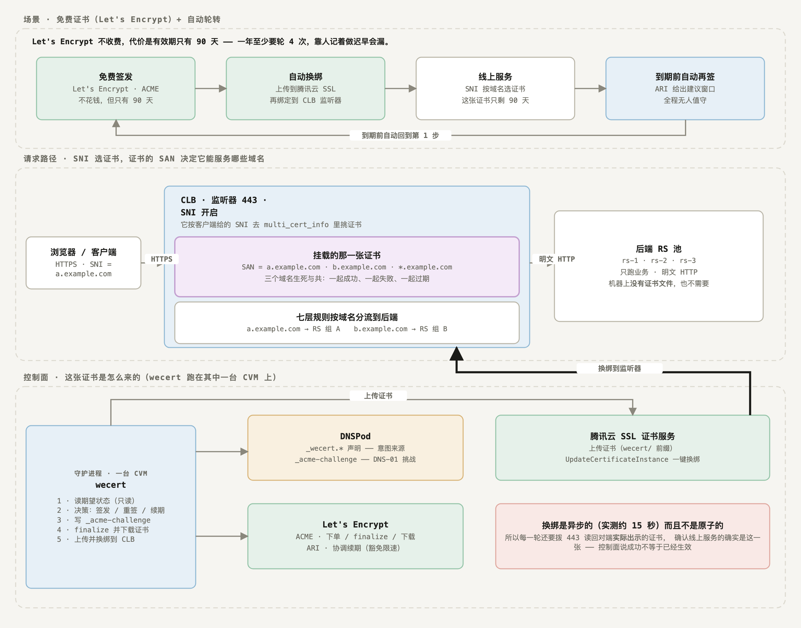
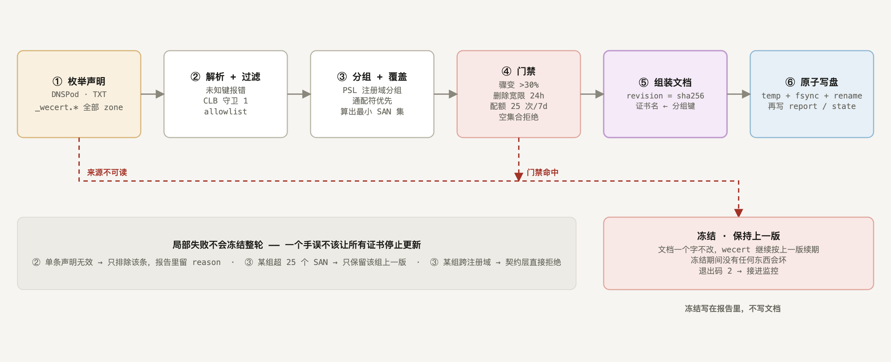
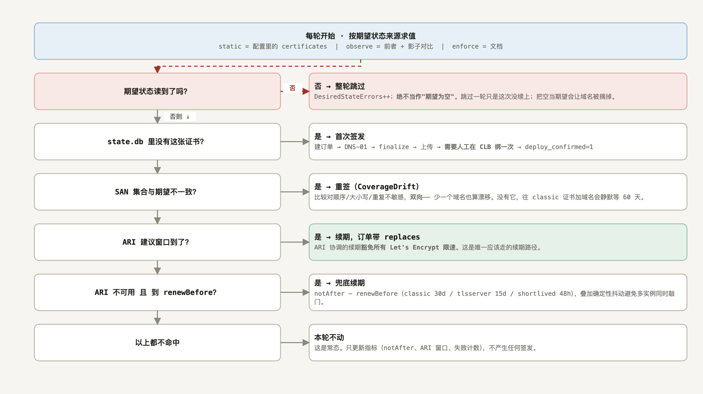
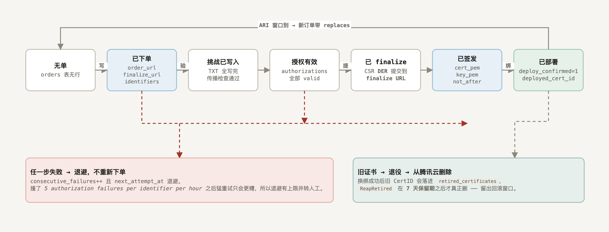
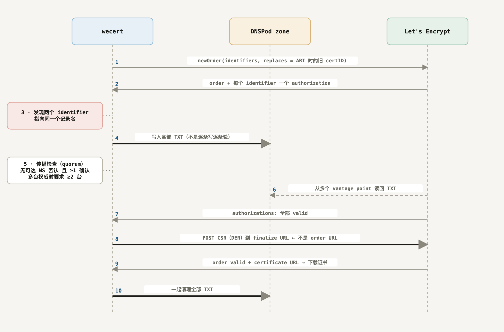
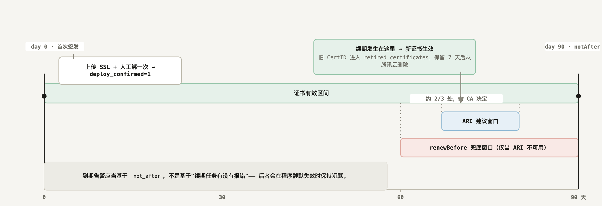

<!-- 完整参考文档。简介请看 README.zh-CN.md。 -->
<p align="center">
  <picture>
    <source media="(prefers-color-scheme: dark)" srcset="docs/logo-dark.png">
    
  </picture>
</p>

<p align="center">
  <a href="README.md">English</a> &nbsp;|&nbsp; <b>简体中文</b>
</p>

<p align="center">
  
  
  
  
  <a href="https://github.com/susunola/wecert/actions/workflows/ci.yml"></a>
</p>

# wecert

一个 cert-manager 风格的 ACME 证书自动续期器，面向 **TLS 在腾讯云 CLB 终结** 的部署形态。

<sub>[← 返回简介](README.zh-CN.md)</sub>

一个 cert-manager 风格的 ACME 证书自动续期器，面向 **TLS 在腾讯云 CLB 终结** 的部署形态。

一台机器、一个二进制、一个 SQLite 文件。因为解密发生在 CLB，整个系统**不需要节点 agent，也不需要分发证书文件**。

```
┌────────────────────────────────────────────────────┐
│  wecert（单二进制，跑在一台 CVM 上）                │
│                                                    │
│  ├─ ACME 层（lego 低层 api.Core）                  │
│  │    ├─ account key + order URL 落盘（重启复用）  │
│  │    ├─ ARI: GetRenewalInfo → 续期窗口            │
│  │    └─ NewWithOptions{Profile, ReplacesCertID}   │
│  ├─ DNS-01 solver（DNSPod + 权威 NS 传播等待）     │
│  ├─ State store（SQLite）                          │
│  └─ Deployer（腾讯云 UpdateCertificateInstance）   │
└────────────────────────────────────────────────────┘
                        │ 腾讯云 API
                        ▼
              CLB（TLS 终结，SNI 多证书）
                        │
                        ▼
              多台 CVM（只跑业务）
```

---

## 目录

- [为什么是这么设计的](#为什么是这么设计的)
- [四条不变量](#四条不变量)
- [核心特性](#核心特性)
- [技术栈](#技术栈)
- [前置条件](#前置条件)
- [快速开始](#快速开始)
- [架构](#架构)
- [证书生命周期](#证书生命周期)
- [域名随时会改](#域名随时会改)
- [配置参考](#配置参考)
- [运维](#运维)
- [命令行参考](#命令行参考)
- [实测踩过的坑](#实测踩过的坑)
- [开发](#开发)
- [现状与下一步](#现状与下一步)
- [License](#license)

---

> **注意：程序的日志与错误信息是英文的。** 本文档保留中文说明，但所有
> 日志、CLI 帮助和错误文本都直接用程序的实际输出（英文），以免文档与实现不一致。


## 为什么是这么设计的

Let's Encrypt 的速率限制里，最要命的不是那 100 个 SAN 上限，而是：

| 限制 | 值 |
|---|---|
| New Orders per Account | 300 / 3 小时 |
| New Certificates per Registered Domain | 50 / 7 天（全局，跨账号共享） |
| **New Certificates per Exact Set of Identifiers** | **5 / 7 天（无 override）** |
| Authorization Failures per Identifier | 5 / 小时 |

而 **ARI（RFC 9773）协调的续期豁免所有速率限制**。官方文档点名了最常见的踩坑方式：*"重复安装客户端排障，或者每次部署都删掉 ACME 客户端的配置数据"*。

这就是本项目设计的出发点：状态很贵，丢掉它的代价很高。

## 四条不变量

1. **每张证书任何时刻最多一个进行中的订单，且 order URL 必须落盘。**
   `Reconcile` 先找有没有未过期的 pending order 并推进它，绝不新建。
   *例外*是配置里的 `domains` 变了 —— 那种订单已经签不出你要的东西，必须丢弃
   （见[域名随时会改](#域名随时会改)）。
2. **ARI 优先，且下单必须带 `replaces`。** 不带就拿不到那个豁免。
3. **wildcard 与 apex 会写到同一个 `_acme-challenge` 名字上**，所以必须
   *全部写入 → 全部验证 → 才统一清理*，绝不能一条一条来。
4. **期望状态是 `domains`，不是时间。** 生效证书的 SAN 与配置不一致就立刻重签，
   而不是等续期窗口；并且丢弃订单之前必须先把 DNS 里的 TXT 收干净 ——
   授权行是那些记录唯一的线索。

第 3 条是实际写代码时最容易踩的坑：签 `example.com` + `*.example.com` 时，两个授权的 challenge 值都落在 `_acme-challenge.example.com` 上。如果按"写一条 → 验一条 → 删一条"的直觉实现，第二个必然失败。

另外两个刻意的设计选择：

- **不用 lego 高层的 `certificate.Obtain`。** 它在内部自己 `newOrder`，无法把 order URL 持久化并跨重启复用。用低层 `acme/api` 自己掌控状态机。
- **新私钥挂在订单上，不直接覆盖生效私钥。** 否则部署失败就会连回滚的资本都没有。只有新证书成功上线后，才把订单私钥提升为生效私钥。

## 核心特性

- **不需要节点 agent，也不需要分发证书文件** —— TLS 在 CLB 终结，整个部署动作就是几次腾讯云 API 调用。
- **ARI 驱动的续期**，下单带 `replaces`，因此豁免速率限制。
- **崩溃安全** —— account key、order URL、ARI 窗口、云端 CertId 全部落盘 SQLite。重启会接着推进同一张订单，而不是重新下单。
- **域名集合收敛** —— 增删一个 SAN 在下一轮收敛就生效，不必等到续期窗口。
- **支撑大 SAN 列表** —— DNS 传播探测与授权轮询都是有界并发。
- **正确处理 wildcard + apex 共用同一个 `_acme-challenge` 名字**。
- **幂等清理** —— 残留的 DNS challenge 记录会被自动回收；部署失败漏下的云端证书会进回收队列。
- **Prometheus 指标**，以到期时间为告警主信号。
- **单个静态二进制** —— SQLite 是纯 Go 实现，`CGO_ENABLED=0`，交叉编译 linux/amd64、linux/arm64、darwin/arm64。

## 技术栈

| 组成 | 选型 | 理由 |
|---|---|---|
| 语言 | Go 1.26 | 单个静态二进制，无运行时依赖 |
| ACME 客户端 | [`go-acme/lego`](https://github.com/go-acme/lego) v4.35.2 —— 低层 `acme/api` | 只有低层才能把 order URL 持久化 |
| DNS | [`miekg/dns`](https://github.com/miekg/dns) | 直接查询权威 NS |
| DNS 服务商 | DNSPod 自有 Token 或腾讯云 DNSPod（CAM 凭证） | 支持可选的 `_acme-challenge` CNAME 委派 |
| 状态 | [`modernc.org/sqlite`](https://gitlab.com/cznic/sqlite) | **纯 Go**，这才使 `CGO_ENABLED=0` 静态编译可行 |
| 云 SDK | `tencentcloud-sdk-go`（ssl、clb、dnspod、common） | 证书上传/重绑定 + DNS 记录 |
| 指标 | `prometheus/client_golang` | 到期告警 |
| 配置 | `gopkg.in/yaml.v3` 且开 `KnownFields(true)` | 未知字段直接报错，不静默忽略 |

## 前置条件

- **Go 1.26+**（`go.mod` 声明 `go 1.26.6`，这个补丁版修掉了 `govulncheck` 列出的标准库漏洞）。
- **托管在 DNSPod 的域名** —— DNSPod 自有产品（`dnspod.cn`）或腾讯云 DNSPod 都可以。
- **腾讯云账号**，且账号下有你要绑证书的 CLB 资源。
- **凭证**，三者之一：
  - CVM 实例角色（推荐 —— 临时凭证，密钥不落盘）；
  - DNSPod API Token（当 `dns.provider: dnspod` 时）；
  - 腾讯云 CAM 密钥对（仅建议本地调试）。
- **强烈建议配置 `_acme-challenge` CNAME 委派**，见[配置参考](#配置参考)。

可选：`terraform` 和 `sqlite3`，用于 `testenv/` 与 `scripts/` 下的端到端测试环境。

> **关于 module 路径。** `go.mod` 声明的是 `github.com/susunola/wecert`，与仓库地址一致，`go install github.com/susunola/wecert/cmd/wecert@latest` 可以正常解析。

## 快速开始

### 1. 编译

```bash
git clone https://github.com/susunola/wecert.git
cd wecert
make build          # → bin/wecert
make tools          # → bin/wecert-preflight, bin/wecert-clbverify
```

三个平台的静态发布产物：

```bash
make release        # → dist/wecert_{linux_amd64,linux_arm64,darwin_arm64} + SHA256SUMS
```

### 2. 先跑前置检查

在动任何云资源之前，验证凭证、域名归属和 NS 委派。这些检查全部是只读的。

```bash
export TENCENTCLOUD_SECRET_ID=...
export TENCENTCLOUD_SECRET_KEY=...
./bin/wecert-preflight -domain example.com
```

### 3. 装到目标 CVM 上

```bash
sudo ./install.sh ./dist/wecert_linux_amd64
```

脚本会创建 `wecert` 系统用户、装二进制到 `/usr/local/bin/wecert`、准备 `/etc/wecert/`、安装 systemd unit。它**不会**启动服务，也不会替你填 token。

手工执行等价于：

```bash
sudo useradd --system --no-create-home --shell /usr/sbin/nologin wecert
sudo mkdir -p /etc/wecert
sudo chown root:wecert /etc/wecert
sudo chmod 750 /etc/wecert

sudo cp config.example.yaml /etc/wecert/config.yaml
sudo chown root:wecert /etc/wecert/config.yaml
sudo chmod 640 /etc/wecert/config.yaml
```

### 4. 先对着 staging 验证

`config.example.yaml` 里 `acme.directory` 默认就是 Let's Encrypt **staging**，这是刻意的：`install.sh` 会把这份文件直接装成生产配置，所以默认值必须是安全的那个。在生产环境注册真实 ACME 账号会消耗有限资源（10 个 / IP / 3 小时）。

```bash
sudo -u wecert ./bin/wecert -config /etc/wecert/config.yaml -dry-run
```

`-dry-run` 只校验配置并初始化 ACME 账号，不签发也不部署。

### 5. 启动服务

```bash
sudo cp bin/wecert /usr/local/bin/
sudo cp deploy/systemd/wecert.service /etc/systemd/system/
sudo systemctl daemon-reload
sudo systemctl enable --now wecert
```

staging 全流程跑通之后，再把 `acme.directory` 切到生产：

```yaml
directory: https://acme-v02.api.letsencrypt.org/directory
```

### 6. 首次签发需要人工绑一次

首次签发时腾讯云侧还没有"旧证书 → 云资源"的绑定关系可查，所以 wecert 只会上传证书并打印出 CertId：

```
certificate uploaded; waiting for a one-time manual bind in the CLB console cert=example-com uploadedCertId=xxxxxxxx
```

去 CLB 控制台绑定一次即可。之后每次续期都由 [`UpdateCertificateInstance`](https://www.tencentcloud.com/zh/document/product/1007/57981) 自动完成 —— 腾讯云自己会去找绑定了旧证书的 CLB 监听器并换掉。

**这里不需要维护监听器清单**，同一监听器上的 SNI 多证书也不会被误覆盖。

绑好之后，下一轮收敛会自己发现并确认：

```
confirmed the certificate is bound to cloud resources cert=example-com certId=xxxxxxxx resources=2
```

这一条很关键：`wecert_certificate_deployed` 读的是 `deploy_confirmed`。如果没有这个回查，
你手工绑好的证书会一直报 0，直到下次续期为止 —— classic profile 下最长 **90 天**，
而这段时间里它其实一直在正常服务。这个检查是只读的
（`CreateCertificateBindResourceSyncTask`，带缓存），确认一次之后就不再查。

重绑定确认生效后，日志变成：

```
certificate renewed and live cert=example-com notAfter=… deployedCertId=xxxxxxxx
```

> 腾讯云另有一个 `UploadUpdateCertificateInstance`，能让证书 ID 保持不变、内容原地替换，但**需要提工单开白名单**且只支持 CLB。属于锦上添花，不必等 —— 公开的 `UpdateCertificateInstance` 已经够用。

---

## 架构

### 目录结构

```
wecert/
├── cmd/
│   ├── wecert/               # 主守护进程 / 单轮执行
│   ├── preflight/            # 只读前置检查（凭证、DNS 归属、NS 委派、残留记录）
│   └── clbverify/            # 从 CLB API 独立取证，用于测试断言
├── internal/
│   ├── acme/
│   │   ├── client.go         # 账号加载/注册 → api.Core
│   │   ├── keys.go           # 密钥生成、CSR（DER）、叶子解析、覆盖与漂移检查
│   │   ├── ari.go            # RFC 9773 certID 与续期窗口、确定性调度
│   │   ├── dns.go            # DNS-01 solver：写入、等待传播、清理
│   │   ├── manager.go        # Manager 结构，Reconcile 决策入口
│   │   ├── manager_flow.go   # advance / solveChallenges / 授权轮询 / TXT 清理
│   │   ├── manager_done.go   # download / 部署 / discardOrder / 退避
│   │   └── manager_renew.go  # 续期决策（ARI）/ issue
│   ├── config/               # 声明式期望状态与校验
│   ├── deploy/               # TencentCLB 部署器与凭证来源
│   ├── metrics/              # Prometheus 采集器
│   ├── reconcile/            # 遍历所有证书的收敛循环
│   └── state/                # SQLite 持久化
├── deploy/
│   ├── cam-policy-*.json     # 最小化 CAM 策略（test / stage-AB）
│   └── systemd/
│       ├── wecert.service        # 常驻守护进程
│       ├── wecert-once.service   # 单轮执行（Type=oneshot）
│       └── wecert-once.timer     # 每小时触发 oneshot
├── docs/
│   ├── logo.png / logo-dark.png        # 品牌资源（浅色 / 暗色主题）
│   └── logo-mark.png / logo-mark-dark.png
├── scripts/
│   ├── e2e-test.sh           # 对 staging 跑完整签发，用临时状态库
│   └── run-stage-ab.sh       # Terraform + 签发 + 重绑定断言
├── testenv/                  # Terraform：VPC + CLB + HTTPS 监听器 + 可选 CVM
├── config.example.yaml
├── e2e-config.example.yaml   # 端到端脚本用的 staging 配置
└── Makefile
```

### 收敛生命周期

每张证书在每一轮都走同一条决策路径。**检查的先后顺序是有讲究的** —— 图见[收敛决策](#3-收敛决策)。

有两件事图上看不出来，因为它们讲的是*什么时候*而不是*做什么*：

- **订单的 identifier 集合在创建时就固定了。** 如果它还开着的时候配置变了，正确动作是丢弃并重建订单，而不是遵守"绝不重新下单"去推进一张 CSR 已经无法 finalize 的订单。
- **丢弃订单必须先清 DNS。** 授权行是"写过哪些 TXT"的唯一记录，先删它们会让那些记录永久泄漏在 zone 里。

ACME 订单状态机见[订单状态机](#4-订单状态机)。

### 状态库结构

只有一个 SQLite 文件。丢了它就会重新下单，从而撞上速率限制 —— 所以这是唯一需要备份的东西。

> 完整表清单（9 张，含每列含义）在 [README.reference.md](README.reference.md#state-schema) 的同一节；
> 下面只列四张最常被查询的表，避免第三份会过期的拷贝。最新的两列是
> `authorizations.challenge_prepared_at`（挑战被选中的时刻，用来判断权威否认是否可信）与
> `revoke_requests.cert_identity`（吊销请求点名的是哪张证书），
> `retired_certificates` 另外保留归档的 `cert_pem`/`key_pem`（回滚与吊销都要用）。

```
accounts                      -- 每个 directory URL 一个 ACME 账号
├── directory       TEXT PK   -- 例如 https://acme-v02.api.letsencrypt.org/directory
├── kid             TEXT      -- 账号 URL
├── private_key_pem BLOB      -- 账号私钥
└── updated_at      INTEGER

certificates                  -- 每张配置证书的运行时状态
├── name                 TEXT PK
├── not_after            INTEGER   -- 到期时间（unix 秒）；0 表示还没签发
├── cert_url             TEXT
├── cert_pem / key_pem   BLOB      -- 当前生效的证书与私钥
├── issued_at            INTEGER
├── ari_cert_id          TEXT      -- base64url(AKI).base64url(serial)
├── ari_window_start/end INTEGER   -- ARI 建议窗口
├── ari_checked_at       INTEGER   -- 节流 renewalInfo 查询
├── ari_retry_after_ns   INTEGER   -- 遵守服务端给的 Retry-After
├── consecutive_failures INTEGER   -- 驱动指数退避
├── next_attempt_at      INTEGER
├── last_error           TEXT
├── deployed_cert_id     TEXT      -- 腾讯云 CertId
├── deploy_confirmed     INTEGER   -- 1 = 确认已在云资源生效，而非仅仅上传
└── updated_at           INTEGER

orders                        -- 每张证书最多一条进行中的订单
├── cert_name    TEXT PK
├── order_url    TEXT NOT NULL -- 必须落盘；丢了就会重新下单
├── finalize_url TEXT          -- CSR POST 到这里，不是 order_url
├── cert_url     TEXT
├── expires_at   INTEGER
├── status       TEXT
├── key_pem      BLOB          -- 本订单的私钥，不是生效私钥
├── identifiers  TEXT          -- 下单那一刻的规范 identifier 集合
└── updated_at   INTEGER

authorizations                -- 每个 identifier 一行，按 authz URL 区分
├── cert_name, authz_url PK
├── identifier           TEXT
├── status               TEXT
├── challenge_url/token  TEXT
├── txt_name, txt_value  TEXT      -- 清理 DNS 的唯一线索
├── presented            INTEGER   -- 已写入 DNS（不保证传播完成）
└── challenge_sent       INTEGER   -- 已通知 CA 去验证

retired_certificates          -- 已上传、等待回收的证书
├── cert_id    TEXT PK
├── cert_name  TEXT
└── retired_at INTEGER
```

迁移在 `Open` 时执行，用 `PRAGMA table_info` + `ALTER TABLE` 原地补列。
**升级永远不会要求你删库重建。** 主库文件、`-wal` 和 `-shm` 都以 `0600` 创建，因为里面有 ACME 账号私钥和每张证书的私钥。

### 包职责

| 包 | 职责 |
|---|---|
| `internal/config` | 期望状态：解析、校验、规范化。域名小写化与去重、逐标签校验、profile 上限约束、`DomainKey`（顺序无关的集合比较）。 |
| `internal/state` | SQLite 持久化与原地迁移。 |
| `internal/acme` | 状态机：签发、DNS-01、ARI 调度、部署、清理、退避。 |
| `internal/deploy` | `Deployer` 接口、腾讯云 CLB 实现、凭证来源（CVM 角色元数据或静态）。 |
| `internal/reconcile` | 遍历所有证书；单张失败绝不阻塞其它；发布指标。 |
| `internal/metrics` | Prometheus 采集器。 |

## 证书生命周期

七张图，从"它要解决什么问题"一路画到"旧证书从云上删掉"。它们也在同一份可交互页面里 —— 图之间有可点的跳转，还有一个打印/存 PDF 的按钮：[docs/certificate-lifecycle.html](docs/certificate-lifecycle.html)；下面这些就是那份页面渲染出来的图。

重新生成用 `make diagrams`。**中文页是唯一的事实来源**，英文页和两套图都由翻译表从它生成；只要有东西没译到，构建就直接报错 —— 所以两种语言不可能悄悄漂移。

它还会在真实浏览器里**逐语言**量每一个标签：有任何一个溢出盒子、或者两个 `<text>` 标签互相压住，就拒绝出图。英文比中文长，所以"中文放得下、英文溢出"是个真实的失败模式 —— 第一次跑就抓到了两处。

### 0. 部署形态：免费证书在 CLB 上自动轮转



这套系统要解决的场景就是最上面那条带子：**Let's Encrypt 的证书不花钱，代价是有效期只有 90 天** —— 一年至少要轮 4 次，靠人记着做迟早会漏。

腾讯云自带的免费 DV 并不能替代它：**那是单域名证书，不支持 SAN，也不支持通配符**。手上只要有几个域名，就得每个域名一张证书、每条证书各自维护一条轮转。而 Let's Encrypt 一张证书最多能装 100 个名字、还支持通配符，几个域名（含 `*.example.com`）可以合成一张证书、只轮转一条 —— 下面画的那张多 SAN 证书能成立，前提就在这里。

所以重点不是"wecert 能签发"，而是"到期前它已经自己换好了，全程不用人管"。

请求带着 SNI 到 CLB。CLB 按客户端给的名字去 `multi_cert_info` 里挑证书，七层规则再按域名分流到后端 RS 池。`wecert` 就跑在其中一台 CVM 上：读 DNSPod 里的 `_wecert.*` 声明、写 `_acme-challenge` 记录、向 Let's Encrypt 取证书、上传到腾讯云 SSL 并换绑监听器。

这个形态里有两件容易被忽略的事：

- **后端 RS 完全不参与 TLS。** 解密发生在 CLB，所以证书是一份*云端资源*而不是几个文件。把 certbot 装在每台 RS 上拿不到任何好处，而假设"证书最终写进一个 Secret"的工具在这里也没有落点。
- **共用一张证书的域名生死与共。** SNI 只决定*用哪一张*，真正决定"能不能服务这个域名"的是那张证书的 SAN。所以 `a.example.com` 和 `b.example.com` 一旦进了同一张证书，其中一个的 DNS 出问题就会把另一个一起拖下水。

第二条是其余一切设计的出发点 —— 通配符优先分组、期望状态、以及到期前降级，都是因为它。

### 1. 系统全景：谁拥有什么、谁只读什么


从左到右是权限的传递：**意图**（人写）→ **推断**（可丢弃）→ **契约**（机器写）→ **执行**（必须稳）→ **外部**。每一层的失败模式都不一样，这正是它们被拆开的原因。

### 2. 意图 → 契约：推断侧流水线



注意红色只挂在真正会冻结的地方。阶段 2 里单条声明写错只排除那一条；阶段 3 里某组超过 SAN 上限只保留该组上一版。**两者都不冻结整轮** —— 一个手误不该让所有证书停止更新。

**通配符优先省下的是配额：**

| 动作 | 没有通配符 | 已声明 `*.example.com` |
|---|---|---|
| 加 `foo.example.com` | 1 次重签 | **0 次** —— SAN 集合根本不变 |
| 批量导入 50 个子域 | 50 次，周配额直接见底 | **0 次** |
| 加 `a.b.example.com` | 1 次重签 | 1 次 —— 需要 `*.b.example.com` |
| 加 `example.net` | 1 次重签 | 1 次 —— 另一个注册域就是另一张证书 |

> **通配符不会被凭空造出来。** 声明 `*.example.com` 意味着这张证书能对**任意**子域完成握手 —— 那是权限扩张，必须是一个显式声明的动作，不能由分组逻辑替人决定。同理，`*.example.com` **不覆盖** `example.com`，两个都要显式声明。

### 3. 收敛决策



判断是**有序**的。从上往下第一个命中的分支决定这一轮做什么，全都不命中就是"本轮不动" —— 而那是绝大多数轮次的正常结果。

> **三条不变量决定了这个顺序。** ① 每张证书最多一个在途订单，且 order URL 先落盘再干活；② 续期一律 ARI 优先并带 `replaces`；③ 通配符与顶点共用同一个 `_acme-challenge` 名字，所以 TXT 必须一起写、一起验、一起清。违反任何一条都会直接撞上 *5 certificates per exact set of identifiers / 7 days* —— 而那条限速没有 override。

### 4. 订单状态机



这个状态机的全部意义是**让进程随时可以被杀掉**。每个状态都在 `state.db` 里有对应字段，重启之后靠它们决定"接着跑"还是"重新下单"。

> **order URL 必须在 `newOrder` 返回之后立刻落盘，在任何别的事情之前。** 这就是崩溃安全的全部依赖：如果没有它，进程在 DNS 传播那几分钟里被杀掉就会再下一单，而那一单的 identifier 集合与前一单完全相同 —— 直接撞上 exact-set 限速，且**没有任何 override 可以申请**。

同一个道理也解释了为什么订单的 identifier 集合被单独存下来：订单创建时它就固定了。如果这期间配置变了，正确动作是**丢弃并重建订单**，而不是遵守"绝不重新下单"去推进一张 CSR 已经无法 finalize 的订单。

### 5. DNS-01：通配符和顶点共用一个 TXT 名字



这是最容易写错、也最难发现的一段。`example.com` 和 `*.example.com` 的挑战记录都叫 `_acme-challenge.example.com` —— 同一个名字、两个值。

按 identifier 逐个处理 —— 写一条、验一条、清一条 —— 意味着轮到 `example.com` 时，为 `*.example.com` 写进去的值已经被清掉或者被覆盖了。DNSPod 允许同一个名字下有多条 TXT，但**清理必须一起做**，否则已经验过的那个挑战会重新失效。

传播检查用 quorum 而不是"全部权威 NS 可达"：实测 9 个里总有 1 个不可达（实测 *确认 8 / 否认 0 / 不可达 1*）。要求全部可达会让验证永远通不过。判据是**没有任何可达的 NS 否认，且至少 2 个确认**。

### 6. 一张证书的一生



时间轴按 `classic` 的 90 天画。真正决定续期时刻的是 ARI 的 `suggestedWindow`；下面的 `renewBefore` 只是 ARI 拿不到时的兜底。

| Profile | 有效期 | Max Names | 默认 `renewBefore` |
|---|---|---|---|
| `classic`（默认） | 90 天 | 100 | 30 天 |
| `tlsserver` | 45 天 | **25** | 15 天 |
| `shortlived` | 160 小时 | 25 | 48 小时 |

CA/Browser Forum 已经排定 **≤100 天从 2027-03-15 起、≤47 天从 2029-03-15 起**，所以"90 天 + 人工兜底"两年内就不是选项了。期望状态生成器默认把单证书上限设成 **25**（与 `tlsserver` 对齐），就是为了将来切 profile 时不用改架构。

### 数据所有权

"丢了会怎样"这一列是最值得记住的：它决定了每份状态该放在哪、该不该备份。

| 东西 | 谁写 | 谁读 | 丢了会怎样 |
|---|---|---|---|
| `_wecert.*` TXT 声明 | 人 / CI | wecert-onboard | **有事** —— 宽限期之后域名从证书里移除 |
| `desired-state.yaml` | wecert-onboard | wecert | **安全** —— wecert 冻结在上一版并告警 |
| `onboard-state.json` | wecert-onboard | wecert-onboard | **有事** —— 宽限期归零，删除变激进 |
| `desired-state.report.json` | wecert-onboard | 人 | **无所谓** —— 只影响排障 |
| `state.db` | wecert | wecert | **灾难** —— order URL、ARI certID、CertID 全丢，重新下单撞 exact-set 限速 |
| ACME 账号私钥 | wecert | wecert | **灾难** —— 账号是有限资源（每 IP 每 3 小时最多 10 个） |

### 失败语义

每一种"读不到"都有明确的反应。**没有一种会把"读不到"当成"没有了"。**

| 情况 | 反应 | 为什么 |
|---|---|---|
| 声明来源读不到 | **整轮冻结**，文档一个字不改 | 空 ≠ 没了。照做会重签一张不含域名的证书 |
| CLB 守卫读不到 | **不做任何删除**，且守卫视为"通过" | 降级会让安全性随故障一起消失，而你恰好在那时最需要它 |
| 文档读不到（运行期） | 冻结在最后一版，继续按它续期 | 续期不停，只是新域名进不来 |
| 文档读不到（启动期 · `enforce`） | **硬失败，不启动** | 起不来是吵闹的；"起得来但什么都不续期"是无声的 |
| 算出来的期望状态是空的 | **拒绝写盘**，`-force` 也不行 | "合法的空"和"生成失败的空"在文件里长得一模一样 |
| 声明集合骤降超过 30% | 冻结 + 告警 | 正常的一次下线不会让集合少三成 |
| 7 天内集合变更超过 25 次 | 冻结 + 告警 | LE 只给每注册域 50 次 / 7 天，还跨账号共享 |
| 删除一个名字 | 仅在**确认缺失 + 超过 24h 宽限 + 无 CLB 规则引用**三者同时满足时 | 删除比增加危险一个数量级 |
| 某组超过 25 个 SAN | 保留该组上一版 | 丢掉整组会让 wecert 看到一张证书凭空消失 |
| 单条声明写错 | 只排除该条，报告里留 reason | 一个手误不该让所有证书停止更新 |
| 某张证书签发失败 | 不影响其它证书 | 一张配错域名的证书拖住全部续期，是自动化里最危险的耦合 |
| 临近到期且反复签发失败（`failureFallback` 开启时） | 摘掉反复失败的名字先签 | 部分可用好过全挂；只摘有逐个失败证据的名字；恢复（重试全集）发生在下一个续期窗口 |

### 限速算术

| 限制 | 额度 | 什么时候撞 | 怎么避 |
|---|---|---|---|
| New Orders / 账号 | 300 / 3 小时 | 反复下单 | order URL 落盘，崩溃后复用 |
| New Certs / 注册域 | 50 / 7 天 · **跨账号共享** | 域名集合频繁变化 | 通配符优先 + 25 次/周预算 |
| New Certs / **精确 identifier 集合** | 5 / 7 天 · **无 override** | 同一组域名反复重签 | 每证书最多一个在途订单 |
| Authorization Failures / identifier | 5 / 小时 | DNS 没配好还猛重试 | 退避 + 转人工 |
| **ARI 协调的续期** | **豁免以上全部** | — | 订单必须带 `replaces`，且与被替换的证书**至少共享一个标识符**（集合不变自然满足；完全不相交则不满足） |

最后一行才是通配符优先不只是优化的原因：**域名集合一变，这次签发就是一张全新证书**，拿不到 ARI 豁免。所以"加一个域名"的成本必须被压到接近零，而通配符是唯一能做到这件事的手段。这也是为什么期望状态生成器宁可报"已被声明的通配符覆盖，0 次签发"，也不肯去动 SAN 集合。

---

## 域名随时会改

每张证书的 SAN 可以有很多个，而且这个集合会变。有三处是专门为它设计的。

**改完就生效，不等续期窗口。** 每一轮都会把配置里的 `domains` 和生效证书里实际的 SAN
做集合比对 —— 顺序、大小写、重复都不影响判定，而且**双向**比较，所以删域名同样能发现。
没有这一步，往 `classic`（90 天）证书里加一个域名会静默地等最长 60 天，
而你会以为它已经生效了。

**在飞的订单不会卡住新的域名集合。** 订单的 identifier 集合在下单那一刻就固定了。
如果配置在订单还没走完时又改了，程序会把这张订单丢掉重建 ——
而不是死守着"绝不新建订单"去推进一张终将被拒的订单。
`orders.identifiers` 列就是用来做这个判断的。

**域名在判上限之前先规范化。** 这类列表大多是从别处整段复制来的，重复和大小写混用是常态。
先去重再判上限才对；顺序反了会把一个合法的 100 域名配置因为有 1 个重复而判成 101 超限。

> ### ⚠️ 改域名是有配额代价的
>
> ARI 的续期豁免要求订单与被替换的证书**至少共享一个标识符**（Let's Encrypt 官方措辞）。
> 在一张既有证书上增删域名仍然满足它；真正要走
> **Certificates per Registered Domain（50 / 7 天，跨账号共享）** 的是**完全不相交**的集合
> —— 所有名字都搬到另一张证书上去。
>
> 如果你频繁改 identifier，请留意这条上限。把不相关的业务拆到不同注册域下，
> 可以避免它们互相挤占同一份预算。这条路径上程序会打一条 warning 日志。

### 动态声明域名

上面说的都是"域名集合写在配置文件里"。当域名是由别人、别的系统加进来的时候，
`wecert-onboard` 把这份判断整个搬出 wecert：域名声明成 DNS zone 里的
`_wecert` TXT 记录，这个二进制把它们变成一份可 diff 的期望状态文档，
wecert 只读那份文档。**wecert 自己永远不推断。**

收益在配额算术上。声明了 `*.example.com` 之后，加 `foo.example.com`
什么都不用改，**0 次签发** —— 而没有通配符时批量导入 50 个子域就是 50 次重签，
那是整整一周的配额。

删除刻意比增加保守一个数量级：一个名字只有在**确认缺失**、持续超过宽限期、
**并且**没有 CLB 规则还在引用它，三个条件同时满足时才离开证书。
详见 [期望状态](desired-state.md)。

## 配置参考

配置字段的注释版见 `config.example.yaml`。

### 顶层

| 字段 | 必填 | 默认 | 说明 |
|---|---|---|---|
| `statePath` | 是 | — | SQLite 路径。必须放在持久化存储上 —— 丢了就会重新下单。 |
| `acme` | 是 | — | 见下 |
| `dns` | 是 | — | 见下 |
| `tencent` | 是 | — | 见下 |
| `metrics` | 否 | `127.0.0.1:9800` | Prometheus 监听地址 |
| `webhook` | 否 | — | 事件触发与出站通知，见下 |
| `desiredState` | 否 | `mode: static` | 期望状态从哪里来，见下 |
| `onboarding` | 否 | — | `wecert-onboard` 的策略。**wecert 自己不读这一节。** |
| `probe` | 否 | 开启 | 从网络侧验证"部署下去的那张证书确实在服务" |
| `certificates` | 仅 static/observe | — | 至少一张。`desiredState.mode: enforce` 时必须为空 |

### `acme`

| 字段 | 必填 | 说明 |
|---|---|---|
| `directory` | 是 | ACME 目录 URL。staging：`https://acme-staging-v02.api.letsencrypt.org/directory`；生产：`https://acme-v02.api.letsencrypt.org/directory` |
| `email` | 是 | ACME 账号的联系邮箱 |

### `dns`

两种实现用完全不同的凭证体系，别搞混。

| 字段 | 必填 | 默认 | 说明 |
|---|---|---|---|
| `provider` | 否 | `dnspod` | `dnspod` 用 DNSPod 自有 API Token（调 dnsapi.cn）。`tencentcloud` 用腾讯云 CAM 凭证（调 dnspod.tencentcloudapi.com）—— 推荐，因为能和证书部署共用一套凭证，且支持实例角色的 `SessionToken`。 |
| `loginToken` | 当 `provider: dnspod` | — | DNSPod 自有 API Token，形如 `12345,abcdef…`。**不是**腾讯云 SecretId/SecretKey。 |
| `loginTokenFile` | 替代 `loginToken` | — | 改成从文件读取 Token，于是它不会出现在 `config.yaml` 里 —— 也就不会出现在它的备份、diff 和任何人的终端回滚里。路径会做**环境变量展开**，这正是 systemd `LoadCredential` 能用的原因：`LoadCredential=dnspod-token:/etc/wecert/dnspod.token` 把文件放到 `$CREDENTIALS_DIRECTORY/dnspod-token`，配置里写 `loginTokenFile: ${CREDENTIALS_DIRECTORY}/dnspod-token` 即可。两者都没设时也接受环境变量 `DNSPOD_LOGIN_TOKEN`。同时设置 `loginToken` 与 `loginTokenFile` 会被拒绝，而不是替你猜一个。 |
| `ttl` | 否 | `600` | `_acme-challenge` TXT 记录的 TTL。**600 是 DNSPod 免费套餐的下限** —— 配 60 会被 `LimitExceeded.RecordTtlLimit` 拒绝。付费套餐可以调低以加快传播与清理。 |
| `propagationTimeout` | 否 | `5m` | 等待全部权威 NS 可见该记录的上限 |
| `pollingInterval` | 否 | `5s` | 传播探测的间隔 |
| `recursiveNameservers` | 否 | `/etc/resolv.conf` | 可信递归 DNS 的 IP（可带端口），统一用于 CNAME、SOA 与 NS 委派发现。TXT 仍直接查询发现的权威 NS，且必须带权威（`AA`）响应。在 split-horizon / VPN 环境中配置它，避免混用不同的 DNS 视图。 |

#### 强烈建议：`_acme-challenge` CNAME 委派

把所有域名的 `_acme-challenge.example.com` CNAME 到你自己的集中 zone（如 `acme-auth.example.com`）。好处是：

- 新域名接入只需加一条 CNAME —— 不用改程序、不用给程序新 zone 的权限；
- CAM 权限只需授权**一个 zone** 的写权限，不用给几十个域名逐个授权；
- 换 DNS 服务商时只需改 CNAME。

程序已经支持：`GetChallengeInfo` 会跟随 CNAME 给出真正的 `EffectiveFQDN`，传播等待也是针对委派后的 zone 做的。

### `tencent`

| 字段 | 必填 | 默认 | 说明 |
|---|---|---|---|
| `credentialMode` | 否 | `cvm-role` | `cvm-role` 从实例元数据取临时凭证（密钥不落盘）。`static` 用下面的 `secretId`/`secretKey`，或环境变量 `TENCENTCLOUD_SECRET_ID` / `TENCENTCLOUD_SECRET_KEY`（仅建议本地调试）。 |
| `secretId` / `secretKey` | 当 `static` | — | CAM 密钥对。优先用环境变量，这样配置文件可以放心提交、放心备份。 |
| `secretIdFile` / `secretKeyFile` | 替代上面两个 | — | 文件形式，同样做环境变量展开，并与内联值互斥。用 `credentialMode: cvm-role` 时不需要它们：根本没有静态密钥。 |
| `roleName` | 当 `cvm-role` | — | CVM 实例绑定的角色名 |
| `resourceTypes` | 否 | `[clb]` | `UpdateCertificateInstance` 的资源类型。`clb` 最常用，`cdn`、`waf`、`tke`、`apigateway` 也支持。 |
| `regions` | 是 | — | **CLB 是分地域资源，必须列出所有有 CLB 的地域。** 漏掉的地域会静默不更新，那边的证书会过期。 |

### `webhook`

可选。不配就只按定时器收敛。

| 字段 | 默认 | 说明 |
|---|---|---|
| `listen` | *（空 = 不启用）* | 触发端点的监听地址 |
| `token` | — | 设置 `listen` 时**必填**，至少 16 字符 |
| `notifyURL` | *（空）* | 可选的出站事件目标 |
| `notifySecret` | *（空）* | 出站事件的 HMAC 密钥，至少 32 字符。没有 `notifyURL` 时配置它会报错 |

触发端点会执行**真实签发**并消耗 Let's Encrypt 的速率限制配额，所以不允许无鉴权运行。token 短于 16 字符会在配置加载阶段被拒 —— 在这个端点上，弱 token 等于没有 token。

#### 端点

| 方法 | 路径 | 鉴权 | 用途 |
|---|---|---|---|
| `POST` | `/hook/reconcile` | 是 | 触发收敛 |
| `GET` | `/hook/status` | 是 | 每张证书的状态，供触发后轮询 |
| `GET` | `/healthz` | 否 | 探活（不泄漏任何信息，所以放开） |

鉴权支持两种头：

```
Authorization: Bearer <token>
X-Wecert-Token: <token>
```

触发请求体可以省略。不带 body 就是全量收敛：

```jsonc
{}                                  // 全部证书
{"cert": "example-com"}             // 一张
{"certs": ["a-com", "b-com"]}       // 多张
```

`"certs": []` 和 `"certs": null` 表示一张都不要，会被 `400` 拒掉，而不是被放宽成全量收敛 —— Go 调用方 marshal 一个 nil `[]string` 发出来的就是 `null`，顺手给全站签发并不是它的本意。

它返回 `202 Accepted` 而不是 `200` —— 收敛被交给后台，可能要几分钟（DNS 传播）。让调用方等着只会把它的超时拖爆。

```json
{ "accepted": ["a-com"], "skipped": ["b-com"], "unknown": ["typo-com"] }
```

- `accepted` —— 已开始处理
- `skipped` —— 已经在处理中，**没有**二次启动
- `unknown` —— 配置里没有这个名字

结果靠轮询 `/hook/status`：

```json
{
  "time": "2026-09-15T18:00:00Z",
  "certificates": [
    { "name": "a-com", "notAfter": "2026-12-14T16:41:58Z", "daysLeft": 89,
      "uploaded": true, "deployConfirmed": true, "consecutiveFailures": 0 }
  ]
}
```

#### 为什么 `skipped` 比看上去重要

定时器和事件触发可能在同一时刻落到同一张证书上。两边各下一单，就会直接撞上**每 7 天、每个精确 identifier 集合 5 张**——这条限制没有 override。所以 `StartCert` 会在把任务交给后台**之前同步占位**，第二个调用方拿到的是"已在处理中"，而不是启动一个重复的订单。

#### 出站通知

设置 `notifyURL` 后，每次续期尝试都会推送：

```json
{ "event": "renewal", "cert": "a-com", "result": "ok", "timestamp": "2026-09-15T18:00:00Z" }
```

`result` 为 `ok` 或 `error`（后者带 `error` 字段）。投递是**异步且尽力而为**的：通知目标慢或挂掉绝不能拖慢续期 —— 那和"一张证书失败拖住其它证书"是同一类耦合错误。

通知目标通常是个别的流量也能打到的端点，所以真实性校验是可选的 `notifySecret`。设置之后每个请求都带：

```
X-Wecert-Signature: sha256=<对原始请求体做 HMAC-SHA256 的十六进制>
```

HMAC 要对**收到的原始字节**计算，不要拿重新序列化出来的 JSON 去算 —— 键顺序和空白不属于契约。短于 32 字符的密钥会在配置加载阶段被拒：这么短的 HMAC 密钥可以从一个已签名事件里暴力还原，签名就只是装饰。

### `desiredState`

谁对"应该有什么"有最终解释权。三种模式的差别是**权限**，不是"读几个文件"。

| 字段 | 必填 | 默认 | 说明 |
|---|---|---|---|
| `mode` | 否 | `static` | `static` \| `observe` \| `enforce` |
| `path` | observe/enforce | — | 期望状态文档。`static` 模式下设置它会被拒绝 —— 留着用不上的路径几乎一定是切了一半 |
| `maxStaleness` | 否 | `48h` | 文档多久没刷新就告警 |

| 模式 | 收敛依据 | 用途 |
|---|---|---|
| `static` | 配置里的 `certificates` | 历史行为，零风险 |
| `observe` | 仍然按 `certificates`，**额外**报告与文档的差异 | 迁移观察期 |
| `enforce` | 文档 | 动态签发 |

**不要从 `static` 直接跳到 `enforce`。** `observe` 不签发任何东西，只回答
"如果按文档来会加什么、会删什么"。它产出的漂移数据才是去抖窗口、分组大小和
熔断阈值的依据 —— 猜这些参数的代价是账号级的限速。

文档是机器写的，并且刻意拒绝几类东西：空的 `certificates`（与"生成失败"
无法区分，照做会把每张证书的域名全部摘掉）、`revision` 与内容不符（被手工改过）、
以及证书名不是由注册域派生的。

> **为什么名字规则要在契约边界上强制。** 如果证书名跟着域名集合跑，加一个域名
> 就会在状态库里凭空多出一条新记录，而旧那条的 order URL、ARI certID、
> deployed CertID 全部成为孤儿。"每张证书最多一个进行中的订单"随之失效，
> 两边的订单会同时飞 —— 直接撞上 *5 certificates per exact set of identifiers / 7 days*，
> 而这条没有 override。

### `onboarding`

`wecert-onboard` 的策略。这些数字决定配额消耗速度和删除的保守程度，
所以它们放在配置里而不是代码里 —— 而且它们本来就该从真实漂移数据里调出来。

| 字段 | 默认 | 说明 |
|---|---|---|
| `zones` | 所有可见 zone | 要枚举 `_wecert` 声明的 DNS zone |
| `requireCLBRule` | `true` | 守卫 1：声明必须同时有 CLB 规则才生效 |
| `allowlist` | 不限制 | 允许签发证书的注册域，会归一成 eTLD+1 |
| `maxNames` | `25` | 单证书 SAN 上限。与 `tlsserver` 对齐，将来切 profile 不用改架构 |
| `profile` / `keyType` | `classic` / `ecdsa-p256` | 生成证书的默认值 |
| `deploy` | `true` | 生成证书的默认部署开关 |
| `gracePeriod` | `24h` | 名字必须被**确认**缺失多久才允许移除 |
| `budget` / `budgetWindow` | `25` / `168h` | 窗口内允许的集合变更次数。LE 允许每注册域 50 次 / 7 天且跨账号共享，预算取其一半 |
| `dropThreshold` | `0.30` | 声明集合缩小超过这个比例就冻结。必须落在 **[0,1)**：`0.3` 就是 30%，`0` 表示用默认值。丢失比例最大也只能是 1，所以写成 `30`（当成百分比）或任何 `>= 1` 的值都会让保险丝永远无法触发 —— `config.Load` 会直接拒绝，而不是让这道防线无声消失 |
| `statePath` | `<out>.state.json` | 宽限期与预算的账本。必须持久化：内存里的宽限期跨不过进程重启 |
| `reportPath` | `<out>.report.json` | 逐 hostname 的决策报告 |

`_wecert` 声明语法、五条熔断、systemd 单元和排障表见 [期望状态](desired-state.md)。

### `failureFallback`

一张证书临近到期、而签发一直失败时，摘掉其中授权反复失败的名字，为其它的先签一张。**部分可用好过全挂** —— 25 个名字里有 1 个 DNS 配错了，不该把另外 24 个一起拖下水。

**默认关闭。** 它会改变证书覆盖什么，那是安全决策，不该由程序替人做。触发时打 **ERROR** 级日志，并在指标里长期可见，直到它自己解除。

| 字段 | 默认 | 说明 |
|---|---|---|
| `enabled` | `false` | 开启 |
| `afterFailures` | `5` | 连续失败多少次之后才考虑降级 |
| `beforeExpiry` | `168h` | 只在这个窗口内降级。设太大会是净损失：等于用一张缺名字的证书换掉一张还完全有效的证书 |
| `minIdentifierFailures` | `3` | 某个名字至少失败这么多次才允许摘掉。设成 `1` 会让一次网络抖动就摘掉一个名字 |
| `failureWindow` | `24h` | 失败记录保持有效多久 |
| `minNames` | `1` | 剩下的名字少于这个数就拒绝降级 —— 那是"全挂"换了个样子 |

**只摘"确实单独失败过"的名字。** 没有逐个 identifier 的证据时它什么都不做 —— 随机摘会把本来好的名字也一起牺牲掉，那比不降级更糟。它也不适用于"还没有生效证书"的情况：那时没有"保住现有的"这个立论，只有"少签几个"。

**它会自愈，但要等到续期窗口。** 被摘掉的名字永远不会再被尝试，所以它不可能靠自己挣回一次成功。走的是另一条路：失败记录在 `failureWindow` 之后老化，那个名字就不再被摘掉；此后**续期窗口**会重试全集（与「配置变化收敛」走同一个 SAN 漂移分支）。所以恢复的上界是证书自己的续期时间，不是 `failureWindow`：在 90 天的证书上修好 DNS，仍要等到 `notAfter - renewBefore` 才会重试全集。这个延迟是刻意的 —— 每轮都下全集的单正是 fallback 要制止的振荡，一周内就会耗尽「同一标识符集合 5 张」的额度 —— 但在等待修复生效之前值得知道它。在全集证书签发成功之前，`wecert_certificate_fallback_active` 一直是 1，被摘掉的名字也一直写在 `cert_fallback` 行与报告里。

要盯着的是 `wecert_certificate_fallback_active{cert}` 和 `wecert_certificate_fallback_dropped_names{cert}`。降级长期为 1 说明有个未解决的问题，而不是一个稳态。

### `certificates[]`

| 字段 | 必填 | 默认 | 说明 |
|---|---|---|---|
| `name` | 是 | — | 唯一名称，也是状态库的主键。改名字相当于换了一张全新的证书。 |
| `domains` | 是 | — | SAN 列表。会自动小写化和去重。**顺序会保留** —— `classic` profile 会把第一个 `dNSName` 提升为 CN。 |
| `profile` | 否 | `classic` | ACME profile，决定 Max Names 上限 |
| `keyType` | 否 | `ecdsa-p256` | `ecdsa-p256`、`ecdsa-p384`、`rsa2048`、`rsa4096` |
| `renewBefore` | 否 | 按 profile 推导 | 仅在 ARI 不可用时作为兜底：`classic` 30d、`tlsserver` 15d、`shortlived` 48h |
| `deploy.enabled` | 否 | `false` | 为 false 时证书只留在本地状态库，不推送到腾讯云 |

#### profile 与 SAN 数量

"每个 SAN 最多 100 个域名"是 profile 相关的，不是固定值：

| profile | 有效期 | Max Names |
|---|---|---|
| `classic`（默认） | 90 天 | 100 |
| `tlsserver` | 45 天 | **25** |
| `shortlived` | 160 小时 | 25 |

CA/Browser Forum 已排期 **2027-03-15 起证书 ≤100 天，2029-03-15 起 ≤47 天**。也就是说"90 天证书 + 人工兜底"这条路两年内就没有了。

**建议每张证书不超过 25 个域名。** 既对齐 `tlsserver` 的上限（将来切 profile 不用改架构），也控制住爆炸半径 —— 同一张证书里的域名是"生死与共"的，会一起成功、一起失败、一起过期。

> 通配符只覆盖一层标签：`*.example.com` 不包含 `a.b.example.com`。多层命名需要为每个子区单独申请 `*.b.example.com`，或显式列出。`*.*.example.com` 不被允许。通配符只能走 DNS-01。

## 运维

### systemd 部署

两种模式互斥。**只启用一种** —— 它们共用一个状态库，而"每张证书最多一个在飞订单"这条保证只在单进程内成立。

这一点现在是**强制的，不只是写在文档里**：打开状态库时会在 `<statePath>.lock` 上取一个排他 `flock`，第二个进程启动即失败：

```
the state database is already held by another wecert process (lock file: /var/lib/wecert/state.db.lock)
```

没有这道锁的话，daemon 和 timer 同时跑会各自维护一份"每张证书最多一个在飞订单"的局部视图，为同一个精确 identifier 集合下两次单 —— 那是 *5 certificates per exact set of identifiers / 7 days*，一条没有 override 的限额。

锁是建议锁且由内核管理，所以 `kill -9` 会立刻释放它，不存在需要人工清理的陈旧 PID 文件。`-dry-run` 刻意跳过这道锁：它几乎总是在 daemon 正在跑的时候被执行，而且从不发起签发。

**守护模式（默认）：** 每小时收敛一轮，启动时先跑一轮（带抖动）。

```bash
sudo systemctl enable --now wecert
journalctl -u wecert -f
```

**定时模式：** 每小时跑一次就退出。

```bash
sudo systemctl disable --now wecert.service
sudo systemctl enable --now wecert-once.timer
```

| 单元 | 用途 |
|---|---|
| `wecert.service` | 常驻守护进程，`Restart=on-failure`。`StateDirectory=wecert`（`0700`）、`ProtectSystem=strict`。 |
| `wecert-once.service` | `Type=oneshot`、`-once`、`TimeoutStartSec=45min`。超时要按**每张证书**的 `propagationTimeout + 授权等待 + 订单等待` 留量，而 reconcile 是串行遍历证书的 —— 证书多时要相应上调。 |
| `wecert-once.timer` | `OnBootSec=2min`、`OnUnitActiveSec=1h`、`RandomizedDelaySec=10min`、`Persistent=true`。显式声明 `Unit=wecert-once.service`。 |

timer 里的 `Unit=` 不是装饰：不写这行时 systemd 会解析成同名服务，所以一旦有人把文件改名成 `wecert.timer`，它就会静默指向**守护进程**，定时模式从此不再生效而表面上看不出来。

### 监控与告警

`/metrics` 暴露：

| 指标 | 用途 |
|---|---|
| `wecert_certificate_not_after_timestamp_seconds` | **到期告警的主指标** |
| `wecert_certificate_deployed` | 只有证书**确认已在云资源上生效**才是 `1`；仅上传、还没人工绑定时是 `0` |
| `wecert_certificate_consecutive_failures` | 持续 > 0 需要人工介入 |
| `wecert_certificate_ari_window_start_timestamp_seconds` | ARI 窗口起点 |
| `wecert_reconcile_total{cert,result}` | 收敛轮次计数 |
| `wecert_last_reconcile_timestamp_seconds` | 上一轮**完整收敛结束**的时刻。只在结束时打点、从不在开始时打点，所以卡住的一轮和死掉的进程一样会变陈旧；`0` 表示启动后还没跑完过一轮。这是"进程活着但什么都没在收敛"唯一可见的方式 —— 上面那个计数器在"没到期"和"循环卡死"两种情况下都不动 |
| `wecert_revocation_pending` | 已记录、但 CA 还没接受的吊销请求数。**非 0 是一件悬而未决的安全动作**，不是后台任务：这条记录存在，是因为有人判定某张证书不该再被信任 |
| `wecert_revocation_query_errors_total` | 读不出待处理吊销请求的轮次数。读失败时 `wecert_revocation_pending` 保持上一次的值而不是谎报 `0`，所以只有这个计数器能区分"队列真的是空的"和"我们已经很久没能看了" |
| `wecert_certificate_probe_match{host}` | 1 = 服务的就是部署的那张；0 = 换绑没生效，或另一张证书在赢 SNI |
| `wecert_certificate_probe_not_after_timestamp_seconds{host}` | 从网络读回的 `notAfter` —— 和状态库那个对比着看 |
| `wecert_certificate_probe_errors_total{host}` | 探测根本没跑成。是环境问题，不是证书问题 |
| `wecert_certificate_fallback_active{cert}` | 1 = 正在服务一张缺了几个名字的证书（因为那几个名字一直签不出来） |
| `wecert_certificate_fallback_dropped_names{cert}` | 那张证书少了几个名字 |
| `wecert_desired_state_age_seconds` | 期望状态文档的年龄。持续增长说明 `wecert-onboard` 没在跑 |
| `wecert_orphaned_certificates` | 状态库里有、期望状态里没有的证书。它们不会再被续期 |
| `wecert_ratelimit_remaining_tokens{limit,scope}` | CA 已公布限额的估算剩余额度。**这是上界**：只统计 wecert 自己花掉的，而"每个注册域名的证书数"和"每组完全相同标识符的证书数"是全账号共享的，所以真实剩余只会更少 |
| `wecert_ratelimit_blocked{limit,scope}` | `1` = CA 已针对该限额拒绝过请求，并告知何时会重新接受 |

到期告警应该基于 `not_after` 做，而**不要**基于"续期任务有没有报错" —— 后者会在程序静默失效时保持沉默：

```promql
# classic（90 天）提前 21 天告警
(wecert_certificate_not_after_timestamp_seconds - time()) / 86400 < 21

# tlsserver（45 天）提前 10 天告警
(wecert_certificate_not_after_timestamp_seconds - time()) / 86400 < 10
```

**其余规则随仓库一起提供。** `deploy/prometheus/wecert-alerts.yml` 是一份可以直接加载的 Prometheus 规则文件 —— 三个分组（`wecert.expiry`、`wecert.convergence`、`wecert.integrity`）共 17 条规则，每条阈值上方都写了这个数字是怎么来的。把 `rule_files:` 指过去，到期窗口按自己的口味改：上面那两条是"窗口属于业务决策"的规则，而随仓库发的是在任何窗口下都不对的那些 —— CA 还没接受的吊销、两小时没跑完一轮收敛、正在服务的不是部署的那张证书。

**黑盒探测已经内建。** 每一轮 wecert 都会对每张已部署证书的头几个名字拨 443，读回实际在服务的证书 —— 就是上面 `probe` 那一节。它能抓出"程序以为成功、实际没生效"这类最隐蔽的故障，而只信自己的状态库永远看不见它。如果 wecert 跑在一台拨不到 VIP 的机器上，要么关掉 `probe.enabled`，要么改从别的机器定时跑 `wecert-probe`；开着但拨不通是无害的，只是没用，表现是 `probe_errors` 涨而 `probe_match` 不动。

> `wecert_certificate_deployed` 反映的是 `deploy_confirmed`，不是"有没有上传过"。
> 上传成功 ≠ 已经绑到监听器上：首次签发上传完还要人工绑一次，那之前它是 0。
> 不区分这两件事的话，指标会在证书其实还没生效时就变绿。

**指标端口绑定失败会直接退出。** 端口被占用时 wecert 不会"打条日志继续跑" ——
`/metrics` 是唯一的到期告警通道，一个静默死掉的端点意味着证书会一路过期而没人知道。
对运维的实际影响是：同一台机器上跑两个实例会启动失败，这是有意的。

### 腾讯云权限（最小化）

用 **CVM 角色**（默认配置），从实例元数据取临时凭证，密钥不落盘：

```
dnspod:DescribeRecordList / CreateRecord / DeleteRecord   scope: 你那一个 acme-auth zone
ssl:UploadCertificate
ssl:DescribeCertificates
ssl:DeleteCertificate
ssl:DescribeDeleteCertificatesTaskResult
ssl:UpdateCertificateInstance
ssl:DescribeHostUpdateRecordDetail
ssl:CreateCertificateBindResourceSyncTask
ssl:DescribeCertificateBindResourceTaskResult
```

（`dnspod:DescribeDomainList` 也在策略里：`wecert-onboard` 与 `wecert-preflight` 需要它列举账号下的域名。
需要跑 `wecert-clbverify`（一次性人工绑定时用）的话，那个工具另需 `clb:DescribeListeners` —— 它不在
运行时策略里，因为守护进程从不调用 CLB API。）

后三个不是可选项：缺 `DescribeHostUpdateRecordDetail` 会让每次一键替换都在 3 分钟后超时、
每轮重新上传证书；缺两个绑定查询动作则 `deployed` 指标永远不会变绿。

现成的策略见 `deploy/cam-policy-test.json` 和 `deploy/cam-policy-stage-ab.json`。

删除时传 `IsCheckResource=true` 会把删除变成异步：返回的任务会被
`DescribeDeleteCertificatesTaskResult` 轮询到成功为止，因仍有资源引用而失败（status 4）的证书会留在
回收列表里，下一轮再试——这正是「宁可占配额，也不误删在役证书」的落点。

注意部署器删除证书时传 `IsCheckResource=true`：只要还有云资源引用着这张证书就拒绝删除。
删不掉的代价是配额被占住，误删的代价是 HTTPS 中断 —— 两者不对等。
`ReapRetired` 会记录这次拒绝并在下一轮重试。

## 命令行参考

### `wecert`

| 参数 | 默认 | 说明 |
|---|---|---|
| `-config` | `config.yaml` | 配置文件路径 |
| `-state` | — | 覆盖 `statePath`（便于测试） |
| `-once` | `false` | 只跑一轮就退出（配合 systemd timer / cron） |
| `-interval` | `1h` | 守护模式下的收敛间隔 |
| `-log-level` | `info` | `debug` \| `info` \| `warn` \| `error` |
| `-dry-run` | `false` | 只校验配置并初始化 ACME 账号，不签发也不部署 |
| `-version` | `false` | 打印版本后退出 |

### `wecert-onboard`（期望状态生成器）

把 DNS 里的 `_wecert` 声明变成 `wecert` 读的那份期望状态文档。
做成一次性进程，由 systemd timer 驱动，跑完就退出。
只有 `desiredState.mode` 离开 `static` 之后才需要它。

| 参数 | 默认 | 说明 |
|---|---|---|
| `-config` | — | **必填。** 与 `wecert` 同一份配置；策略在 `onboarding` 那一节 |
| `-out` | `desiredState.path` | 期望状态文档的写入路径 |
| `-state` | `<out>.state.json` | 宽限期与配额预算的账本 |
| `-report` / `-no-report` | `<out>.report.json` | 逐 hostname 的决策报告 |
| `-zones` | 所有可见 zone | 要枚举的 DNS zone，逗号分隔 |
| `-require-clb` | `true` | 守卫 1：声明必须同时有 CLB 规则才生效 |
| `-allow` | — | 允许签发证书的注册域，逗号分隔 |
| `-max-names` | `25` | 单证书 SAN 上限 |
| `-grace` | `24h` | 确认缺失多久之后才允许移除 |
| `-budget` / `-budget-window` | `25` / `168h` | 窗口内允许的集合变更次数 |
| `-drop-threshold` | `0.30` | 集合缩小超过这个比例就冻结 |
| `-force` | `false` | 跳过全部熔断；只用于你确认过的那次变更 |
| `-dry-run` | `false` | 只算不写 |
| `-json` | `false` | 报告以 JSON 输出 |

退出码：`0` 已写出（或与上一版相同）、`1` 程序自身出错、`2` **有意冻结** —— 去看报告。

```bash
./bin/wecert-onboard -config /etc/wecert/config.yaml -dry-run   # 先看会改什么
./bin/wecert-onboard -config /etc/wecert/config.yaml            # 落盘
```

### `wecert-preflight`（默认只读；`-prune-certs` 会删）

| 参数 | 说明 |
|---|---|
| `-domain` | 要验证的域名：SSL 读权限、DNSPod 归属、NS 委派、`_acme-challenge` 残留记录 |
| `-list-certs` | 列出账号下的 SSL 证书（ID / 别名 / 域名 / 状态） |
| `-prune-certs` | 删除 wecert 上传的证书（别名前缀 `wecert/`） |
| `-yes` | 跳过 `-prune-certs` 的交互确认 |

> `-prune-certs` 的判据是别名前缀 `wecert/`，而 wecert 对**所有**它上传的证书都用这个前缀 ——
>
> 另外它传的是 `IsCheckResource=false`，与部署器自己的回收逻辑（传 `true`，让服务端在证书仍被监听器引用时拒绝删除）相反。这是有意为之——清理工具就是为了删掉残留，被引用的残留否则删不掉——但这也意味着**服务端不会替你兜底**：拦住这条命令的只有打印出来的清单和确认提示。
> 包括当前正在服务的那张。所以命令会先打印待删清单并要求确认，非交互 stdin 按拒绝处理。
> 请核对清单。

NS 委派检查是排障价值最高的一条：域名托管在别处、或者 NS 迁移没完成的场景下，
你写进去的 TXT 记录根本不会被解析到 —— 这就是经典的"写成功了但 CA 验证一直失败"，
每次尝试赔掉一次授权失败额度，而且错误信息不会告诉你原因。

### `wecert-clbverify`（独立取证）

| 参数 | 说明 |
|---|---|
| `-region` | 地域，例如 `ap-guangzhou` |
| `-clb` | CLB 实例 ID |
| `-listener` | 监听器 ID；省略则取该 CLB 下的第一个监听器 |
| `-expect` | 期望的主证书 ID；提供则断言必须相等 |
| `-not-expect` | 不应出现的证书 ID；提供则断言必须不等 |
| `-wait` | 轮询等待期望证书出现的最长时间（重绑定是异步的） |
| `-raw` | 原样打印 `DescribeListeners` 的 JSON 响应，用于排障 |

断言必须带 `-wait`：`UpdateCertificateInstance` 调用返回只代表任务创建成功，
真正重绑定要等后台跑完（实测约 15 秒）。

```bash
./bin/wecert-clbverify -region ap-guangzhou -clb lb-xxxx -listener lbl-yyyy \
  -expect apJdfyPa -not-expect apJRqDsC -wait 90s
```

## 实测踩过的坑

以下每一条都是**真跑一次**才暴露出来的 —— 单元测试一条都抓不到。

### 腾讯云 CLB：开了 SNI 就不绑主证书（最阴险的一个）

`SniSwitch=true` 时，CLB 会**静默忽略** `CreateListener` 里的主 `certificate_id`。
证书必须走 `multi_cert_info` 配置。

"静默"体现在：

| 现象 | 你以为的 |
|---|---|
| 监听器创建成功，无报错 | 绑好了 |
| Terraform state 里 `certificate_id` 有值 | 绑好了 |
| `terraform plan` 报 `No changes` | 绑好了（provider 不回读绑定，漂移不可见） |
| `DescribeListeners` 返回里连 `Certificate` 字段都没有 | —— |
| `UpdateCertificateInstance` 报 `CertificateDeployInstanceEmpty` | **这才是唯一能暴露它的信号** |

后果：HTTPS 监听器是裸的，但所有常规检查都显示正常。

### 上传成功不等于已经绑上

`UpdateCertificateInstance` 返回成功只代表任务创建成功，真正的重绑定是异步的，
而且**不是原子的**（见下一节）。不做轮询就断言会把它误判成失败。这也是 `DeployConfirmed` 和 `DeployedCertID` 分开记的原因：
如果 `deployed` 指标只看"上传有没有返回 ID"，那证书刚上传完、还没绑到监听器上时它就会变绿。

在 v0.4.0 之前，这个标志**只**由"真正执行了重绑的签发"置位，所以人工绑好的证书会一直报 0，
直到下次续期为止。现在每轮收敛还会做一次只读的绑定查询来补确认
（见《首次签发需要人工绑一次》）。

**绑定查询任务的 `Status` 字段没有公开文档，猜错会静默失效。**
实测 **`Status == 1` 才是完成**。第一版按直觉写成了"0 表示完成"，
结果确认会一直等到超时；而且首次查询时结果列表也是空的（服务端缓存尚未建立），
早期版本据此得出"绑定数为 0"，把一张绑好的证书判成了未绑定。
两个坑都在 `internal/deploy/tencent_test.go` 里用测试钉住了。

### 重绑定是异步的，而且**不是原子的**

`UpdateCertificateInstance` 确实会重绑定所有绑了旧证书的资源 —— 但**不是同一时刻**。
实测一张 2-SAN 证书绑在两条 CLB 转发规则上：

| 调用返回后 | test.alpha | test.beta |
|---|---|---|
| 30s | 新证书 | **旧证书** |
| 60s | 新证书 | 新证书 |

多轮实测下来，这个窗口在 30 秒到 2 分钟之间浮动。

续期时这无害（新旧证书都有效），但**任何验证都必须轮询**。
我们第一次只采样一次，读成"两条规则里只有一条被重绑了"，那是错的。
首次签发一个全新域名时更要留意：那个窗口内该域名可能还没有证书。

唯一权威的检查是从外部做一次 TLS 握手：`openssl s_client -servername <域名>`
打 CLB，读实际服务的 `notBefore`/`notAfter`。任何一方的自述都达不到这个可信度。

### `DescribeListeners` 不回读证书绑定

所以不能只靠它验证部署结果。可靠的独立信号是 `UpdateCertificateInstance` 返回里的
`UpdateSyncProgress.TotalCount`（"这张旧证书实际绑了几个资源"），以及
`CreateCertificateBindResourceSyncTask`。`TotalCount` 为 0 意味着证书其实没绑上 ——
这是最容易被忽略的失败形态。

### DNSPod 免费套餐的 TTL 下限是 600

配 `ttl: 60` 会被 API 以 `LimitExceeded.RecordTtlLimit` 拒绝。默认值已改为 600。

### 权威 NS 不能要求"全部可达"

DNSPod 有 9 台权威 NS。要求 9 台全部响应且一致，只要有一台从你的网络不可达，
就永远等不到"传播完成" —— 而这跟记录有没有传播开是两件事（LE 是从它自己的位置校验的）。
现在的判定是：**没有任何可达 NS 否认该值，且至少一台确认**；当 zone 有多台权威时
还要求至少 2 台独立确认，避免"只连上一台"就放行。只有 1 台权威的 zone 必须能通过 ——
要求 2 台确认会让这种 zone 永远等不到传播完成。

实测日志：`确认 8 / 否认 0 / 不可达 1` —— 按最初的严格实现这次会失败。

### lego 的 API 陷阱

- `Orders.UpdateForCSR` 的参数名叫 `orderURL`，但它**直接往你给的 URL POST**。
  必须传 `finalize` URL，传 order URL 会被 LE 当成 POST-as-GET 并报
  `POST-as-GET requests must have an empty payload`。
- `Orders.Get` **不填充** `ExtendedOrder.Location`（只有 newOrder 的响应头里有），
  不能拿它当 order URL 用。
- `UpdateForCSR` 会自己对传入字节做 base64url，所以要给 **DER** 不是 PEM。
  给 PEM 会让 LE 报 asn1 `tags don't match`。
- `sender.newHTTPSOnly` 会强制 https，并且**包住**你传进去的 `http.Client.Transport` ——
  所以测试桩必须是 TLS 服务端。

### 丢弃订单时不先清 TXT，会攒下一堆僵尸记录

`cleanup` 全库只有**一个**调用点（全部授权 valid 之后），而 `discardOrder` 有**三个**。
最容易撞上的那条路径是：

```
第 N 轮:    awaitAuthorizations 超过 3 分钟上限 → 记录失败，TXT 留在 DNSPod
第 N+1 轮:  订单已变 "ready" → advance 直接走 finalize
            ← solveChallenges（cleanup 唯一的调用方）被整个跳过
            → download → discardOrder → 删掉授权行
            ↑ TXT 永远留在 DNSPod，而定位它的线索已经没了
```

DNSPod 免费套餐 TTL 下限 600、9 台权威 NS、实测传播 78s ——
**"授权验证跨轮次"是常态而不是异常。**

现在清理提到删行之前，并统一成幂等的 `cleanupOrphanTXT`，额外覆盖"删订单成功、删授权失败"
和进程被 kill 的情况。它会删掉已经清理成功的行，并**保留定位不到的行** ——
因为 `TxtName` 是人工清理时仅剩的线索。

### systemd timer 的单元名必须和 service 对上

`wecert.timer` 会被 systemd 解析成同名服务 `wecert.service` —— 也就是那个常驻守护进程。
如果本意是定时跑 `wecert-once.service`，文件名就必须是 `wecert-once.timer`，
或者显式写 `Unit=wecert-once.service`。依赖"文件名恰好等于目标服务名"这种隐式约定，
一旦改名就会静默指向守护进程。

### `UpdateCertificateInstance` 失败时，上传成功的证书会漏成孤儿

`Deploy` 是**有意**在出错时仍然返回已经上传成功的 CertId 的。调用方曾经把它丢掉，
于是这张证书既不在 `certificates` 表、也不在 `retired_certificates` 表里，
`ReapRetired` 永远看不到它。叠加上传时带的 `Repeatable=true`（不去重），
失败几次就漏几张，最后撞上腾讯云账号的上传证书配额 ——
而回收机制的存在意义正是防这个。

### `state.db` 是 SQLite 按 umask 建的，默认 0644

库里有 ACME 账号私钥和全部生效证书的私钥。systemd 那条路有
`StateDirectoryMode=0700` 挡着，但手工执行（上面的 `-dry-run`、两个把库放在 `/tmp`
的 e2e 脚本）时没有这层保护。现在 `state.Open` 会把目录建成 `0700`、
把文件（以及 `-wal`、`-shm` —— 它们是私钥的副本）显式设成 `0600`。
权限不应该依赖调用方的 umask。

---

## 开发

```bash
make check      # 提交前的完整门禁：gofmt + vet + 英文检查 + test -race + e2e 自测 + 告警规则
make test       # 单元测试
make test-race  # 带竞态检测（DNS 探测与授权轮询都是并发的）
make fmt-check  # 只检查不修改
make vet        # 静态检查
make build      # 产出 bin/wecert
make release    # 交叉编译 linux/amd64、linux/arm64、darwin/arm64
make fuzz       # 属性/模糊测试目标，每个目标跑 FUZZTIME（随 PR #55 一起进）
make test-pebble  # 对着本地 CA 跑一遍真实 ACME 生命周期（需要 pebble 二进制）
make cover      # 覆盖率
```

CI（`.github/workflows/ci.yml`）跑 `gofmt` + 英文检查 + `vet` + `govulncheck` + `test -race` +
`make build` + `make release`。`gofmt` 单独设门禁是必要的：`go vet` 不检查格式。
更实际的理由是，一个类型错误会让所有依赖它的包一起编译不过（含主程序），
`go vet` / `go test` 会跟着一起失败。
CI **没有**跑 `check-scripts`、`check-alerts`、`make fuzz` 和 `make test-pebble` —— 这四样得自己跑。

### 测试分布

18 个包、60 个测试文件、633 个测试函数
（`go test ./... -list 'Test.*' | grep -c '^Test'`）：

| 包 | 文件数 | 覆盖什么 |
|---|---|---|
| `internal/acme` | 20 | 签发状态机 |
| `internal/config` | 5 | 校验、域名规范化、profile |
| `internal/deploy` | 6 | 上传、绑定确认、替换 |
| `internal/state` | 7 | 表结构、权限、备份 |
| `internal/onboarding` | 4 | 文档生成与 CLB guard |
| `internal/reconcile` | 2 | 到底要不要下单，以及指标写入 |
| `internal/webhook` | 2 | 触发参数解析、token 校验 |
| `internal/ratelimit` | 4 | 令牌算术，含模糊测试目标 |
| `internal/spec`、`internal/probe`、`internal/group`、`internal/metrics` | 各 1 | 来源选择、黑盒探测、分组、指标注册表 |
| `cmd/*` | 6 | 各工具的参数处理与退出码 |

### 测试钉住了什么

不是行覆盖率，而是最容易被后续改动破坏的性质：

- 订单与私钥的跨重启往返（丢了 order URL 就会撞 7 天限额）
- ARI 续期时刻的确定性（每次重启都重新随机会把续期时刻无限往后推）
- 同名 TXT 的独立保存（wildcard 和 apex 共用一个名字）
- **丢弃订单前先清 DNS**，以及没有订单时的自愈回收
- **域名集合漂移触发重签**，以及集合一致时**一张订单都不产生**（误报会在几天内刷满 identifier 集合配额）
- 配置变更时丢弃 identifier 集合已不匹配的在飞订单
- 老版本状态库的原地升级（`orders.identifiers` 和 `certificates.deploy_confirmed` 都是后加的字段，升级绝不能要求删库）
- 状态库文件是 `0600`，在 `umask 000` 下验证
- 并发探测保持记录顺序（串位会表现成"某几个域名的验证一直不通过"）

`Manager` 的**完整**签发流程仍未端到端覆盖 —— 那需要真实的 ACME 服务端。
`Reconcile` 的**决策路径**已经能用假 ACME 目录驱动（断言"有没有去下单"）。
要全覆盖，可以在 CI 里起 [pebble](https://github.com/letsencrypt/pebble)
（LE 官方的测试 ACME 服务端，不消耗任何真实配额）。

> 每个新增的回归测试都做过**变异验证**：把修复改回坏的样子、确认测试变红，
> 再从校验过哈希的备份还原。**没红过的测试不算数** ——
> 断言写反、被 `t.Skip` 吞掉、循环一次都没进，都会让它永远通过而看起来很正常。

### 端到端测试

仓库里带了 `e2e-config.example.yaml`（单域名）和 `e2e-config-wildcard.yaml`
（wildcard + apex，也就是共用同一个 `_acme-challenge` 名字的那种情况）。
`e2e-test.sh` 默认读 `./e2e-config.yaml`，`.gitignore` 把它和 `config.yaml` 一起挡住了 ——
要提交的配置请保留 `*.example.yaml` / `e2e-config-*.yaml` 这类名字。先复制一份：

```bash
make build tools
cp e2e-config.example.yaml e2e-config.yaml     # 填上你的 token 与测试域名
./scripts/e2e-test.sh test1.example.com ./e2e-config.yaml
```

用一份全新的状态库对 staging 跑完整签发，并且会强制检查配置指向 staging 才继续。
它断言的是不变量：签发成功后不残留订单、ARI certID 构造出来了、
以及第二轮复用同一个 order URL 而不是重新下单。

`scripts/run-stage-ab.sh` 更进一步：用 Terraform 建真实云资源（VPC + CLB + HTTPS 监听器 +
占位证书），把占位证书的 CertId 预置进状态库，跑 wecert，然后**从 CLB API 独立取证**
确认监听器的 CertId 真的变了。默认只做 plan，创建资源需要显式 `--yes`。

## 现状与下一步

**已在真实环境验证通过（Let's Encrypt staging + 真实腾讯云账号 + 真实域名 `atomwangnus.com`）：**

- [x] **阶段 A：wildcard 签发**
  - wildcard + apex 共用同一 `_acme-challenge` 名字的路径正常
  - 权威 NS 传播等待（实测 78s，9 台 NS，仲裁逻辑容忍 1 台不可达）
  - 证书成功上传到腾讯云 SSL 证书服务
  - **ARI certID 构造成功、ARI 窗口查询成功**（豁免速率限制的前提）
  - 幂等性：未到续期窗口时一张订单都不产生；失败时复用同一订单而非重建
- [x] **阶段 B：`UpdateCertificateInstance` 重绑定 CLB**
  - 监听器原绑 `apJRqDsC` → wecert 签发新证书 → 自动重绑定到 `apJdfyPa`
  - 从 CLB API 独立取证确认生效（异步任务约 15s）
  - 验证了核心假设：**腾讯云自己找绑定资源，wecert 不需要维护监听器清单**

**待办：** 英文版这一节已改为记录「五项全部已交付并验证」以及真正剩下的**未验证**清单（见 [README.reference.md](README.reference.md) 的同一节与各 e2e 报告的「未跑 / 未验证」）。这里不再维护第二份会过期的列表。


## License

MIT —— 见 [LICENSE](LICENSE)。（这一节此前写的是"本仓库没有 LICENSE 文件"，但该文件从第一个
版本起就在仓库里。）
---

<sub>[← 返回简介](README.zh-CN.md) · [English reference](README.reference.md)</sub>
