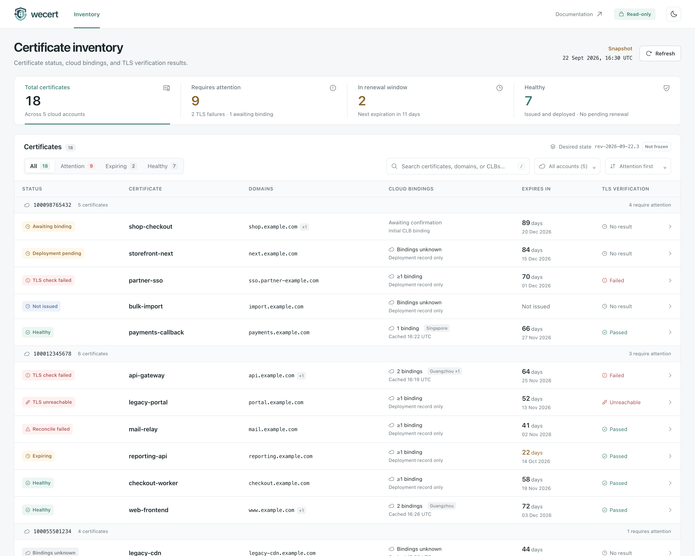

<p align="center">
  <picture>
    <source media="(prefers-color-scheme: dark)" srcset="docs/logo-dark.png">
    
  </picture>
</p>

<p align="center">
  <a href="README.md">English</a> &nbsp;·&nbsp; <b>简体中文</b>
</p>

<p align="center">
  
  
  
  
  <a href="https://github.com/susunola/wecert/actions/workflows/ci.yml"></a>
</p>

# wecert

一个 cert-manager 风格的 ACME 证书自动续期器，面向 **TLS 在腾讯云 CLB 终结** 的部署形态。

一个二进制、一个 SQLite 文件。因为解密发生在负载均衡器上，所以不需要节点 agent，也不需要分发证书文件 —— 整个部署动作就是几次腾讯云 API 调用。

**一览**

| | |
|---|---|
| **签发与续期** | 走 DNS-01 从 Let's Encrypt 签发，并带 ARI（RFC 9773），因此续期与 CA 协调、豁免其速率限制 |
| **DNS provider** | **DNSPod**、**腾讯云 DNS**、**Cloudflare**、**Route 53** 四种内建在每个二进制里；lego 注册表里另外约 198 个 provider 可以用 `-tags lego_dns` 自行编译进来 |
| **部署** | 上传到腾讯云 SSL 并换绑 CLB 监听器 —— 不需要维护监听器清单，同一监听器上的其他证书也不受影响 |
| **验证** | 真实拨通 443 并读回实际在服务的证书，因为"API 说成功了"和"确实在服务"是两个不同的断言 |
| **多域名** | 通配符优先分组，单张证书最多 100 个名字，外加一份逐名字的失败账本：一直失败的那个名字会被摘掉，而不是丢掉整张证书 |
| **运行形态** | 任意 CVM 上的一个守护进程（或一个每小时执行的 systemd timer）；全部状态都在一个可备份的文件里 |
| **可观测性** | Prometheus 指标，外加 17 条可直接加载的告警规则，以及一个可选的、带鉴权的 webhook 用于事件驱动收敛 |

第一次来？先看[前置条件](#前置条件)，再跟着[快速开始](#快速开始)把一张证书签发、部署并验证完。设计背后的论证在[工作原理](#工作原理)，完整参考见[完整参考](README.reference.zh-CN.md)。

## 最近一次真实 E2E 验证

2026-09-24 已完成两轮互相独立的 **Let's Encrypt staging** 实跑：Cloudflare DNS-01、腾讯云 SSL/CLB、Amazon S3 与腾讯 COS 均为真实服务。每轮均签出不同证书、上传、真实换绑 CLB HTTPS listener 并以新的 `wecert-clbverify` 查询读回，同时将 S3 与 COS 的快照恢复到独立状态库。该证据仅覆盖 staging，不消耗生产 CA 配额。完整范围、限制和结果见[真实 E2E 记录](docs/e2e-run-2026-09-24.md)。

## 为什么会有这个项目

Let's Encrypt 的证书不花钱，代价是有效期很短 —— 目前是 90 天，而 CA/Browser Forum 已排期 2027-03-15 起 ≤100 天、2029-03-15 起 ≤47 天。这意味着一年要轮转好几次、而且永远如此，靠人记住每一次，迟早会漏。

现有的 ACME 客户端都假设证书最终落在"申请它的那台机器"上：certbot 写文件，cert-manager 写 Kubernetes Secret。而在这里，证书是 CLB 在服务的**云端资源**，所以需要的不是一个写文件的工具，而是一个小控制器：发现、签发、上传、换绑、验证 —— 并且对每一步都保持诚实。

两个推论决定了整套设计：

- **共用一张证书的域名生死与共。** SNI 只决定*用哪一张*证书，真正决定它能服务哪些域名的是 SAN。`a.example.com` 和 `b.example.com` 一旦进了同一张证书，其中一个的 DNS 出问题就会把另一个一起拖下水。通配符优先分组、期望状态、失败降级，都是因为这个才存在。
- **真正要命的限额是关于状态与 identifier 的，不是 SAN 上限。** *New certificates per exact set of identifiers* 是 5 / 7 天且无 override，而 ARI 协调的续期豁免全部限额。所以丢掉 `state.db` 的代价远高于重签一次 —— 这就是 order URL 必须在任何 CA 调用之前落盘的原因，也是为什么这个文件是唯一必须备份的东西。

两点都详见[为什么是这么设计的](README.reference.zh-CN.md#为什么是这么设计的)。

## 前置条件

- **一个腾讯云账号**，账号下有 CLB（七层监听器），并具备 [`deploy/cam-policy-runtime.json`](deploy/README.md) 里的 CAM 权限：SSL 上传 / 查询 / 删除，以及 DNSPod 记录写入。凭证来自 CVM 角色、环境变量或配置文件。
- **一个你掌控的 DNS zone**，托管在 **DNSPod**（API token）、**腾讯云 DNS**（同一套 CAM 凭证）、**Cloudflare**（受限 API token）或 **Route 53**（AWS 凭证，EC2 实例角色即可）上。Let's Encrypt 走 DNS-01 验证，所以这个 zone 必须能通过 API 访问，并且委派正确。
- **一台运行的机器** —— 任意能访问腾讯云 API 的 CVM 都行。它不需要能从公网访问。
- **Go 1.26+**，只在从源码编译时才需要。Release 二进制是静态的，覆盖 linux/amd64、linux/arm64 与 darwin/arm64。

开始之前需要知道一件事：**首次签发需要人工在 CLB 控制台绑定一次。** 此时腾讯云侧还没有"旧证书"可供反查监听器，所以 wecert 只会上传然后停下，由你去绑一次。之后的每一次续期都是全自动的。

> **注意：程序的日志与错误信息是英文的。** 本文档保留中文说明，但日志、CLI 帮助和错误文本一律按程序的实际输出（英文）引用，以免文档与实现不一致。

## 快速开始

### 1. 获取二进制

从源码编译，或者直接用静态产物：

```bash
git clone https://github.com/susunola/wecert.git
cd wecert
make build          # → bin/wecert，面向当前所在的机器
make tools          # → bin/wecert-preflight, bin/wecert-clbverify
make release        # → dist/wecert_{linux_amd64,linux_arm64,darwin_arm64} + SHA256SUMS
```

当编译机不是那台 CVM 时，用 `make release`：产物是静态且交叉编译的，所以发到 Linux CVM 上的就是 `dist/wecert_linux_amd64`。module 路径与仓库地址一致，因此 `go install github.com/susunola/wecert/cmd/wecert@latest` 也可以直接用。

### 2. 检查凭证、DNS 归属与 NS 委派

全部只读。请在做任何其他事情之前先跑它：它抓的是那些否则要等到订单已经下出去之后，才以挑战失败的形式冒出来的错误。

```bash
export TENCENTCLOUD_SECRET_ID="<secret-id>"
export TENCENTCLOUD_SECRET_KEY="<secret-key>"
./bin/wecert-preflight -domain example.com
```

它会验证 SSL 读权限、`example.com` 的 DNSPod 归属、NS 委派，以及残留的 `_acme-challenge` 记录。每一处失败都会指出来要修什么。

### 3. 配置，然后 dry-run

[`config.example.yaml`](config.example.yaml) 逐字段带注释。它出厂时 `acme.directory` 故意指向 Let's Encrypt **staging** —— `install.sh` 会把这份文件直接装成你的生产配置，所以默认值必须是安全的那个。

最少需要改的地方：

```yaml
acme:
  email: ops@example.com                 # ⚠️ 必须换成你能收信的邮箱，见下
dns:
  provider: tencentcloud                 # 或者 dnspod + loginToken、cloudflare + apiToken，
                                         # 或者 route53 + region（走实例角色时不需要任何密钥）
certificates:
  - name: example-com
    domains: [example.com, "*.example.com"]
```

这段里有两行是**故意留的占位符**：`acme.email` 必须换成你自己能收信的邮箱 —— Let's Encrypt
在注册账号时会拒绝保留文档域名（`example.com` 之类，报 `contact email has forbidden domain`），
而 wecert 现在会在本地就用同样的理由拒绝它，所以忘了改会在 `-dry-run` 这一步就停下来，
而不是装到一半才失败。`acme.directory` 默认指向 staging：整条链路验证通过后再切生产。

然后在 CVM 上安装 —— 在代码检出目录里执行，用对应那台机器的二进制：

```bash
sudo ./install.sh ./dist/wecert_linux_amd64
```

`install.sh` 会创建 `wecert` 用户、把二进制装到 `/usr/local/bin/wecert`、以正确的属主创建 `/etc/wecert` 与 `/var/lib/wecert`、把示例配置放到 `/etc/wecert/config.yaml`（已存在则绝不覆盖），并写入 systemd unit。它不启动任何东西。

编辑那份文件，然后校验它：

```bash
sudo vi /etc/wecert/config.yaml
sudo -u wecert /usr/local/bin/wecert -config /etc/wecert/config.yaml -dry-run
```

`-dry-run` 会加载配置、打开或创建状态库、注册 ACME 账号、构造 DNS provider 与 deployer，然后退出，
**不签发也不部署任何东西**。dry-run 通过意味着：配置能解析、状态目录可用、CA 账号可达、凭证存在且格式正确
（`credentialMode: static` 是"文件或环境变量里有"；CVM 角色则是第一次使用时才去取，所以**这一步不会调用任何云 API**）。
要确认凭证真的能用（SSL 权限、DNSPod 归属、NS 委派），跑 `wecert-preflight -domain <你的域名>`。

### 4. 启动

```bash
sudo systemctl enable --now wecert                      # 守护模式，每小时收敛一轮
# 或者：sudo systemctl enable --now wecert-once.timer     # 定时模式，每小时跑一次就退出
```

每台机器只启用其中**一个**。两者共用一个状态库，而第二个进程会在启动时被状态库上的锁**直接拒绝**（非零退出：`the state database is already held by another wecert process`），而不是排队等待。两个进程为同一张证书下单会去抢同一条速率限制，而"每张证书最多一个在飞订单"这条保证只在单进程内成立。

第一轮会从 staging CA 真实签发一张证书并上传：

```bash
journalctl -u wecert -f            # 用 timer 时改成 -u wecert-once
```

### 5. 人工绑定一次，然后确认

首次签发按设计就停在这里：

```
certificate uploaded; waiting for a one-time manual bind in the CLB console cert=example-com uploadedCertId=xxxxxxxx
```

去 CLB 控制台把这张证书绑到监听器上。wecert 会在之后的某一轮发现，并把 `wecert_certificate_deployed` 翻成 1。此后 `UpdateCertificateInstance` 会让腾讯云自己去找绑定了旧证书的监听器并换掉 —— 不需要维护监听器清单，同一监听器（SNI）上的其他证书也不受影响。

不要相信 API，去确认它真的在服务。`wecert-probe` 是同一次构建产出的另一个二进制，只需要能通过 443 访问这个名字，所以在编译工具链的那台机器上跑就行：

```bash
./bin/wecert-probe -host www.example.com -min-valid 168h
```

退出码 `0` 表示这个名字服务了一张剩余有效期超过一周的证书，`2` 表示服务的是别的东西 —— 那正是"换绑静默地什么都没做"的样子。要钉死到 wecert 部署的那张证书上，就把它的 `notAfter` 传给 `-expect-not-after`（指标里的 `wecert_certificate_not_after_timestamp_seconds`，或者日志里那一行）。

### 6. 切到生产

staging 端到端全绿之后，把 `acme.directory` 指向 `https://acme-v02.api.letsencrypt.org/directory` 并重启。接入 `wecert-onboard` —— 见[域名声明在别处时](#域名声明在别处时) —— 是启动那个保持期望状态新鲜的 timer 的好时机。

> **上不了手?** 三个常见原因，按顺序：NS 委派还没生效（跑 `wecert-preflight -domain`）；在本该用腾讯云 CAM 凭证的地方用了 DNSPod token（两者是不同的凭证体系，配置里写明了所选 provider 需要哪一种）；以及速率限制 —— `wecert_ratelimit_blocked` 会告诉你被哪条限额拒了，而对账号级的 new-order 配额，daemon 会打出 CA 重新接受请求的确切时刻。

## 只读 Console

集中查看证书、云端绑定、到期时间与 TLS 验证结果，支持按账号和状态筛选、搜索域名或 CLB ID，以及点击证书查看部署记录和探测证据。提供浅色、深色主题与手机布局，资源全部内嵌，无需单独构建或部署前端。

<picture>
  <source media="(prefers-color-scheme: dark)" srcset="docs/console-dark.png">
  
</picture>

*截图使用示例数据，由正式 Console 的渲染代码生成。*

在现有配置中增加以下内容，将 token 替换为 `openssl rand -hex 32` 生成的随机密钥，然后重启 daemon：

```yaml
webhook:
  listen: 127.0.0.1:9801
  token: "REPLACE_WITH_A_LONG_RANDOM_SECRET"
```

已安装 systemd 服务时，执行 `sudo systemctl restart wecert`。页面入口为该端口上的 **`GET /status`**，JSON 接口为 **`GET /api/inventory`**。两者均沿用 webhook 的 Bearer token；普通浏览器直接访问而未携带鉴权头时，会返回 `401`。

快速查看：将 `WECERT_TOKEN` 设置为配置中的 token，获取一份可交互的本地快照：

```bash
umask 077
curl --fail --silent --show-error \
  -H "Authorization: Bearer ${WECERT_TOKEN}" \
  http://127.0.0.1:9801/status -o console.html
```

用浏览器打开 `console.html`，即可搜索、筛选和查看详情。它是静态快照，更新数据需重新获取。需要在线刷新时，按[回环代理与 SSH 隧道示例](docs/console.md#live-browser-access)配置浏览器入口，或使用已有的鉴权 HTTPS 网关。页面依赖持续运行的 daemon；每小时执行一次的 `-once` timer 不会维持监听。完整开启步骤与状态含义见 [Console 使用说明](docs/console.md)。

## 部署到本机 nginx

默认后端是腾讯云 CLB（上传 + 一次控制台绑定 + 一键换绑）。当 TLS 在**与 wecert 同一台机器**
上的 nginx 终结时，设置：

```yaml
deploy:
  target: nginx
nginx:
  dirTemplate: /etc/nginx/ssl/%s   # %s 是证书名
  reload: [systemctl, reload, nginx]
```

wecert 以原子 rename 写入 `fullchain.pem`（0644）和 `privkey.pem`（0600），再执行 reload
（argv 形式，不会进 shell）。这两份文件本身就是部署结果：没有云证书 id，也没有控制台绑定，
写入成功即视为已确认。把 server 块里的 `ssl_certificate` / `ssl_certificate_key` 指到它们即可。

一个进程只对接一个后端（`deploy.target: tencent` 或 `nginx`），同一配置里混用会在加载时被拒绝。
服务以用户 `wecert` 运行，默认无法 reload nginx——请用 sudoers 放行这一条命令、放 helper 脚本，
或设 `reload: []` 自己调度重载。完整示例见 `config.example.yaml`。

## 日常运维

**状态放在哪里。** `statePath`（**必填，没有默认值**），例如 `/var/lib/wecert/state.db`（0600，所在目录 0700）。它装着 ACME 账号密钥、每一张证书的私钥、在飞订单的 order URL，以及 ARI certID —— 而丢掉一个 order URL 就要拿一次签发去补，直接算在 5 / 7 天这条限额上。所以它也会被自动快照：`stateBackup` 默认开启，每 24 小时做一次一致的 `VACUUM INTO`，保留 7 份。恢复用一条命令 `wecert -restore latest`（也可以给快照文件或快照目录），代价与步骤见 [docs/recovery.md](docs/recovery.md)。

**健康与告警。** `/metrics` 默认监听 `127.0.0.1:9800`，并附一份[可直接加载的规则文件](deploy/prometheus/wecert-alerts.yml)：17 条告警，覆盖按 profile 的到期、收敛与完整性 —— CA 还没接受的吊销、两小时没跑完的一轮、正在服务的不是部署的那张证书。该监听端口不做任何鉴权，所以请让它留在 localhost 或私有网卡上。

如果 metrics 端口绑不上，wecert 会直接退出，而不是打条日志继续跑：`/metrics` 是唯一的到期告警通路，端点静默死掉就意味着证书到期无人察觉。

**按需收敛。** 配置 `webhook` 之后，域名刚加完就可以由 CI 直接触发一次收敛，不必等下一个整点：

```bash
curl -X POST http://127.0.0.1:9801/hook/reconcile \
  -H "Authorization: Bearer $TOKEN" \
  -d '{"cert":"example-com"}'
```

> 该监听端口是**明文 HTTP** —— 它应当待在你自己的 TLS 终结器后面，或者只监听私有网卡，鉴权就是那枚 token。如果你的调用方更方便，也可以用 `X-Wecert-Token: <token>` 代替 `Authorization` 头。

它返回 `202 Accepted`，收敛在后台跑；结果靠 `GET /hook/status` 轮询。其它状态码都是**拒绝**，含义各不相同：`401` token 缺失或不对，`429` 这个地址的失败预算用完了（正确的 token 仍然能通过），`400` 请求体不合法或什么都没点名（`{"cert":""}`），`413` 请求体超过 64 KiB，`503` 什么都没启动 —— 期望状态读不到，或者进程正在退出；只有这种情况才值得重试。定时器和事件触发可能在同一时刻落到同一张证书上，所以占位是**同步**做的，第二个调用方拿到的是 `skipped`，而不是下一个重复订单 —— 那会直接撞上"该 identifier 集合每 7 天 5 张"的限额。token 是必填的，且至少 16 个字符；这个端点会真实签发，所以请把它当凭证对待。详见[配置参考 → `webhook`](README.reference.zh-CN.md#webhook)。

**吊销。** 一次显式的运维动作，绝不是 wecert 自己会做的决定：

```bash
wecert -config /etc/wecert/config.yaml -revoke example-com -revoke-reason keyCompromise
```

它会要求你把证书名再输一遍（`-yes` 可跳过），然后在联系 CA **之前**先把这个决定记进 `state.db`。顺序本身就是重点：吊销在时间上是无界的 —— 私钥泄漏不会因为 CA 回了个 503 就不算泄漏了 —— 所以一次失败的尝试会留下一条持久请求，daemon 会在此后**每一轮**重试，直到 CA 接受，`wecert_revocation_pending` 和一条告警让它可见。`-revoke-reason` 接受几种在这里有意义的 RFC 5280 码：`unspecified`（默认，即不带原因）、`keyCompromise`、`affiliationChanged`、`superseded`、`cessationOfOperation`。

有两个值得知道的限制：证书是从 `state.db` 里读的，所以在 wecert 开始归档材料之前签发的证书只能在 CA 那边吊销；并且吊销**不会**退还速率限制额度 —— 那些配额在证书签发时就已经消耗掉了。

**升级。** 迁移是增量式的，并在启动时、在阻止第二个实例进入的同一把文件锁下执行，所以新版二进制会就地升级旧状态库，而不是要你重建。回滚到旧版二进制目前还没有测试覆盖（[backlog](docs/backlog.md)）。

## 工作原理

四条不变量。每一条之所以存在，都是因为打破它的代价用时间也换不回来。

1. **每张证书最多一个在飞订单，且 order URL 在任何 CA 调用之前就已落盘。** 重启会接着推进同一张订单，而不是重新下单。订单的私钥存在订单上，绝不覆盖生效私钥，所以部署失败时仍然留有可回滚的东西。
2. **ARI 优先，且下单必须带 `replaces`。** 不带就拿不到速率豁免。
3. **通配符与顶点共用同一个 `_acme-challenge` 名字**，所以形态是*全部写入 → 全部验证 → 一起清理*，绝不能一条一条来。
4. **期望状态是域名集合，不是时间戳。** 生效证书的 SAN 与配置不一致就立刻重签，而不是等续期窗口 —— 否则往一张 90 天的证书里加域名，最长要 60 天才生效，而且是静默的。

lego 高层的 `certificate.Obtain` 是刻意不用的：它在内部自己调 `newOrder`，所以 order URL 无法持久化。改用低层的 `acme/api` 包，状态机因此掌握在我们自己手里。完整论证见[域名随时会改](README.reference.zh-CN.md#域名随时会改)与[实测踩过的坑](README.reference.zh-CN.md#实测踩过的坑)。

## 证书生命周期

其余一切都从一条规则出发：**wecert 永远不推断。** 由另一个东西算出应该有什么、并把它写下来；wecert 只读那份文档做收敛。判断只推断一次、以 diff 的形式评审，而证书生命周期保持稳定。

### 0. 部署形态 —— 免费证书在 CLB 上自动轮转


这套系统要解决的场景就是最上面那条带子：**Let's Encrypt 的证书不花钱，代价是有效期只有 90 天** —— 一年至少要轮 4 次，靠人记着做迟早会漏。

腾讯云自带的免费 DV 不是替代方案：**它是单域名证书，不支持 SAN，也不支持通配符。** 手上只要有几个域名，就得每个域名一张证书、每条证书各自维护一条轮转。而一张 Let's Encrypt 证书最多能装 100 个名字、并且支持通配符，所以几个域名 —— 包括 `*.example.com` —— 可以合成一张证书、只轮转一条。下面画的多 SAN 形态能成立，前提就在这里。

重点不是 wecert *能*签发，而是到期之前证书已经被换好了，全程没有人参与。

请求带着 SNI 到 CLB。CLB 按客户端给的名字去 `multi_cert_info` 里挑证书，七层规则再按域名分流到后端 RS 池。`wecert` 就跑在其中一台 CVM 上：读 DNSPod 里的 `_wecert.*` 声明、写 `_acme-challenge` 记录、向 Let's Encrypt 取证书、上传到腾讯云 SSL 并换绑监听器。

这个形态里有两件容易被忽略的事：

- **后端 RS 完全不参与 TLS。** 解密发生在 CLB，所以证书是一份*云端资源*，而不是几个文件。把 certbot 装在每台 RS 上拿不到任何好处，而假设"证书最终写进一个 Secret"的工具在这里也没有落点。
- **共用一张证书的域名生死与共。** SNI 只决定*用哪一张*证书，真正决定"能不能服务这个域名"的是那张证书的 SAN。所以 `a.example.com` 和 `b.example.com` 一旦进了同一张证书，其中一个的 DNS 出问题就会把另一个一起拖下水。

第二点是其余一切设计所围绕的约束 —— 通配符优先分组、期望状态、失败降级，都是因为它才存在。

### 1. 系统全景 —— 谁拥有什么、谁只读什么


### 2. 从声明到契约 —— 推断侧流水线


### 3. 一轮收敛决定什么


### 4. ACME 订单状态机


### 5. DNS-01 —— 通配符与顶点共用一个 TXT 名字


### 6. 一张证书的一生


时间轴按 `classic` 的 90 天证书画。真正决定续期时刻的是 ARI 的 `suggestedWindow`；`renewBefore` 只是 ARI 不可用时的兜底。

ARI 协调的续期在被替换证书**至少共享一个标识符**时**豁免 Let's Encrypt 的全部速率限制**（官方措辞是 "at least one identifier matching the certificate it intends to replace"）。集合不变自然满足，在一张既有证书上加名字也满足 —— 这正是通配符优先不只是一项优化的原因；而**完全不相交**的集合（把名字整体搬到另一张证书上）才要花 `Certificates per Registered Domain`。

这些图背后的三张表 —— 数据所有权、失败语义、限速算术 —— 在[证书生命周期](README.reference.zh-CN.md#证书生命周期)，同样七张图也在那里。另有一份可交互页面：[docs/certificate-lifecycle.html](docs/certificate-lifecycle.html)，图之间有可点的跳转，还有一个打印 / 存 PDF 的按钮。

## Profile

"每个 SAN 最多 100 个域名"是随 profile 而变的，不是固定值：

| Profile | 有效期 | Max Names |
|---|---|---|
| `classic`（默认） | 90 天 | 100 |
| `tlsserver` | 45 天 | 25 |
| `shortlived` | 160 小时 | 25 |

CA/Browser Forum 已排期 **2027-03-15 起 ≤100 天、2029-03-15 起 ≤47 天**，所以"90 天证书 + 人工兜底"这条路在两年内就不再是选项。把每张证书控制在 **25 个域名以内**既对齐 `tlsserver`，也控住了爆炸半径 —— 同一张证书里的域名会一起成功、一起失败、一起过期。

> 增删域名会让这次签发变成一张新证书，因此要走 **Certificates per Registered Domain（50 / 7 天）**，而不是享受 ARI 豁免。

## 域名声明在别处时

如果域名是由其他人或其他系统加进来的，`wecert-onboard` 可以把这份判断完全搬出 wecert。域名以 `_wecert` TXT 记录的形式声明在 DNS zone 里，这个二进制把它们变成一份可评审的期望状态文档，而 **wecert 只读那份文档 —— 它自己绝不推断任何东西**。

回报就在上面的配额算术里。声明了 `*.example.com` 之后，加一个 `foo.example.com` 的签发成本是**零**；而没有通配符时，导入 50 个子域就是 50 次重新签发。

删除被刻意设计得比新增保守一个数量级，而且整套东西可以先跑只读的 `observe` 模式。从[期望状态](docs/desired-state.md)开始读。

## 文档

**运维它**

- [完整参考](README.reference.zh-CN.md) —— 架构、收敛状态机、状态库结构、逐字段配置说明、运维，以及实测踩过的坑。
- [配置参考](README.reference.zh-CN.md#配置参考) · [运维](README.reference.zh-CN.md#运维) · [监控与告警](README.reference.zh-CN.md#监控与告警)。
- [告警规则](deploy/prometheus/wecert-alerts.yml) —— 可以直接加载进 Prometheus；每条阈值都写明了这个数字是怎么来的。
- [恢复](docs/recovery.md) —— `state.db` 里有什么、每种丢失的代价，以及怎么恢复一份快照并在启动前验证它。
- [可用性](docs/availability.md) —— 重启已经能扛住什么、为什么同一台机器上的第二个进程是多余的，以及三个真实可选方案各自的代价。
- [backlog](docs/backlog.md) —— 接下来值得做什么，按"真实暴露面 / 工作量"排序。

**理解它**

- [为什么是这么设计的](README.reference.zh-CN.md#为什么是这么设计的) —— 是哪些速率限制决定了这套设计。
- [证书生命周期](README.reference.zh-CN.md#证书生命周期) —— 上面那七张图，加上数据所有权、失败语义与限速算术。可交互版本：[docs/certificate-lifecycle.html](docs/certificate-lifecycle.html)。
- [期望状态](docs/desired-state.md) —— 用 `_wecert` DNS 记录声明域名、生成期望状态文档、以及把 wecert 切过去。设计取舍见 [desired-state-providers.md](docs/desired-state-providers.md)。
- [挑战类型](docs/challenge-types.md) —— 为什么 DNS-01 在这里是正确的默认值、HTTP-01 会额外要求什么，以及 TLS-ALPN-01 为什么根本行不通。
- [实测踩过的坑](README.reference.zh-CN.md#实测踩过的坑) —— CLB 的 SNI 陷阱、`DescribeListeners` 不回读绑定、DNSPod 的 TTL 下限、lego 的 API 陷阱。
- [证书全生命周期验收用例](docs/lifecycle-acceptance.md) —— 在真实 DNSPod + Let's Encrypt **staging** 上验证一张证书完整一生的可执行清单：签发、SAN 漂移、通配符与顶点共享 TXT 名、并发证书、ARI 与兜底两条续期路径、中断自愈，以及声明 → 文档 → enforce 的交接。
- [路线图](README.reference.zh-CN.md#现状与下一步) · [开发](README.reference.zh-CN.md#开发)。

**参与开发**

- [CONTRIBUTING.md](CONTRIBUTING.md) —— 一次改动应该包含什么，以及怎么跑那些门禁。
- [SECURITY.md](SECURITY.md) —— 怎么私下报告漏洞，以及哪些限制是刻意为之。
- [deploy/README.md](deploy/README.md) —— 最小权限的 CAM 策略与 Prometheus 规则。

## 现状与支持

工程实现是生产级的：600+ 测试、测试套件里针对 pebble 跑的真实 ACME 生命周期、经变异验证的回归测试、可复现的 release 二进制，以及一份 SBOM。但它同时**尚无量产运行记录** —— 它还没有在别人的集群上跑满一年，这份 README 不会暗示相反的情况。请把第一次部署当成一次灰度发布：先 staging，再一张证书，最后才是其余全部。

受支持的版本就是最新 release。没有长期支持分支，所以安全修复不会回移到旧 tag。已知的缺口与计划在 [backlog](docs/backlog.md) 和 [CHANGELOG](CHANGELOG.md) 里。

<details>
<summary>命令行参考</summary>

### `wecert`

| 参数 | 默认 | 说明 |
|---|---|---|
| `-config` | `config.yaml` | 配置文件路径 |
| `-state` | — | 覆盖 `statePath`（便于测试） |
| `-once` | `false` | 只跑一轮就退出（配合 systemd timer / cron） |
| `-interval` | `1h` | 守护模式下的收敛间隔 |
| `-log-level` | `info` | `debug` \| `info` \| `warn` \| `error` |
| `-dry-run` | `false` | 校验配置、初始化 ACME 账号，并构造 DNS provider 与 deployer；不签发也不部署 |
| `-revoke` | — | 要吊销的证书名，执行后退出（见[吊销](#日常运维)） |
| `-revoke-reason` | `unspecified` | RFC 5280 原因码：`unspecified` \| `keyCompromise` \| `affiliationChanged` \| `superseded` \| `cessationOfOperation` |
| `-yes` | `false` | 与 `-revoke` 配合：跳过交互式确认 |
| `-version` | `false` | 打印版本后退出 |

### `wecert-onboard`（期望状态生成器）

把 `_wecert` TXT 声明变成 `wecert` 读取的那份期望状态文档。由 systemd timer 驱动，跑完就退出。只有 `desiredState.mode` 离开 `static` 之后才需要它。

| 参数 | 默认 | 说明 |
|---|---|---|
| `-config` | — | **必填。** 与 `wecert` 读的同一份配置文件；策略在 `onboarding` 那一节 |
| `-out` | `desiredState.path` | 期望状态文档的写入路径 |
| `-state` | `<out>.state.json` | 宽限期与配额预算的账本存放位置 |
| `-report` / `-no-report` | `<out>.report.json` | 逐 hostname 的决策报告 |
| `-zones` | 所有可见 zone | 要枚举的 DNS zone，逗号分隔 |
| `-require-clb` | `true` | 守卫 1：只有当某条 CLB 规则在服务这个名字时，声明才算数 |
| `-allow` | — | 允许签发证书的注册域，逗号分隔 |
| `-max-names` | `25` | 单张证书的 SAN 上限 |
| `-grace` | `24h` | 一个名字要确认缺失多久之后才允许移除 |
| `-budget` / `-budget-window` | `25` / `168h` | 每个窗口内允许的名字集合变更次数 |
| `-drop-threshold` | `0.30` | 声明集合缩小超过这个比例就冻结 |
| `-profile` / `-keytype` / `-deploy` | 取自配置 | 为它生成的证书设置的默认值 |
| `-force` | `false` | 跳过骤变保险丝、宽限期与 CLB 引用检查；只用于你刻意做的那次变更 |
| `-dry-run` | `false` | 只算不写 |
| `-json` | `false` | 报告以 JSON 输出，而不是人类可读的摘要 |
| `-quiet` | `false` | 只打印最后那一行摘要 |

退出码：`0` 已写出（或与上一版相同）、`1` 程序自身出错、`2` **有意冻结** —— 去看报告。

```bash
./bin/wecert-onboard -config /etc/wecert/config.yaml -dry-run   # 先看会改什么
./bin/wecert-onboard -config /etc/wecert/config.yaml            # 落盘
```

### `wecert-preflight`（诊断；`-prune-certs` 会删除）

| 参数 | 说明 |
|---|---|
| `-domain` | 验证 SSL 读权限、DNSPod 归属、NS 委派与残留的挑战记录 |
| `-list-certs` | 列出账号下的 SSL 证书 |
| `-prune-certs` | 删除 wecert 上传的证书（别名前缀 `wecert/`） |
| `-bindings` | 对某个证书 ID 原样打印绑定资源查询结果（用于排查"0 个绑定"的判定） |
| `-yes` | 跳过 `-prune-certs` 的确认提示 |

> `-prune-certs` 按别名前缀 `wecert/` 匹配，而 wecert 对**所有**它上传的证书都用这个前缀 —— 包括当前正在服务的那张。它会先打印清单并要求确认；非交互式的 stdin 一律按"否"处理。云端拒绝的删除（`DeleteResult=false`）会按**失败**报告并让命令非零退出，而不是被打印成一次并未发生的删除。

### `wecert-probe`（网络侧取证）

拨一个真实的 TLS 连接，读回对端实际出示的证书。这是 wecert 里**不**信任云控制面的那一部分：换绑是异步的，SNI 上也可能有另一张证书在赢 —— 这两件事从 API 都看不出来。

| 参数 | 默认 | 说明 |
|---|---|---|
| `-host` | — | **必填。** 要探测的名字，逗号分隔 |
| `-port` | `443` | 要拨的 TCP 端口 |
| `-timeout` | `10s` | 单次尝试的超时 |
| `-min-valid` | `0` | 服务中的证书剩余有效期少于它就判失败，例如 `168h` |
| `-expect-san` | — | 部署下去的 SAN 集合；服务中的集合必须完全一致 |
| `-expect-not-after` | — | 部署那张证书的 `notAfter`（RFC3339）；用来抓"换绑没生效" |
| `-wait` | `0` | 轮询到判定为 ok 或超时为止（例如 `90s`）—— 刚换完绑时有用 |
| `-json` | `false` | 每次尝试输出一个 JSON 对象（NDJSON：`-wait` 下的重试、或解析到多个地址的主机，都各占一行） |

退出码：`0` 与预期一致 · `1` 探测根本没跑成 · `2` 探测跑成了，但服务的是错的证书。

`-json` 下 `verdict.problems` 是对象数组（`{"kind": "...", "text": "..."}`），每个独立问题一条 ——
因为排查方向不同：`min_valid_for` 表示服务的就是部署的那张证书、只是剩余有效期不够（续期还没跑），
而 `not_after` 或 `names_extra` 才表示服务的是另一张证书。

```bash
./bin/wecert-probe -host www.example.com -min-valid 168h
./bin/wecert-probe -host www.example.com -wait 90s        # 刚换完绑
```

> 它拨不了通配符 —— `*.example.com` 没有自己的地址。请拨同一张证书覆盖的某个具体名字。

### `wecert-clbverify`（独立取证）

| 参数 | 说明 |
|---|---|
| `-region` / `-clb` / `-listener` | 目标监听器；`-listener` 省略则取该 CLB 下的第一个 |
| `-expect` / `-not-expect` | 断言主证书 ID 等于 / 不等于 |
| `-wait` | 轮询等待换绑完成的最长时间（换绑是异步的，实测约 15s） |
| `-raw` | 原样打印 `DescribeListeners` 的 JSON |

```bash
./bin/wecert-clbverify -region ap-guangzhou -clb lb-xxxx -listener lbl-yyyy \
  -expect apJdfyPa -not-expect apJRqDsC -wait 90s
```

</details>

## License

[MIT](LICENSE)
